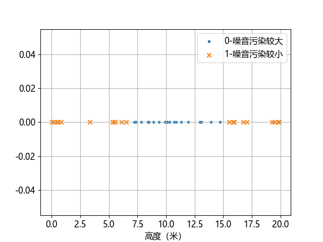

## 10.1 问题与建模

有一些居民楼和写字楼都临街，马路上车来车往的很是热闹，但也因此产生了噪音污染问题，尤其是在夜里有车经过时产生的噪音非常明显。董大白在公司的不同楼层的办公区观察临街的马路风景，总感觉不同楼层的噪音强度不一样。他邀请环境噪音污染研究人员在 500 个地点的采样后得到一组数据，把受噪音污染较大的高度区域编号为 0，相对较安静的高度区域编号为 1。表 10.1.1 展示了部分样本。

表 10.1.1 部分样本数据

|样本|楼层高度（米） $x$|噪音污染程度 $y$|
|-|-|-|
|1|2.3397 |1|
|2|6.0114 |1|
|3|7.3135 |0|
|4|8.6654 |0|
|5|10.1924|0|
|6|15.0574|1|
|7|18.6840|1|
|...|...|...|

噪音污染程度 $y$ 有两个取值，0 表示噪音较小，1 表示较大。

有了这个数据的指导，人们会决定是否要给自己的窗户安装隔音设施。笔者居住的房子在临街的 10 层，夏天的晚上开窗睡觉，有车辆经过时，尤其是一些大型的施工车辆产生的噪音非常大。

**问题：找到合适的分类方法把数据分成两组，得到噪音污染大的区域分界线。**

### 问题分析

照例先统计数据的基本信息。

```
--- X (500) ---             --- Y (500) ---
最大值: 20.0024             最大值: 1.0
最小值: -0.0194             最小值: 0.0
均值: 10.0073               均值: 0.5980
标准差: 5.7857              标准差: 0.4903
```

$X$ 是高度数据，所以样本中出现 -0.0194（米）的数据时估计是在地下室测试的。图 10.1.1 是部分样本的可视化结果，横坐标为测量高度，纵坐标没有意义。



图 10.1.1 不同高度的楼层噪音污染的程度划分

可以看到这是一组一维的数据，分布在 $x$ 轴上，但是被分成了三个部分：左侧为区域编号 1，中间为区域编号为 0，右侧为区域编号为 1。也就是说位于较高和较低的楼层的噪音污染较小，位于中间楼层的噪音污染较大。

我们无法像第 4 章的线性分类那样**用一根直线**把这两类样本分开，所以，这是一个**非线性**的二分类问题。
