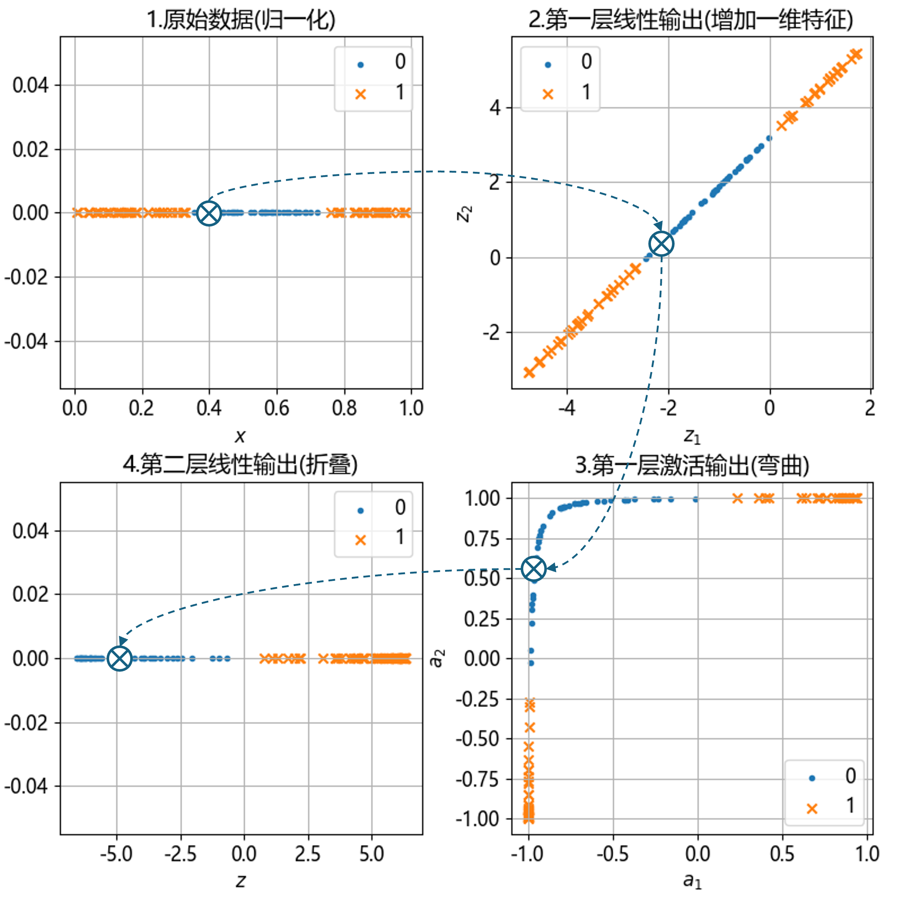
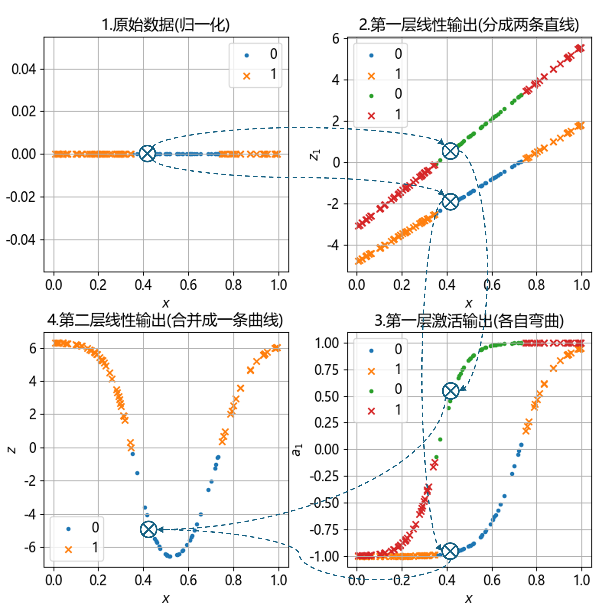

## 10.4 工作原理

我们尝试用两种方法来解释第 10.3 节中的神经网络的工作原理。但不论是哪一种解释，都会归结为：激活函数把非线性问题转换为线性问题，由神经网络的最后一个线性层轻松完成线性分类。

### 10.4.1 第一种解释

图 10.4.1 一维特征的非线性二分类神经网络工作原理（解释一）

### 10.4.2 第二种解释

图 10.4.2 一维特征的非线性二分类神经网络工作原理（解释二）

