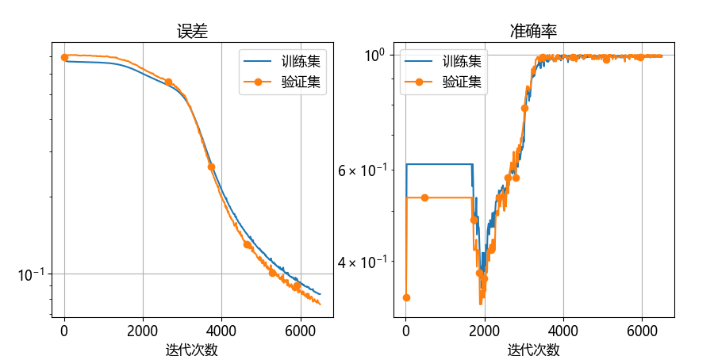

## 10.5 编程模型的改进【电子资源】

由于本章的问题比较简单，所以我们可以拿出一些时间来改进编程模型。先回忆一下历史：

- 前七章中，我们一直使用 `common.NeuralNet` 编程模型来封装神经网络的基本操作，每次都需要推导反向传播公式并加以实现，费心劳神；

- 第8~10章，开始使用部分的自动微分机制，定义了很多操作符（operator），在其内部实现反向计算，并使用 `Module` 类封装，每次都需要在其内部不厌其烦地书写 `init, forward, backward, update, predict, save, load` 等函数。一旦在 `init` 中定义的操作符类型和在 `forward` 中的顺序有变化，后面的函数中都需要跟着变化。

为了解决以上很多繁琐的手工劳动，我们把 `Module` 升级，派生出一个 `Sequential` 类来封装一连串的操作符运算。【代码：common.Module.py】中展示了具体做法。首先是初始化，它要求建立一个 `operator` 的列表，并在内部记录它的前向顺序和反向顺序，分别用于前向计算和反向传播。

```python
# 帮助类
class Sequential(Module):
    def __init__(self, *operators):
        self.operator_seq:list[Operator] = operators
        for op in operators:
            print(op)  # 打印输出便于检查顺序
        self.reversed_ops = self.operator_seq[::-1] # 用于反向传播的顺序
```
在 `Sequential` 类的内部迭代地调用一系列的 `operator` 的 `forward,backward,update` 方法，以下为前向计算：

```python
    def forward(self, X):
        data = X
        for op in self.operator_seq:  # 按顺序前向计算
            data = op.forward(data)
        if self.classifier_function is not None:  # 分类任务要计算分类概率
            data = self.classifier_function.forward(data)
        return data
```
以下为反向传播：
```python
    def backward(self, predict, label):
        ...
        for op in self.reversed_ops: # 按顺序反向传播
            delta = op.backward(delta)
```
以下为参数更新：
```python
    def update(self, lr):
        for op in self.operator_seq:
            op.update(lr)  # 依次在每个operator内部更新
```
以上代码为一次性的，放在基础类文件中，后面可以复用。在客户端这样调用即可【代码：H10_5_NN_train.py】：

```python
if __name__=="__main__":
    model = Sequential(
        layer.Linear(1, 2),
        activator.Tanh(),     # 激活层
        layer.Linear(2, 1),   # 线性层2（输出层）
    ) # 分类器不放在 Sequential 内部，需要在下面单独处理
    model.set_classifier_loss_function(layer.LogisticCrossEntropy()) # 二分类函数+交叉熵损失函数
    data_loader = load_data()
    params = HyperParameters(max_epoch=500, batch_size=32, learning_rate=0.1)
    training_history = train_model(data_loader, model, params)
    training_history.show_loss()
    model.save("model_10_5")
```

使用【代码：H10_5_GradientCheck.py】梯度检查正确，使用【代码：H10_5_NN_train.py】训练网络可以得到正确结果如下：

```
...
轮数 498, 迭代 6487, 训练集: loss 0.083590, accu 0.9925, 验证集: loss 0.076609, accu 0.9900
轮数 499, 迭代 6500, 训练集: loss 0.083493, accu 0.9950, 验证集: loss 0.076185, accu 0.9900
```



图 10.5.1 误差和准确率形态

这一改动大大地改善了客户端的编程体验，可以更方便地研究更复杂的网络结构。我们在后面的章节中将会使用这一微型框架（mini framework）。
