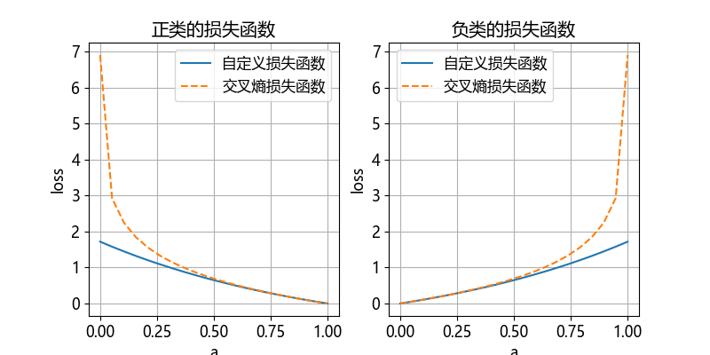
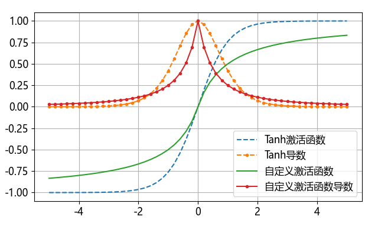
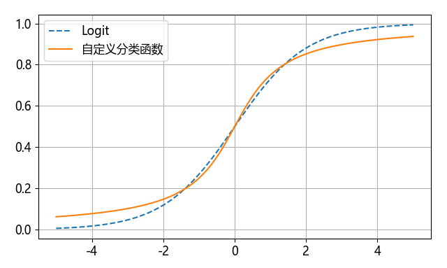
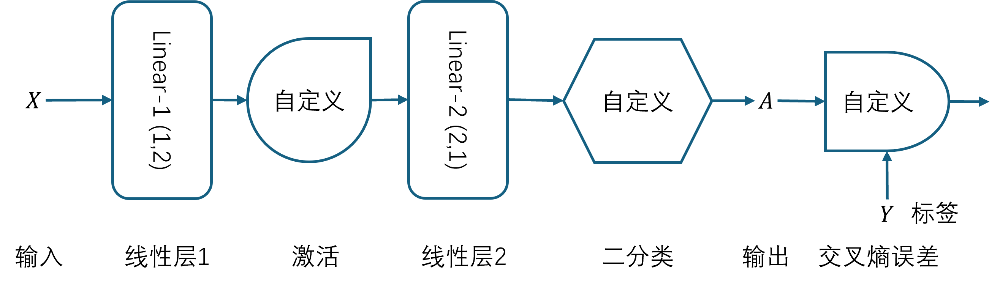
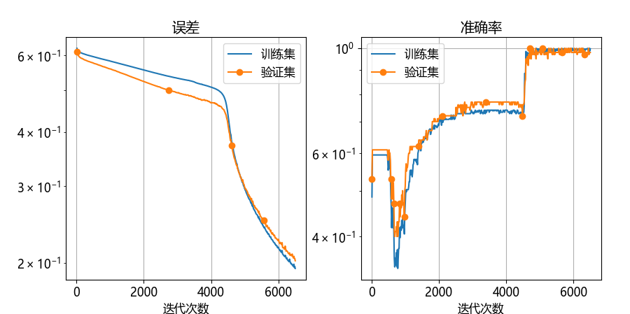

## 10.6 定制神经网络【电子资源】

神经网络的基本构成有：

- 线性计算；
- 激活函数（对于有隐层的网络）；
- 分类函数（对于分类任务）；
- 损失函数。

其中，线性计算即 $z = xw+b$ 已经简单到无法定制了，但是后面三项元素都是可定制的。在前面讲过的回归和分类两种任务中，回归任务使用 Tanh 或 ReLU 做激活函数、使用 MSE 做损失函数，分类任务中使用 Logit 或 Softmax 做分类函数、使用交叉熵做损失函数，这些组合是计算量最小的、久经考验的，但并非唯一的。

本小节就是要“刻意”地定制后三项元素，以便读者将来在有需要时可以灵活地运用这些知识。

### 10.6.1 自定义损失函数

这里我们主要讨论二分类任务，因此要替代的是二分类交叉熵，如图 10.6.1 中虚线所示。



图 10.6.1 自定义的损失函数和交叉熵损失函数的比较

交叉熵中的对数函数本来向下弯曲的，只不过用负号来改变了方向，所以我们可以使用一个本来就向上弯曲的函数替代它，比如 $f(x)=e^x$，但是它的 0 点值为 1，所以要用 $f(x)=e^x-1$ 做变换。再参考 $loss=-[y \ln a + (1-y) \ln (1-a)]$ 的形式，我们最终得到自定义的损失函数为：

$$
loss = y (e^{1-a}-1) + (1-y)(e^a-1)
\tag{10.6.1}
$$

其函数图像如图 10.6.1 中的实线所示。与二分类交叉熵相比，可以看到在两侧的梯度要小很多，整体的梯度比较缓和，所以反向传播力度不如二分类交叉熵。

接下来求导数：

$$
\frac{\partial loss}{\partial a}=-ye^{1-a}+(1-y)e^a
\tag{10.6.2}
$$

【代码：H10_6_customize_functions.py】实现：

```python
def my_loss(a, y):
    return y * (np.exp(1-a)-1) + (1-y) * (np.exp(a)-1)
    # return np.mean(...)

def de_my_loss(a, y):
    return -y * np.exp(1-a) + (1 - y) * np.exp(a)
```

在实际计算 loss 值时，不要忘记对样本数量求平均 `np.mean()` 。


### 10.6.2 自定义激活函数

在 7.3 节中，我们提到过有很多与 Tanh 类似的激活函数统称为 Sigmoid，我们从图 7.7.3 中取一个函数：

$$
f(x)=\frac{1}{1+|x|}
\tag{10.6.3}
$$

求导数：

$$
f'(x)=\frac{1+|x|-x \cdot \text{sgn}(x)}{(1+|x|)^2}=\frac{1}{(1+|x|)^2}
\tag{10.6.4}
$$

可以看到激活函数公式很整齐，便于计算。把它的函数图像与 Tanh 函数比较，放在图 10.6.2 中。



图 10.6.2 自定义的激活函数与 Tanh 的比较

可以看到自定义的激活函数比 Tanh 要平缓，饱和较慢。它在 0 点二阶不可导，但是不影响使用。在 0 点左右的反向力度下降得太快，这是反向传播的主要工作区域。

代码实现如下：

```python
def my_activator(x):
    return x / (1 + np.abs(x))

def de_my_activator(x):
    return 1 / np.square(1 + np.abs(x))
```

### 10.6.3 自定义分类函数

二分类函数为 Logit，但是此处我们使用反正切函数来模拟：

$$
f(x) = 0.5 + \frac{1}{\pi}\arctan(x)
\tag{10.6.5}
$$

它的导数为：

$$
f'(x) = \frac{1}{\pi(1+x^2)}
\tag{10.6.6}
$$

图 10.6.3 是自定义二分类函数与 Logit 的比较，它在 $[-1,1]$ 区域比 Logit 的斜率大一些，便于清晰分类。



图 10.6.3 自定义二分类函数与 Logit 的比较

代码实现如下：

```python
def my_classifier(x):
    return 0.5 + np.arctan(x) / np.pi

def de_my_classifier(x):
    return 1 / (np.pi * (1 + np.square(x)))
```

### 10.6.4 神经网络

图 10.6.4 是上述自定义元素的神经网络模型。



图 10.6.4 自定义元素的神经网络模型


我们在 10.5 节中改进了编程模型，所以可以很方便地把自定义元素加到网络中，【代码：H10_6_NN_customize_train.py】如下：

```python
if __name__=="__main__":
    model = Sequential(
        layer.Linear(1, 2),
        activator.my_activator(), # 自定义激活函数
        layer.Linear(2, 1),
    )
    model.set_classifier_function(layer.my_binary_classifier()) # 自定分类活函数
    model.set_loss_function(loss.my_loss()) # 自定义损失函数
```
有了模型之后，在训练之前，我们先做一个梯度检查，以确保求导公式及实现是正确的，【代码：H10_6_customize_GradientCheck.py】得到的结果很好。训练过程很顺利，以下是打印输出，图 10.6.5 为训练过程展示。

```
......
轮数 498, 迭代 6487, 训练集: loss 0.196141, accu 0.9875, 验证集: loss 0.204510, accu 0.9800
轮数 499, 迭代 6500, 训练集: loss 0.194209, accu 0.9975, 验证集: loss 0.202290, accu 0.9800
```



图 10.6.5 自定义网络在训练过程中误差和准确率的变化

在 4000 次迭代之后，有一个断崖式的变化，应该是与几种自定义元素组合之后的损失函数的形态有关。对于分类问题，尤其是样本之间有间隙的时候，准确率往往会有一个**突变**，但误差是会**连续**下降的，而且看上去还有很大下降的空间，但并不是我们追求的目标，因为准确率已经接近 100% 了。

补充两点：

- 在实际工作中，更有可能发生的情况是自定义损失函数，但是这个可能性也会比较小;
- 如果 debug 跟踪 `train_model` 函数的过程，读者会发现：在前向计算过程中，没有必要在每一次都计算 loss 值，浪费算力，只在到达需要记录训练过程的 checkpoint 时才去计算。
