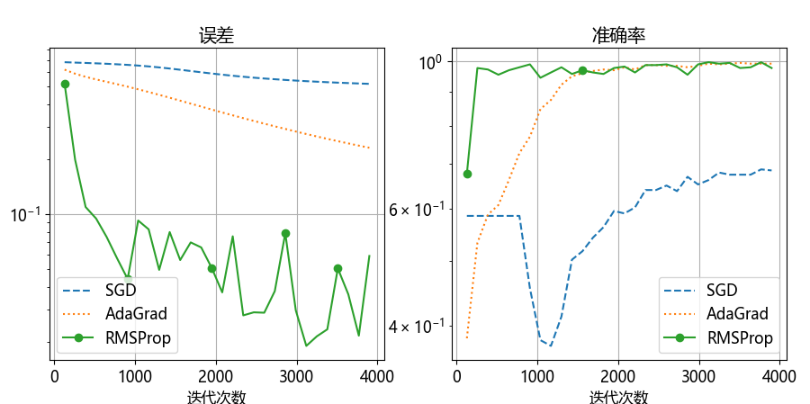

## 10.7 优化器之二阶动量法

在 8.7 节中学习了优化算法中的动量法，在本小节中我们继续学习优化算法，主要是二阶动量法。

### 10.7.1 自适应学习率算法 AdaGrad

#### 1. 算法

#### 2. 实现

#### 3. 试验

图 10.7.1 AdaGrad 算法的学习率 $\eta_t$ 的变化

图 10.7.2 AdaGrad 算法的学习效果

### 10.7.2 均方根反向传播 RMSProp

#### 1. 算法

#### 2. 实现

#### 3. 试验

图 10.7.3 RMSProp 算法的学习率 $\eta_t$ 的变化

图 10.7.4 RMSProp 算法在固定的全局学习率0.5时的不同窗口参数的效果

图 10.7.5 RMSProp 算法在窗口参数为 0.7 时对不同的全局学习率的效果

### 10.7.3 实例比较

图 10.7.6 两种优化算法的比较
