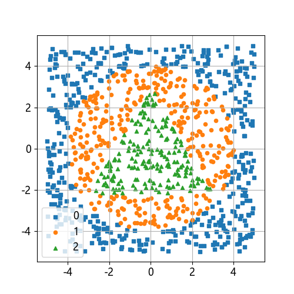
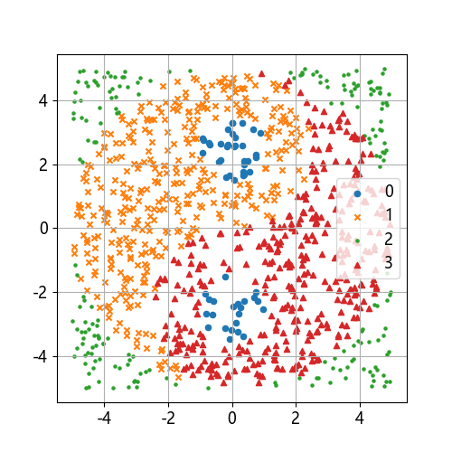

## 11.1 问题与建模

还记得在第 8 章中的董大白的老师的别墅吗？这幢别墅有一个 10×10 平方米的后花园需要建设，老师请董大白好好规划一下。首先是花园的分区、图案问题，要有艺术感，还要有科学属性，不能横平竖直的像庄稼地。其次是费用问题，要计算每种方案的区域面积，以便确定买多少肥沃的土以及花的种子；还要计算区域间的分界线长度，以便去买砖来做一个基本的区域划分。

董大白首先在计算机上绘好了四种图案，然后用蒙特卡洛采样法向里面“撒点”，得到了很多样本点和分区信息。接下来董大白想用神经网络帮忙训练模型然后得到区域面积、分界线长度等信息。这四种图案分别命名为：异或图案（牛郎织女），月亮图案（月中折桂），宝石图案（三色宝石），太极图案（乾坤太极）。

### 11.1.1 问题分析

表 11.1.1 列出各种图案的数据特点比较，其中，有间隙的分类要比无间隙的分类容易，无交叉的分类要比有交叉的分类容易，无包含的分类要比有包含的分类容易。具体样本图请参考图 11.1.1 至 图 11.1.4。

表 11.1.1 各种图案的特点比较

|图案|别名|分类|样本特点|
|-|-|-|-|
|异或图案|牛郎织女|二分类|有间隙，有交叉，无包含|
|月亮图案|月中折桂|二分类|有间隙，无交叉，半包含|
|宝石图案|三色宝石|三分类|无间隙，无交叉，全包含|
|太极图案|乾坤太极|四分类|无间隙，有交叉，全包含|


#### 1. 牛郎织女


图 11.1.1 牛郎织女图案

这实际上是一个异或问题，也就是在二维平面上无法用一根直线划分开两类样本，这个问题曾经令大家对神经网络的研究停滞了几十年。该问题的特点是两类样本成交叉状分布在正方形的四个角落，就好像牛郎织女以及他们的两个孩子被银河分开一样无法团聚。

#### 2. 月中折桂


图 11.1.2 月中折桂图案

这是一个非线性二分类问题，一个类别的样本半包含另外一个类别的样本，可以用两条直线或者一条曲线分开。上半部分像一轮新月，下半部分像一棵大树，所以取名为月中折桂。

#### 3. 三色宝石



图 11.1.3 三色宝石图案

这是一个非线性三分类问题，三类样本成层次的包含关系。有读者可能会说，你看从外到内分别是方形、圆形、三角形，这么规则的图案，分类一定很简单吧？

图案是否规则与神经网络的求解没什么关系。它的难点在于外圈是圆形，内圈是三角形，如果神经元数量少的话，很难精确地拟合出这种效果，只能是个大概。如果图案不规则的话，需要更多的神经元参与计算，模型结构不会有变化。

#### 4. 乾坤太极



图 11.1.4 乾坤太极图案

太极图本来是一个复杂的二分类问题，非黑即白。但是董大白认为那不够有趣，所以把它变成了一个四分类问题。图案看似很规则，但实际上样本之间互相包含，很难分开。这也体现了太极的本意。

### 11.1.2 关于异或问题【电子资源】

在 1969 年，Minsky 的一本著作《Perceptrons》（感知器）证明了无法使用单层网络来表示最基本的异或逻辑功能。这个结论给神经网络带来了毁灭性的影响，对于感知机这一新生领域的资金支持及兴趣都消失了。

#### 1. 单层神经网络不可能解决异或问题

下面我们来简单说明一下。表 11.1.1 是最简单的四个异或样本数据。

表 11.1.1 异或的样本数据

|样本|$x_1$|$x_2$|$y$|
|---|---|---|---|
|1|0|0|0|
|2|0|1|1|
|3|1|0|1|
|4|1|1|0|

图 11.1.5 展示了这四个样本以及两条可能的分界线 A、B，其中分界线 A 是线性的，它不可能完成分类任务，它的表达式如式（11.1.1）所示。


图 11.1.5 异或问题的分界线

$$
z = x_1  w_1 + x_2  w_2 + b 
\tag{11.1.1}
$$

$$
a = \text{Logit}(z) 
\tag{11.1.2}
$$

对于第一个样本数据，$x_1=0、x_2=0、y=0$。如果需要 $a=y=0$ 的话，从 Logit 函数曲线看，需要有 $z<0$，于是有：

$$
x_1 w_1 + x_2  w_2 + b < 0
$$

因为 $x_1=0、x_2=0$，所以只剩下 $b$ 项：

$$
b < 0 
\tag{11.1.3}
$$

对于第二个样本数据，$x_1=0、x_2=1、y=1$。如果需要 $a=y$，则要求 $z>0$，不等式为：

$$
x_1w_1 + x_2w_2+b=w_2+b > 0 
\tag{11.1.4}
$$

对于第三个样本数据，$x_1=1、x_2=0、y=1$。如果需要 $a=y$，则要求 $z>0$，不等式为：

$$
x_1w_1 + x_2w_2+b=w_1+b > 0 
\tag{11.1.5}
$$

对于第四个样本，$x_1=1、x_2=1、y=0$。如果需要 $a=y$，则要求 $z<0$，不等式为：

$$
x_1w_1 + x_2w_2+b=w_1+w_2+b < 0
\tag{11.1.6}
$$

把式（11.1.6）两边都加 $b$，并带入式（11.1.3）：

$$
(w_1 + b) + (w_2 + b) < b < 0 
\tag{11.1.7}
$$

根据式（11.1.4）和式（11.1.5），$w_1+b>0$，$w_2+b>0$，所以 $(w_1+b)+(w_2+b)>0$，与式（11.1.7）矛盾，因此模型表达式（11.1.1）无论如何也不能满足所有的 4 个样本，所以单层神经网络做异或运算是不可能的。

#### 2. 多层神经网络的可能性

在逻辑电路中可以用“与非、或、与”三个基础的逻辑门组合完成异或功能，如图 11.1.6 所示。


图 11.1.6 用逻辑“与非、或、与”的组合实现逻辑“异或”

表 11.1.2 展示了计算过程。

表 11.1.2 用逻辑“与非、或、与”的组合实现逻辑“异或”的计算过程

|样本|$x_1$|$x_2$|$z_1=x_1$ NAND $x_2$|$z_2=x_1$ OR $x_2$|$z=z_1$ AND $z_2$|$y$|
|-|-|-|:-:|:-:|:-:|-|
|1|0|0|1|0|0|0|
|2|0|1|1|1|1|1|
|3|1|0|1|1|1|1|
|4|1|1|0|1|0|0|

在第 5 章的【大作业】中，我们曾经要求读者自己实现逻辑门的线性二分类，能不能把那个结果直接拿过来组合使用呢？可以的！但是不要被“线性”二字所迷惑从而认为双层线性网络就可以解决异或问题。实际上，在实现逻辑门的线性二分类时，最后是需要有 Logit 二分类函数做输出的，组合起来的话就会变成“Linear1 - Logit1 - Linear2 - Logit2”四层网络组件，其中 Logit1 就变成了激活函数，所以整个网络并不是线性的。

还有另外一种伪线性的解释如下。根据表 11.1.2 中的三次计算，式（11.1.8）完成“与非”功能，式（11.1.9）完成“或”功能，式（11.1.10）完成“与”功能。

$$
z_1 = -x_1 - x_2 + 1.5
\tag{11.1.8}
$$

$$
z_2 = x_1 + x_2 - 0.5
\tag{11.1.9}
$$

$$
\begin{aligned}
z = z_1 \times z_2 + 0.75&=(-x_1 - x_2 + 1.5) \times (x_1 + x_2 - 0.5) 
\\
&= -x_1^2-x_2^2- 2x_1 x_2 + 2x_1+2x_2
\end{aligned}
\tag{11.1.10}
$$

从原始样本可以得到以下计算结果，-0.75 可以认为是 0，0.25 可以认为是 1：

```
x1  x2  z1    z2   z1*z2+0.75
-------------------------------
0   0   1.5  -0.5   0
0   1   0.5   0.5   1
1   0   0.5   0.5   1
1   1  -0.5   1.5   0
```

从正负号看确实符合异或运算的结果。虽然式（11.1.8）和式（11.1.9）都是线性的，但是 $z_1 \times z_2$ 的乘法运算（完成逻辑“与”功能）实际上会得到 $x_1^2、x_2^2、x_1x_2$ 等二项式，相当于是把原始特征升维了，所以不是线性计算。

所以图 11.1.6 的逻辑门组合给我们的提示是可以用双层神经网络完成任务，从第 10 章的学习中我们知道，在神经网络中使用激活函数来代替对原始特征的直接升维，然后提取其高维特征，再做线性分类，从而完成端到端的非线性分类任务。
