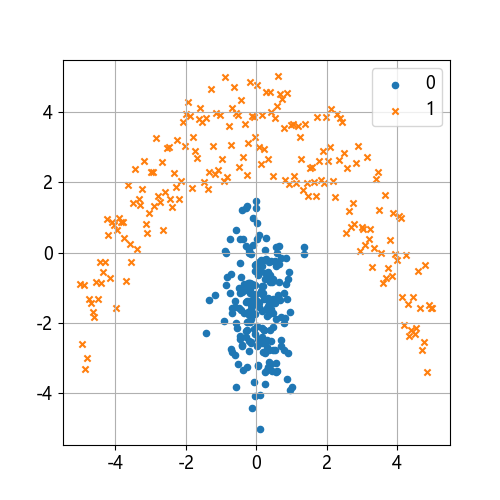
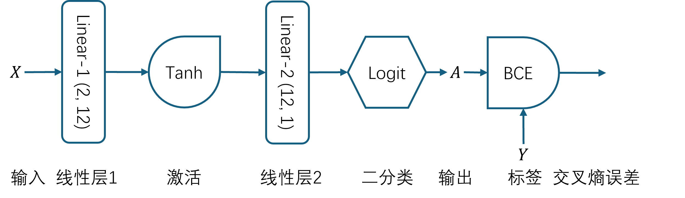
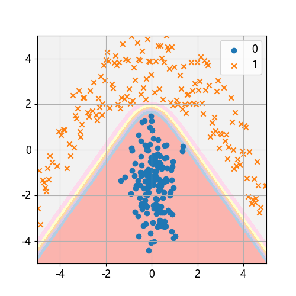
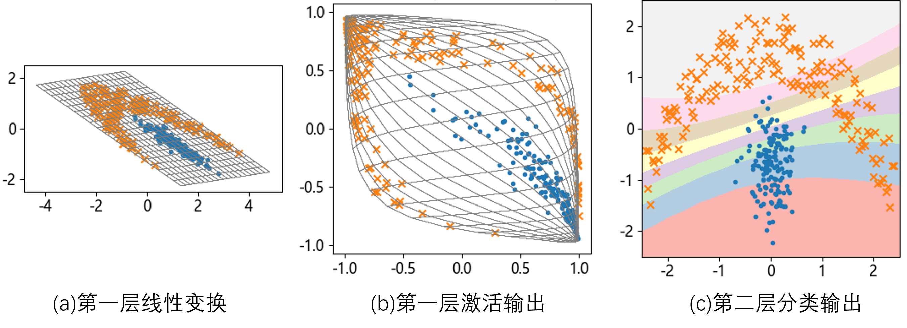
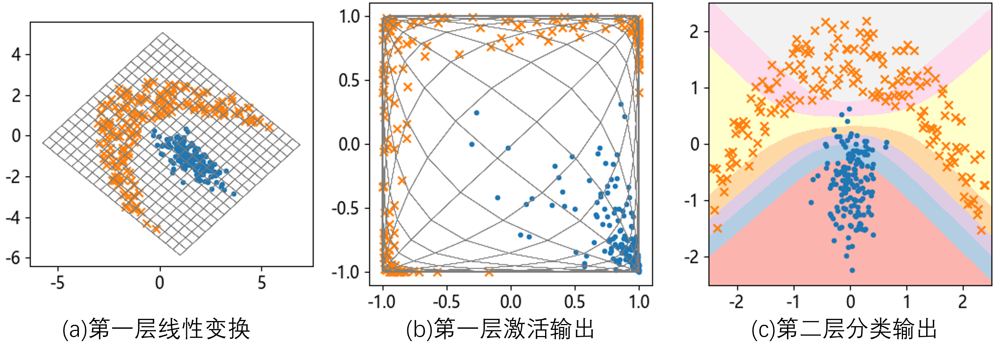
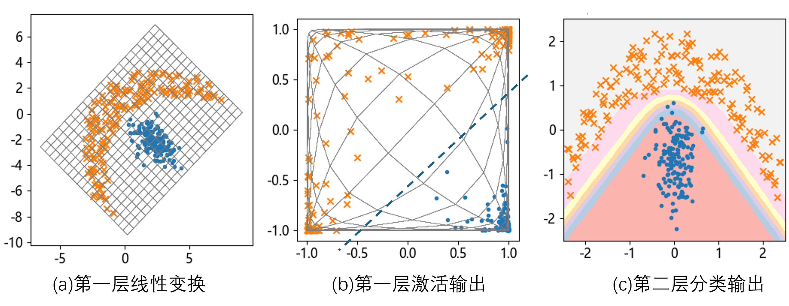

## 11.3 月亮图案分类问题

图 11.3.1 是样本分布可视化结果。



图 11.3.1 样本分布图

下面的打印输出是一些基本的统计信息。

```
--- X (400, 2) ---          --- Y (400, 1) ---
最大值: [5. 5.]             最大值: 1.0
最小值: [-5. -5.]           最小值: 0.0
均值: [0.027 0.065]         均值: 0.5
标准差: [2.08  2.269]       标准差: 0.5
```

### 11.3.1 神经网络



图 11.3.2 解决月亮花园问题的神经网络结果



图 11.3.3 最终的分类结果

### 11.3.2 工作原理

#### 1. 训练 10 轮



图 11.3.4 训练 10 轮的效果

#### 2. 训练 30 轮



图 11.3.5 训练 30 轮的效果

#### 3. 训练 100 轮



图 11.3.6 训练 100 轮的效果
