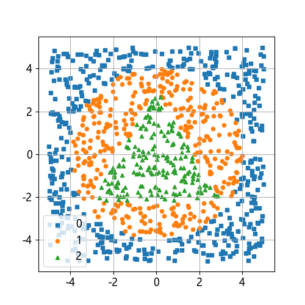
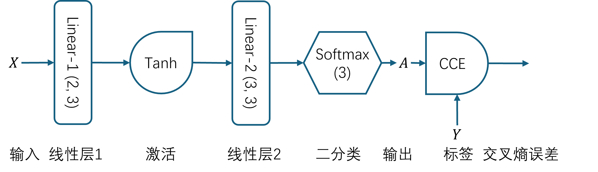
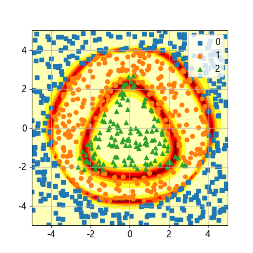
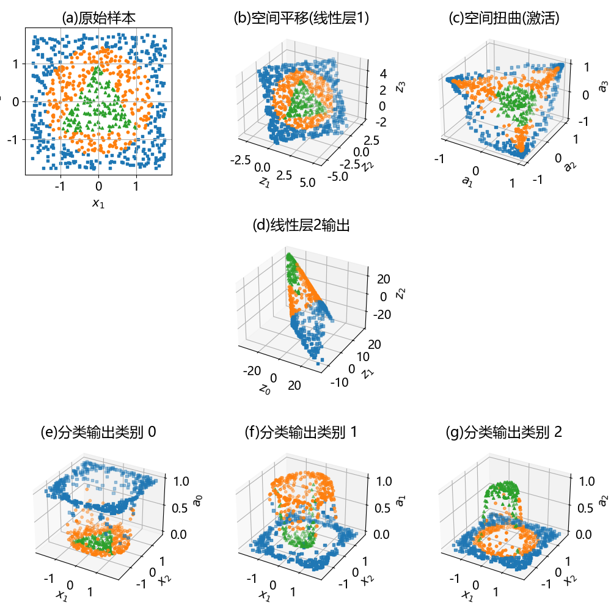
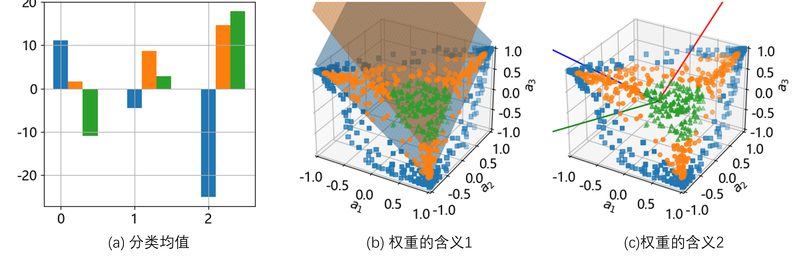

## 11.4 宝石图案分类问题

图 11.4.1 宝石图案数据分布

### 11.4.1 神经网络

图 11.4.2 解决宝石图案的神经网络模型

图 11.4.3 分类结果

### 11.4.2 工作原理

图 11.4.4 工作原理

### 11.4.3 权重值的含义

图 11.4.5 线性层 2 的权重的含义

图 11.4.6 三维空间的两个向量的夹角大小代表了它们的方向是否近似
