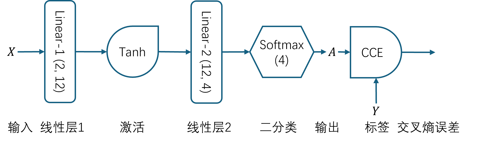
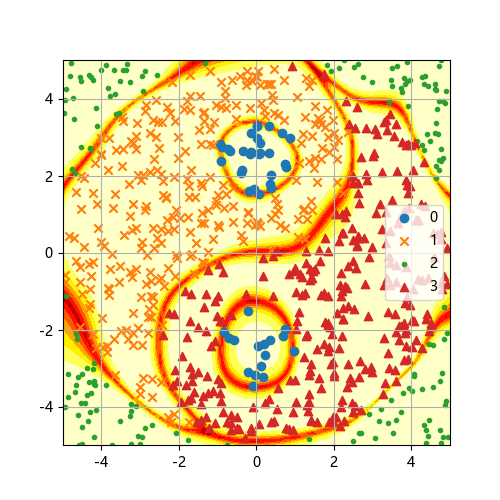
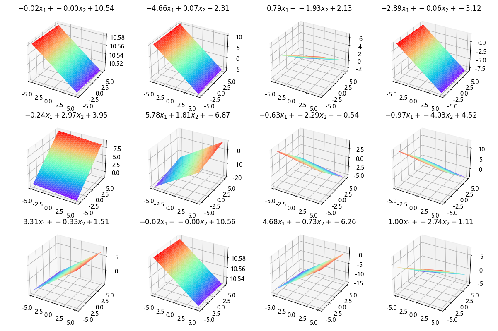
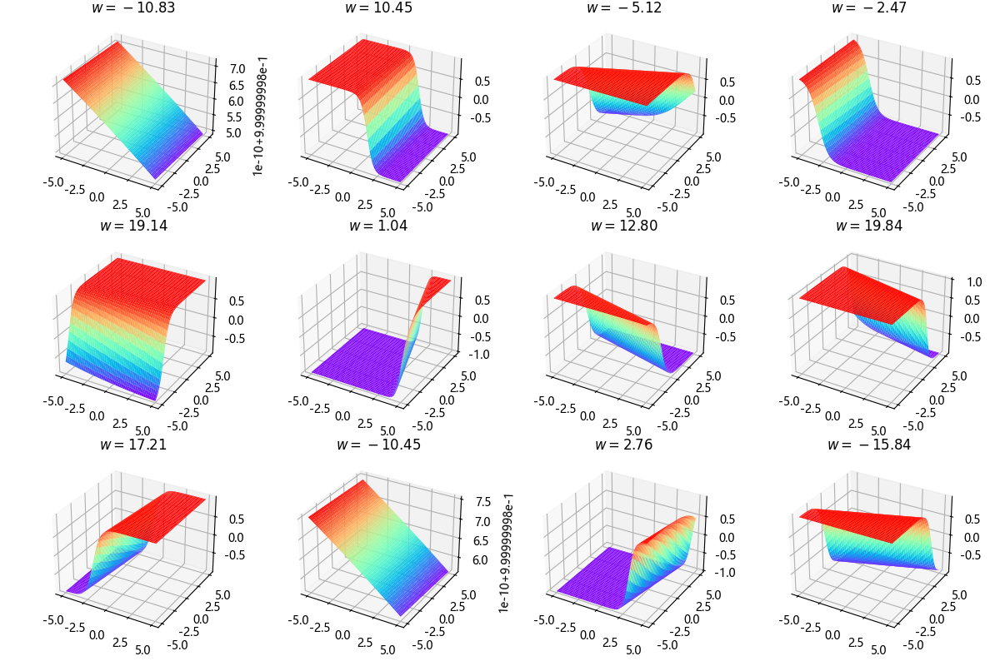
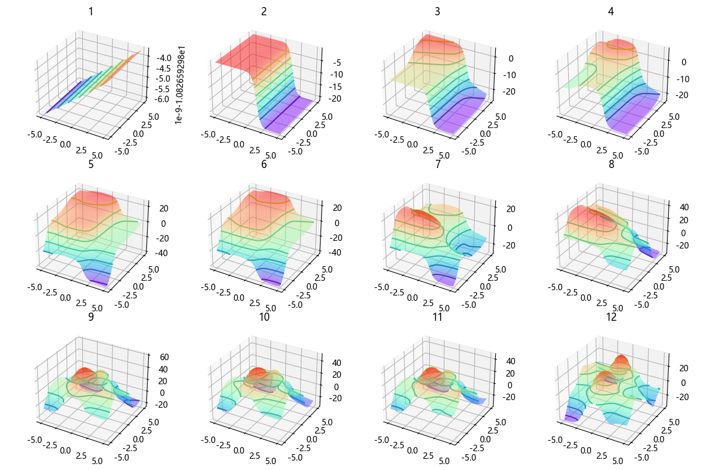
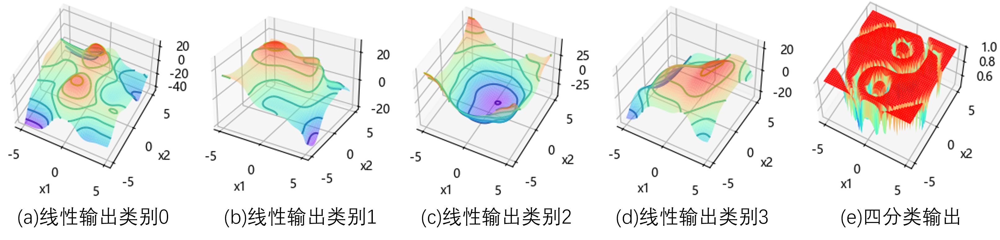

## 11.5 太极图案分类问题

太极图案虽然只有两个类别，但是它们非常复杂：类别区域有交叉，而且两类样本点之间几乎没有空隙。见图 11.5.1。


图 11.5.1 太极图案

以下是基本的统计信息：

```
--- X (1000, 2) ---             --- Y (1000, 1) ---
最大值: [4.973 4.994]           最大值: 3.0
最小值: [-4.99  -4.996]         最小值: 0.0
均值: [0.03  0.017]             均值: 1.895
标准差: [2.889 2.913]           标准差: 0.974
```

### 11.5.1 神经网络



图 11.5.2 解决太极图案的二分类问题需要的神经网络模型



图 11.5.3 太极图案分类的结果

### 11.5.2 工作原理

#### 1. 第一层线性输出



图 11.5.4 第一层线性变换结果

#### 2. 第一层激活输出



图 11.5.5 第一层激活结果

#### 3. 线性层 2 的叠加效果



图 11.5.6 第二层线性变换叠加结果

### 11.5.3 所有类别的迭代效果



图 11.5.7 第二层线性变换输出和最终的四分类输出
