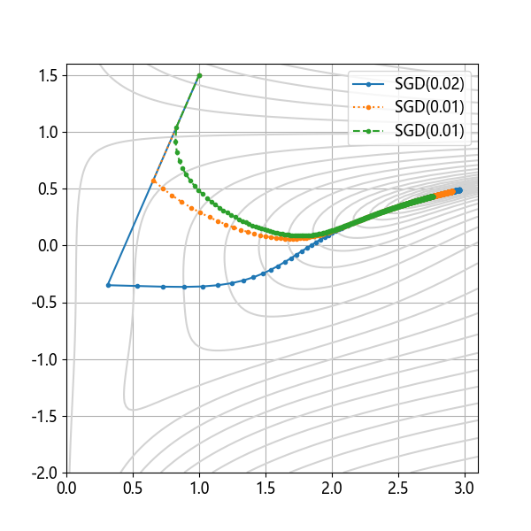
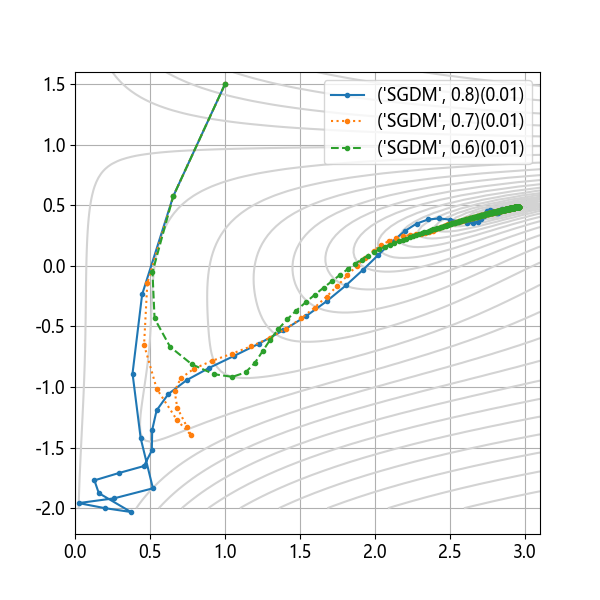
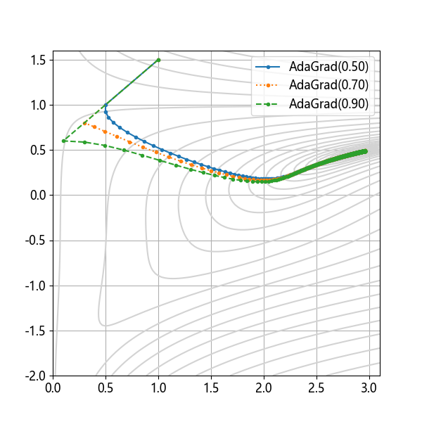
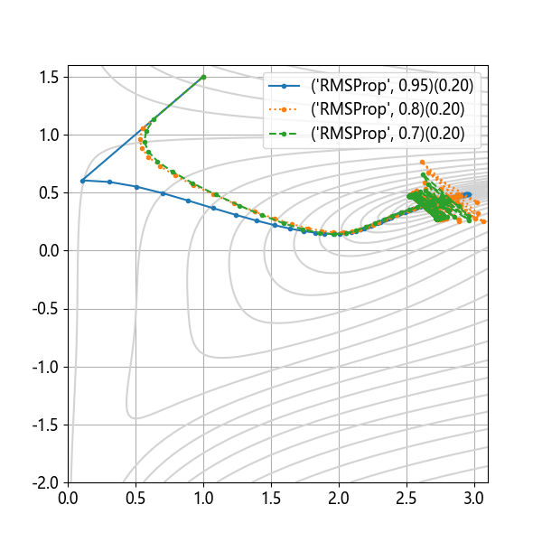
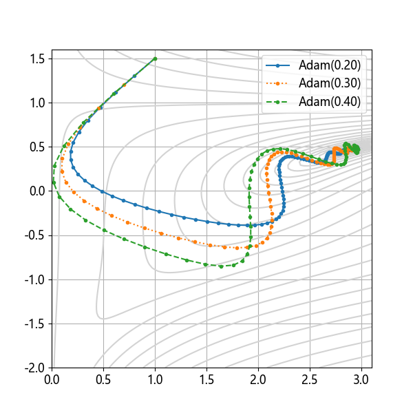
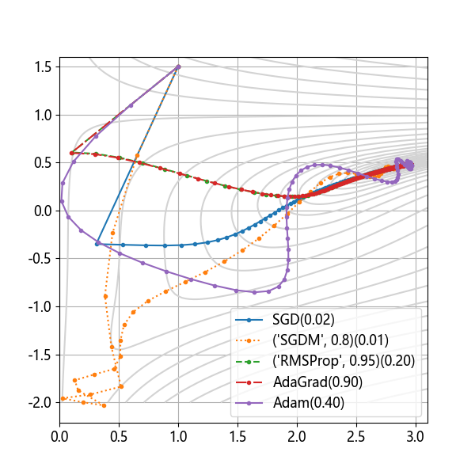

## 11.7 各种优化器的比较

### 11.7.1 SGD

图 11.7.1 SGD 在 Beale 函数上的表现

### 11.7.2 SGDM

图 11.7.2 SGDM 在 Beale 函数上的表现

### 11.7.3 AdaGrad

图 11.7.3 AdaGrad 在 Beale 函数上的表现

### 11.7.4 RMSProp

图 11.7.4 RMSProp 在 Beale 函数上的表现

### 11.7.5 Adam

图 11.7.5 Adam 在 Beale 函数上的表现

### 11.7.6 五种优化算法的比较

图 11.7.6 五种优化算法的比较

