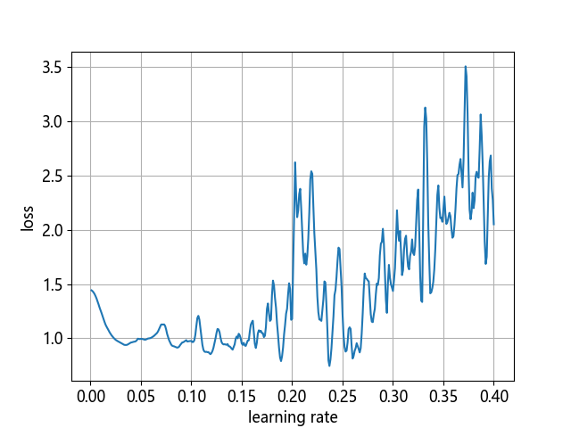
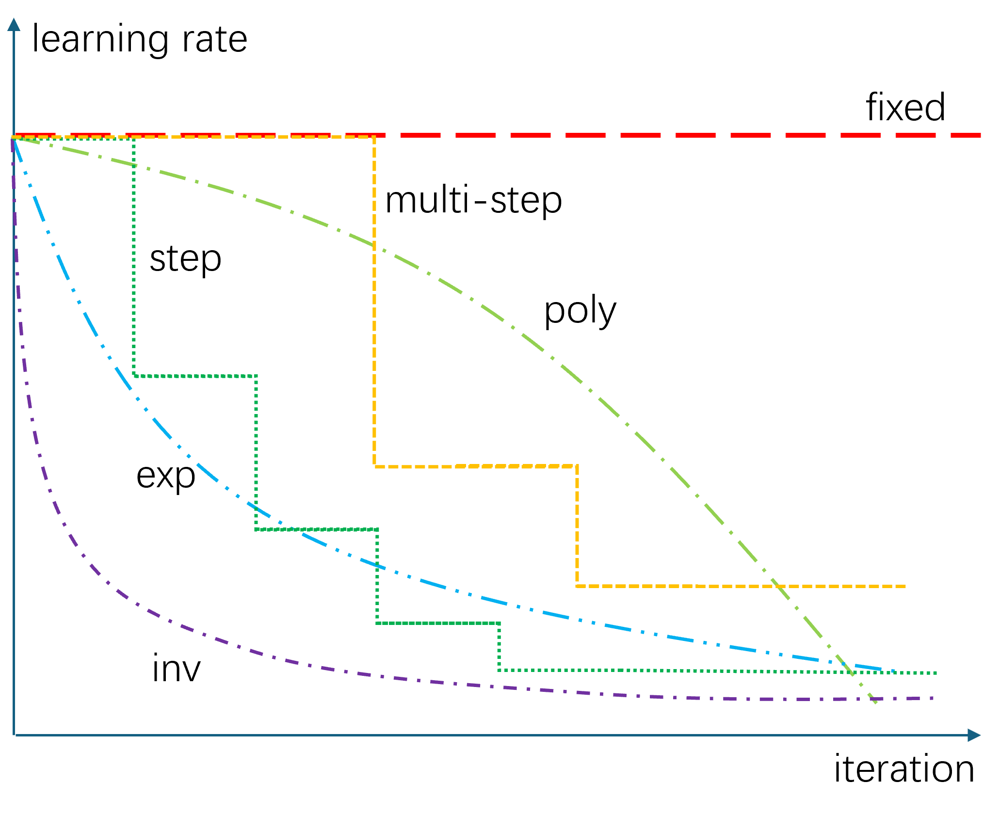

## 11.8 学习率的初始选择与动态调整【电子资源】

学习率的选择需要有丰富的经验，但是也可以借助一些方法来帮助我们确定初始学习率。随着训练的进行，学习率也并非一成不变的，需要根据问题的复杂程度不断地调整学习率。

### 11.8.1 初始学习率的选择

有一种方式可以帮助我们快速找到合适的初始学习率，这个方法是用来估计网络允许的最小学习率和最大学习率，我们也可以用来找我们的最优初始学习率，方法非常简单：

（1）首先我们设置一个非常小的初始学习率，比如`1e-5`；
（2）然后在每个批量训练之后都更新网络，计算 loss 值，同时增加学习率；
（3）最后我们可以描绘出学习率的变化曲线和 loss 的变化曲线，从中就能够发现最好的学习率。

根据本章中太极图案的问题，我们可以给与这样的设置：

```python
params = HyperParameters(max_epoch=2, batch_size=4, learning_rate=0.001)

def increase_lr(params: HyperParameters):
    params.learning_rate += 0.001
    return
```

起始学习率为 0.001，而每次更新完参数后也要增加学习率为 0.001 的固定步长。把批量设置小一些，这样 loss 值的波动会比较敏感。最多训练两轮。很快运行一下【代码：H11_8_Taiji_Adjust_LR.py】，可以得到图 11.8.1。



图 11.8.1 损失函数随着学习率的提高而变化

```
轮数 0, 迭代 1, 训练集: loss 1.354518, accu 0.4600, 学习率:0.0010
轮数 0, 迭代 2, 训练集: loss 1.346641, accu 0.4662, 学习率:0.0020
轮数 0, 迭代 3, 训练集: loss 1.336735, accu 0.4763, 学习率:0.0030
轮数 0, 迭代 4, 训练集: loss 1.324129, accu 0.4900, 学习率:0.0040
...
```

可以看到，学习率小于 0.1 时，一切还好。但是到了 0.15 就开始崩盘了，后面的 loss 值一路狂飙不忍直视。这就意味着最开始的学习率一定要小于 0.15，最好在 0.05 到 0.1 之间。当然这是 4 个样本为一批、使用 Adam 优化器的前提下，如果是 SGD 或其它优化器，则有可能完全不同。


### 11.8.2 学习率的后期修正
#### 1. step 方法

在前面的很多例子中我们都发现，在训练的后期，快到达最优值附近时，会发生较大的震荡，虽然有各种优化器帮助我们解决问题，但是如果能采用更小的学习率的话，将会是最理想的办法。这种办法被称作是学习率衰减（learning rate decay），用公式表示：

$$
\text{lr}_{new}=\text{lr}_{current} \times \text{DecayRate}^{GlobalStep/DecaySteps}
$$

举例来说：

- 当前的 lr = 0.1。
- DecayRate = 0.9。
- DecaySteps = 50。

公式变为：

$$
\text{lr} = 0.1 \times 0.9^{GlobalSteps/50}
$$

意思是初始学习率为 0.1，每训练 50 步计算一次新的 $\text{lr}$，是当前的 $0.9^n$ 倍，其中 $n$ 是正整数，因为一般用 `GlobalSteps/50` 的结果取整，所以 $n=1,2,3,\cdots$。如果计算一下每 50 步的衰减的具体数值，见表 11.8.1。

表 11.8.1 学习率衰减值计算

|迭代|0|50|100|150|200|250|300|...|
|---|---|---|---|---|---|---|---|---|
|学习率|0.1|0.09|0.081|0.073|0.065|0.059|0.053|...|

这样的设置在训练开始时可以快速收敛，到后来变得很谨慎，小心翼翼地向极值点逼近，避免由于步子过大而跳过去。step 可以是上面所说的“步”，即按批次计数，每训练一个小批量数据就把计数加一。也可以按照轮数（epoch）计数，两者的区别是要设置好 `DecaySteps`。假设数据集中有 10000 条样本，小批量为 200，按批次计数时设置 `DecaySteps=50`；按轮数计数时，设置 `DecaySteps=1`，二者的效果相同，但此时的 `GlobalSteps` 是经历的 epoch 数值。

上面描述的算法叫做 step 算法，还有一些其他的算法见图 11.8.2。



图 11.8.2 学习率衰减算法

#### 2. fixed 方法

使用固定的学习率，比如全程都用0.01。要注意的是，这个值不能大，否则在后期接近极值点时不易收敛。

#### 3. multi-step 方法

预设几个迭代次数，到达后调低学习率。与step不同的是，这里的次数可以是不均匀的，比如3000、5500、8000。离散型，简单实用。

#### 4. exp 方法

连续的指数变化的学习率，公式为：

$$
\text{lr}_{new}=\text{lr}_{base} * \gamma^{\text{iteration}}
$$

由于一般的迭代次数都很大，所以学习率衰减得很快。$\gamma$可以取值0.9、0.99等接近于1的数值，数值越大，学习率的衰减越慢。

#### 5. inv 方法

倒数型变化，公式为：

$$
\text{lr}_{new}=\text{lr}_{base} * \frac{1}{(1 + \gamma * \text{iteration})^{p}}
$$

$\gamma$控制下降速率，取值越大下降速率越快；$p$控制最小极限值，取值越大时最小值越小，可以用0.5来做缺省值。

#### 6. poly 方法

多项式衰减，公式为：

$$
lr_{new}=lr_{base} * (1 - {\text{iteration} \over \text{iteration}_{max}})^p
$$

$p=1$时，为线性下降；$p<1$时，下降趋势向上突起；$p>1$时，下降趋势向下凹陷。$p$可以设置为0.9。因为预先设置了最大迭代次数，所以曲线不会下降到小于 0 的位置。
