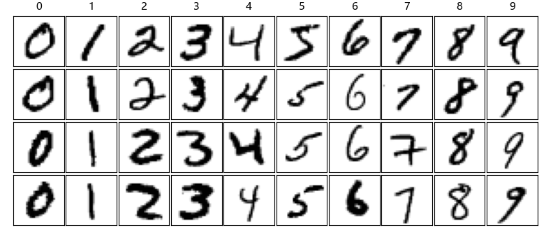

## 12.1 问题与建模

在董大白工作的场所，有个高端的机器人专门负责送信件、快递等等，它一边自行移动一边轻声播放着音乐，避免吓到他人。之前没有播放音乐这个功能时，它曾悄悄地出现在一个女员工身后，把人家吓得花容失色。这个机器人需要识别房间门牌上的数字，然后停下来用一个带橡胶头的弹簧手敲门。收件人取走物品后，会在机器人的屏幕上写下电子签名，并手持物品拍照存档。最后机器人铿锵有力地说一声“谢谢，再见！”就走开了。

图 12.1.1 是董大白的办公室门牌示例。所以，机器人识别门牌数字是这一系列过程中的重要一环。现在我们假设这些数字都是手写的阿拉伯数字 0~9（印刷体数字更容易识别），**问题：如何让神经网络有数字识别的功能？**


图 12.1.1 门牌示例

### 问题分析

手写数字识别其实是一个分类问题，并非图像/物体识别问题。整个问题预可以分为印刷体字符识别、手写体字符识别。而手写体部分又分为联机手写识别（有笔划顺序信息）、脱机手写体识别（无笔划顺序信息）。

光学字符识别（optical hcaracter, recognition，OCR）技术的兴起是从印刷体识别开始的。印刷体识别的主要流程大致分为以下几个部分：图像预处理、版面处理、图像切分、特征提取及模型训练、识别后处理。印刷体字符搞定之后，给手写体字符的识别带来了很大帮助。而手写体的数字识别只是一个巨大房间中的一个角落，今天我们就深入这个角落中一探究竟。

首先需要有数据集做训练样本。MNIST 数据集来自美国国家标准与技术研究所（national institute of standards and technology，NIST），其中的 M 是 mixed 的缩写。训练集有 60000 个样本，由来自 250 个不同的人手写的数字构成, 其中 50% 是高中学生, 50% 来自人口普查局的工作人员。测试集有 10000 个样本。以下是它所包含的四个文件：

- train-imgages-idx3-ubyte：包含 60000 个训练样本的数据文件；
- train-labels-idx1-ubyte：包含 60000 个训练标签的数据文件；
- t10k-imgages-idx3-ubyte：包含 10000 个测试样本的数据文件；
- t10k-labels-idx1-ubyte：包含 10000 个测试标签的数据文件。

下载【数据：https://github.com/xiaowuhu/DLBasic/tree/main/Data/ch12/MNIST】。图 12.1.2 是 MNIST 数据集样本示例中的 10 个数字，每张图片的大小为 28×28 像素，单通道灰度存储，取值范围是 0~255。



图 12.1.2 MNIST 数据集样本示例

以下是统计信息：

```
---- 训练集 ----                    ---- 测试集 ----
--- X (60000, 1, 28, 28) ---        --- X (10000, 1, 28, 28) ---
最大值: 255.0                       最大值: 255.0
最小值: 0.0                         最小值: 0.0
均值: 33.318421449829934            均值: 33.791224489795916
标准差: 78.56748998339798           标准差: 79.17246322228644
--- Y (60000, 1) ---                --- Y (10000, 1) ---
最大值: 9.0                         最大值: 9.0
最小值: 0.0                         最小值: 0.0
分类值: [0. 1. 2. 3. 4. 5. 6. 7. 8. 9.]
```

对于图 12.1.1 这个问题，需要训练一个神经网络可以识别每个小方格中的单独的数字。具体使用（推理）时，需要以下步骤：
（1）机器人有个摄像头，把门牌照下来，做基本的图像处理（矫正、明亮平衡、缩放等）；
（2）然后拆分小方格得到四张黑白图片，分别包含 0、5、1、9，每张图片必须是 28×28 像素的；
（3）把四张图片送入神经网络做推理，得到四个结果；
（4）再拼成一个门牌号字符串“0519”。

在本章中，我们可以忽略上面这个工程过程，只考虑神经网络训练问题。一般来说，图像识别都是用卷积神经网络（本书第五步中讲解），但是在这里我们先尝试用全连接网络做试验。
