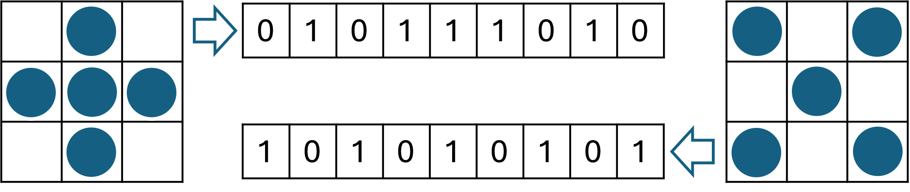
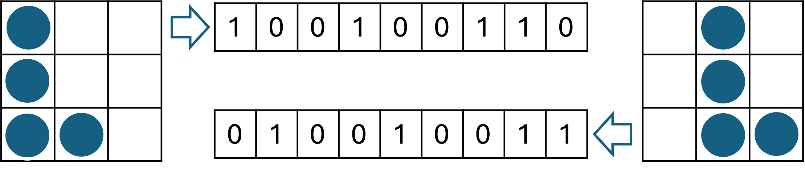
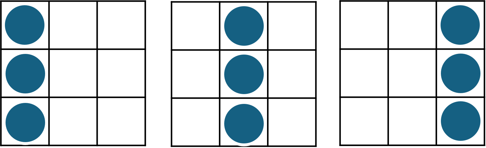
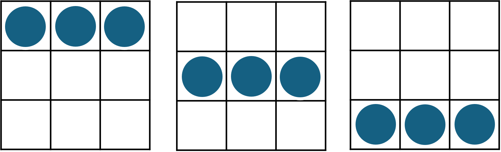
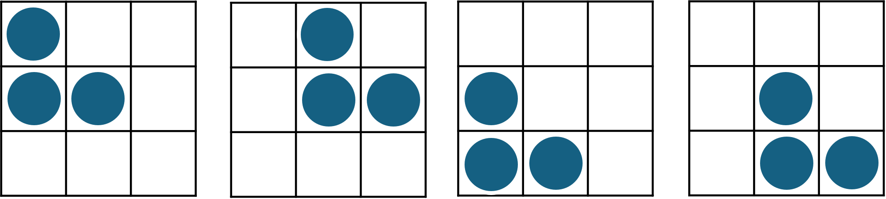
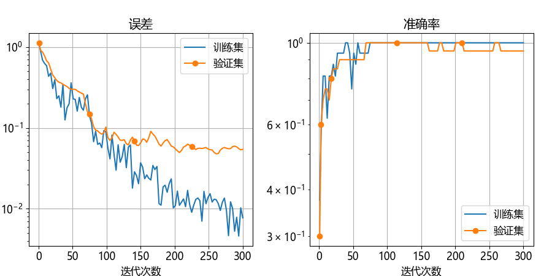

## 12.2 把图片变成向量

图 12.2.1 两张截然不同的图像转换成向量后的比较

图 12.2.2 两张相似的图像转换成向量后的比较

### 12.2.1 生成图片数据

图 12.2.3 第一类图片数据（竖一字形）

图 12.2.3 第二类图片数据（横一字形）

图 12.2.5 第三类图片数据（三角形）

### 12.2.2 搭建神经网络

图 12.2.6 解决 3×3 图片识别问题的神经网络模型

图 12.2.7 训练过程中误差和准确率的变化

### 12.2.3 结果
