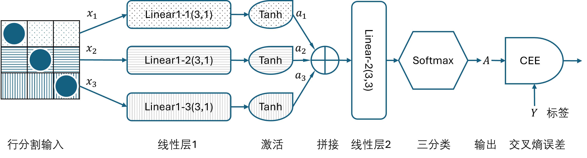
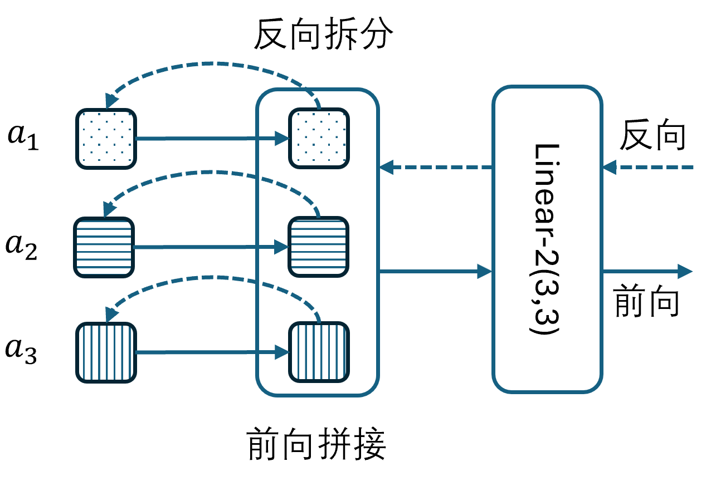
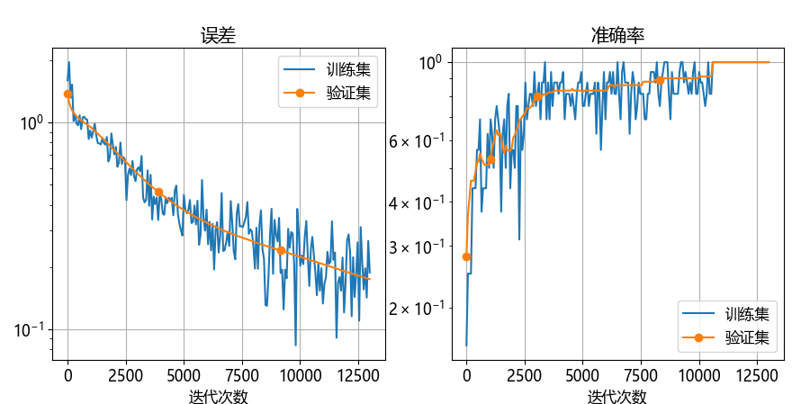
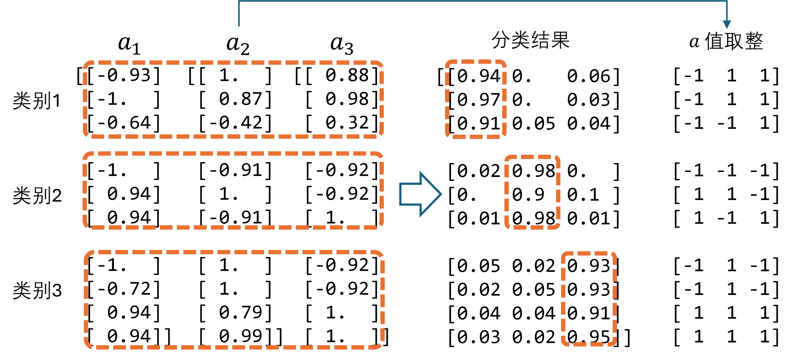

## 12.4 分支模型

从 12.2 节和 12.3 节中，我们得知了神经网络可以对变成向量的图片进行识别，完成分类任务。从图 12.2.6 看，第一层线性层使用了 9×3 的权重矩阵。“得寸进尺”地想一想，如果把一个 3×3 的图片分割成三层，每一层的三个像素都使用一个 3×1 的线性层接入再加激活函数，三层并行，最后再用一个 3×3 的线性层接续到  Softmax 上，能不能完成分类任务呢？想法如图 12.4.1 所示。



图 12.4.1 按行分割的图片识别的神经网络模型

图 12.4.1 中，三行图片都用不同的填充背景表示，并与线性层 1 的三个（横向放置的）Linear 层一一对应。这三个 Linear 层各自输出 1 个特征值，然后需要拼接成 1×3 的特征才能输入给线性层 2，所以我们需要一个新的操作符：Concat。

### 12.4.1 新的操作符 Concat

如图 12.4.2 所示。



图 12.4.2 Concat 操作符的前向计算与反向传播


用公式说明问题比较容易。第一层：

$$
\mathbf a_1 = \text{Tanh}(\mathbf x_1 \mathbf w_1 + \mathbf b_1) \\
\mathbf a_2 = \text{Tanh}(\mathbf x_2 \mathbf w_2 + \mathbf b_2) \\
\mathbf a_3 = \text{Tanh}(\mathbf x_3 \mathbf w_3 + \mathbf b_3)
\tag{12.4.1}
$$

拼接 $\mathbf a_1、\mathbf a_2、\mathbf a_3$：

$$
\mathbf a^{(1)} = \text{Concat}(\mathbf a_1,\mathbf a_2,\mathbf a_3)
\tag{12.4.2}
$$

第二层线性计算加分类：

$$
\mathbf A = \text{Softmax}(\mathbf a^{(1)} \mathbf w^{(2)} + \mathbf b^{(2)})
\tag{12.4.3}
$$

式（12.4.2）的反向传播方法是：

$$
\begin{aligned}
d\mathbf a_1&=\frac{\partial loss}{\partial \mathbf a_1}=\frac{\partial loss}{\partial \mathbf a}\frac{\partial \mathbf a}{\partial \mathbf a_1}=d\mathbf a \big [0:1 \big ] 
\\
d\mathbf a_2&=d\mathbf a \big [1:2 \big ]
\\
d\mathbf a_3&=d\mathbf a \big [2:3 \big ]
\end{aligned}
\tag{12.4.4}
$$

假设 $d\mathbf a \in \mathbb{R}^{n \times 3}$ 是后面传来的梯度，$n$ 为样本数量，则在本例中，由于 $\mathbf a_1 \in \mathbb{R}^{n \times 1}$，所以 $d\mathbf a_1 \in \mathbb{R}^{n \times 1}$，就是 $d\mathbf a$ 的切片 $d\mathbf a[0:1]$。同理，$d\mathbf a_2、d\mathbf a_3$ 也是用切片拆分。

### 12.4.2 代码实现

Concat 运算符定义如下，需要指定 `input_size` 和 `output_size`，如 `(3,3,3)` 和 `(1,1,1)`：

```python
class Concat(Operator):
    def __init__(self, modules, input_size, output_size):
        self.modules = list(modules)
        # 这里要一次性地计算输入输出所需要的分割切片的大小 
        self.slice_input = ... # [(0,3),(3,6),(6,9)]
        self.slice_output = ... # [(0,1),(1,2),(2,3)]
```
前向计算：
```python
    def forward(self, X):
        outputs = []  # 准备好输出
        for i, module in enumerate(self.modules):  # 依次对每个分支做前向计算
            # 分割输入向量为不同的切片并在自己的模块中前向计算
            output = module.forward(X[:, self.slice_input[i][0]:self.slice_input[i][1]])
            outputs.append(output)
        output = np.hstack(outputs)  # 拼接，用 np.concat 也可以
        return output
```
反向传播：
```python
    def backward(self, delta_in):
        for i, module in enumerate(self.modules):  # 依次对每个分支做反向传播
            module.backward( # 对反向梯度做切片
                delta_in[:, self.slice_output[i][0]:self.slice_output[i][1]])
```

模型定义如【代码：H12_4_Toy_Train.py】所示：

```python
def build_model():
    model1 = Sequential(  # 线性层1-1
        layer.Linear(3, 1, init_method="xavier", optimizer="SGD"),
        activator.Tanh(), name = "model1")
    model2 = Sequential(  # 线性层1-2
        layer.Linear(3, 1, init_method="xavier", optimizer="SGD"),
        activator.Tanh(), name = "model2")
    model3 = Sequential(  # 线性层1-3
        layer.Linear(3, 1, init_method="xavier", optimizer="SGD"),
        activator.Tanh(), name = "model3")
    model = Sequential(  # 线性层2
        layer.Concat((model1, model2, model3), (3,3,3), (1,1,1)),
        layer.Linear(3, 3, init_method="kaiming", optimizer="SGD"),
        name = "model"
    )
    model.set_classifier_loss_function(layer.SoftmaxCrossEntropy()) # 多分类函数+交叉熵损失函数
    return model
```
之所以用 Tanh 而不是 ReLU，是因为在简单问题上前者更为有效，对训练更容易一些。在此我们给每个 `Sequential` 对象一个名字，便于在保存模型时能区分彼此。

训练代码如下：

```python
if __name__=="__main__":
    model = build_model()
    data_loader = load_data("train12_4.txt")
    params = HyperParameters(max_epoch=1000, batch_size=32, learning_rate=0.01)
    training_history = train_model(data_loader, model, params, checkpoint=2)
    training_history.show_loss()
    model.save("model_12_4_Toy")
```

### 12.4.3 结果分析

训练时并不那么顺利，很多时候在 100 轮内并不能达到理想的准确率，笔者猜测是因为网络容量不富余，需要一些耐心慢慢调整参数。所以我们使用较小的学习率（0.01）和较长的轮数（1000），并使用最保守的 SGD 优化器，可以比较稳定地得到图 12.4.3 所示结果。



图 12.4.3 训练过程中误差与准确率的变化

图 12.4.4 中的 $a_1$ 是图 12.4.1 中的第一行图像向量的线性变换+激活输出特征，其中，前三行属于类别 1，中间三行属于类别 2，后四行属于类别 3。



图 12.4.4 结果分析

$a_1、a_2、a_3$ 是三行图像的特征输出，单独看它们的值并不能区分出三种类别，但是 $a_1、a_2、a_3$ 的组合就会表现出明显的特征，比如把 -0.93 看作 -1、把 0.88 看作 1 的话，那么第一行组合 $(-0.93, 1., 0.88)$ 就变成了 $(-1,1,1)$，第二行组合 $(-1., 0.87, 0.98)$ 变成 $(-1, 1, 1)$，同理第三行组合是 $(-1,-1,1)$。由于每个位置可以是 -1 或 1，所以一共有 $2^3=8$ 种组合，而图 12.4.4 中出现了 7 种。

如果继续训练，笔者猜测 $a_1、a_2、a_3$ 中的值都会向 1 和 -1 靠近（精确到小数点后两位），感兴趣的读者可以尝试。整个网络只有 18 个参数，比 12.2 节的 36 个参数要少一半，但是能完成同样的任务，而且形成的**二值网络**（只有 1 和 -1）使得神经网络更具有可解释性，这是本节所做的研究的意义所在。

最后看分类结果，三个类别都以明显的优势胜出，相信随着训练的进行，分类概率输出值还会进一步扩大，但是已经没有必要了。执行【代码：H12_4_Toy_Test.py】可以得到每一步的输出结果。
