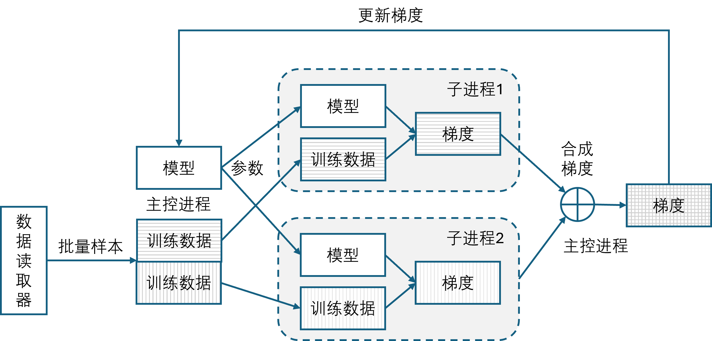
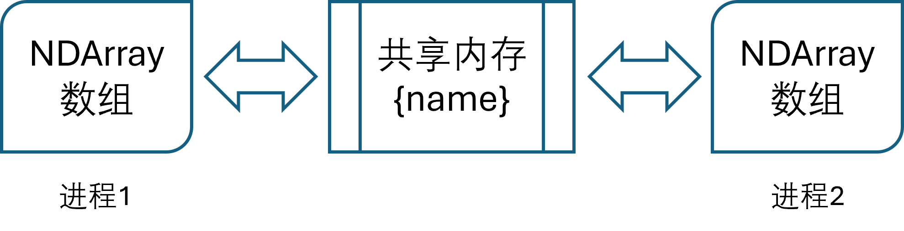
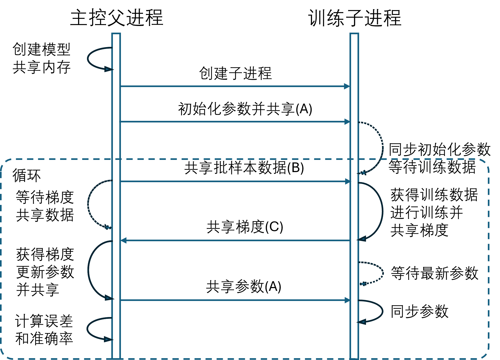

## 12.5 数据并行

当训练数据集很大的时候，并且我们又有冗余的计算设备（CPU 或 GPU 卡），那么就可以把数据均分到不同的 CPU 或 GPU 上去运行。如图 12.5.1 所示为一台机器上的两个子进程共同对一批数据进行训练的框架。



图 12.5.1 数据并行的实现框架

这个框架的要点是如下。

- 要求初始化参数一致。在主控进程中初始化模型参数，然后创建两个子进程，把模型参数拷贝过去。
- 要求训练数据不同。在主控进程中获得一批数据，比如 64 个样本，然后把一半分给子进程 1 去训练，另外一半分给子进程 2 去训练。如果有多个子进程，可以通过参数控制。两个子进程的话就可以提高一倍的训练速度。
- 要求梯度合成。两个子进程的反向传播梯度肯定不同，把它们按位相加，再除以进程数，得到总梯度。这一步叫做 All Reduce。

图 12.5.1 只作为简单的原理性研究，实际应用中还会更复杂一些。下面我们讲述其实现步骤。

### 12.5.1 共享内存

在数据并行技术中，需要大量的数据传输，在单台机器中可以利用共享内存来实现，这是所有多进程通信中最快的方式。如图 12.5.2 所示。



图 12.5.2 共享内存的原理

在进程 1 中（主进程或子进程都可以），建立一个以 `{name}` 命名的共享内存块，设置参数 `create=True`。然后创建一个 `NDArray` 数组指向这个共享内存块，就可以通过操作这个数组来读写共享内存中的数据。代码如下：

```python
from multiprocessing import shared_memory
# 获得训练数据
X, Y = data_loader.get_batch(params.batch_size, 0)
data = np.hstack((X, Y)) # 合并成一块完整数据
# 创建共享内存块
shm = shared_memory.SharedMemory(create=True, name="train_data", size=data.nbytes)
# 创建数组来操作数据
buf = np.ndarray(data.shape, dtype=np.float64, buffer=train_data_shm.buf)
buf[:,0:-10] = X # 写数据 X 到共享内存
buf[:,-10:] = Y  # 写数据 Y 到共享内存
```
由于在 MNIST 问题中有 10 个类别，所以我们把 0~783 分配给样本数据 X，把 784~793 分配给标签值 Y，按顺序写到共享内存中。

在进程 2 中，需要类似的代码来获得共享内存，主要区别是设置参数 `create=False`，并指定相同的名字 `train_data` 和内存大小 `data.nbytes`，然后建立一个 `NDArray` 数组来读写数据。代码如下：

```python
# 获得共享内存块
shm = shared_memory.SharedMemory(create=False, name="train_data", size=data.nbytes)
# 创建数组来操作数据
buf = np.ndarray(data.shape, dtype=np.float64, buffer=train_data_shm.buf)
X = buf[:,0:-10] # 从共享内存读出 X, 切片[0:784]
Y = buf[:,-10:]  # 从共享内存读出 Y, 切片[784:794]
```
从 `buf` 中的指定偏移可以直接获得样本 X 和标签 Y。注意，在两个进程中创建数组的操作是一次性的，不要每次共享新数据时都创建新的数组，会非常耗时。

### 12.5.2 进程间通信

共享内存只是单纯的存储数据，不能用于流程控制。比如，当进程 1 写入数据后，如何告知进程 2 去取数据呢？总不能用轮询方法不断地监控 `buf` 中的数据吧？由于是在同一台机器中的父子进程，所以我们可以使用最简单的 `Event` 来完成通知任务。比如在父进程中：

```python
event = multiprocessing.Event()  # 建立事件
event.clear()  # 清空状态
buf[:,0:-10] = X # 写数据 X 到共享内存
buf[:,-10:] = Y  # 写数据 Y 到共享内存
event.set() # 设置状态，告知对方数据准备好了
```
在创建子进程时需要把 `event` 实例当作参数带入，所以子进程可以使用如下代码监听事件：

```python
event.wait()  # 等待通知
event.clear() # 状态归零，避免下次误用
X = buf[:,0:-10] # 从共享内存读出 X
Y = buf[:,-10:]  # 从共享内存读出 Y
```

如果有多个事件需要监听，就需要建立多个 `event`，不能混用。而且事件一般用于单向通知，如果需要双向通知，需要建立两个 `event`。

### 12.5.3 数据并行训练流程

图 12.5.3 是数据并行的实现流程，其中只画出了一个子进程用于说明过程，更多的子进程在流程上并没有区别。



图 12.5.3 数据并行的实现流程

按箭头方向从上到下的工作流程如下。

（1）父进程（主进程）创建模型，初始化参数，建立共享内存。
（2）创建 n 个子进程，把进程 ID、事件实例等作为参数带入。
（3）把模型的初始化参数共享给子进程。这里需要一块共享内存 A，并使用事件 A 来通知。
（4）子进程创建自己的模型拷贝，使用共享内存 A 和事件 A，把参数同步到模型中。等待训练数据。
（5）父进程共享训练样本，每个子进程得到相同的批大小的不同样本和标签。这里需要一块共享内存 B，并使用事件 B 来通知。等待梯度数据。
（6）子进程获得数据样本后进行前向和反向计算，获得各自的梯度。由于样本不同，所以梯度也不同。
（7）子进程把梯度共享给父进程。这里需要一块共享内存 C，并使用事件 C 来通知。等待最新参数。
（8）父进程把所有子进程的梯度做 All Reduce 运算，然后使用优化器更新模型参数。
（9）父进程把更新后的参数传给所有子进程。同样使用共享内存 A 和事件 A。
（10）子进程得到参数并同步到自己的模型中。等待新的训练数据。
（11）父进程在必要的时候计算训练集和验证集的误差和准确率，记录训练过程。

后续返回到第（5）步循环，直到训练结束。

从流程看，我们一共需要三类共享内存和事件，如下所述。

- 模型参数数据：由于模型中有很多层，每一层的参数尺寸是不同的，不能混在一起，所以每一层的参数都需要一块共享内存。为此整体建立一个事件通知 A 表示“参数下发完毕”。
- 训练样本数据：内存大小由批量和每行数据的大小决定。为此建立一个事件通知 B 表示“训练数据准备好”。
- 梯度数据：它的数量和大小与 A 相同，一个 `W` 对应一个 `dW`，一个 `B` 对应一个 `dB`。而 `W` 和 `B` 由于列数相同，所以可以合并在一起。`dW` 和 `dB` 也是如此。为此建立事件通知 C 表示“梯度更新完毕”。

### 12.5.4 代码实现

#### 1. 主进程

主要的训练逻辑都在主进程端实现，【代码：H12_5_MNIST_Train_DataParalle.py】的片段如下：

```python
    for epoch in range(params.max_epoch):
        data_loader.shuffle_data() # 打乱数据
        for batch_id in range(batch_per_epoch):
            # 拿一大批数据(big_batch_size = batch_size * num_process)
            batch_X, batch_label = data_loader.get_batch(big_batch_size, batch_id)
            # 共享训练数据给子进程，把大批数据分成几个小批分给不同的子进程
            for process_id in range(num_process):
                start = process_id * params.batch_size
                end = start + params.batch_size
                sub_process_info[process_id].train_data_buf[:,0:-10] = batch_X[start:end]
                sub_process_info[process_id].train_data_buf[:,-10:] = batch_label[start:end]
                sub_process_info[process_id].event_data.set() # 通知子进程可以拿训练数据了(B)
            # 等待所有子进程的梯度数据(C)
            for process_id in range(num_process):
                sub_process_info[process_id].event_grad.wait() # 等待梯度数据
                sub_process_info[process_id].event_grad.clear() # 得到梯度数据，清空标志
            # 获得梯度数据
            model.get_grad_value(num_process)
            # 更新模型参数
            model.update_parameters_value(params.learning_rate)
            # 共享模型参数
            model.share_parameters_value()
            for process_id in range(num_process):
                sub_process_info[process_id].event_update.set() # 通知子进程可以拿参数了(A)
            # 辅助工作
            params.learning_rate = lrs.get_learning_rate(iteration)
            if iteration==1 or iteration % check_iteration == 0:
                check_loss(...)
```

#### 2. 子进程

以下是子进程的代码，每个子进程都有自己的事件实例用于和主进程单独通信。

```python
def train_model(process_id, train_data_shape,
    event_data, # 获取训练数据通知
    event_grad, # 回传梯度通知
    event_update # 获得参数更新通知
):
    model = build_model()  # 建立模型副本
    model.setup_share_memory(process_id) # 连接参数及梯度共享内存
    # 建立训练数据共享连接
    train_data_shm = shared_memory.SharedMemory(create=False, name=str(process_id)+"_train_data")
    train_data_buf = np.ndarray(train_data_shape, dtype=np.float64, buffer=train_data_shm.buf)
    # 等待接收初始化权重参数(A)
    event_update.wait()
    event_update.clear() # 收到，清空标志
    model.set_parameters_value(process_id) # 更新本地模型参数
    while True: # 简单的循环流程，只负责梯度计算，具体逻辑由主进程控制
        event_data.wait() # 从主控请求训练数据(B)
        event_data.clear() # 得到数据，清空标志
        batch_X = train_data_buf[:,0:-10] # 把数据从共享内存中拷贝出来
        batch_label = train_data_buf[:,-10:]
        batch_predict = model.forward(batch_X)  # 前向计算
        model.backward(batch_predict, batch_label)  # 反向传播获得梯度
        model.share_grad_value(process_id) # 共享梯度数据
        event_grad.set() # 通知主控可以拿梯度了(B)
        event_update.wait() # 等待参数更新数据
        event_update.clear() # 得到数据，清空标志
        model.set_parameters_value(process_id) # 更新本地模型参数
```

### 12.5.5 训练

多进程会不会带来时间上的效益呢？我们先跑一下不做数据并行【代码：H12_3_MNIST_Train_DataParallel.py】的单进程的程序，所得时间为 32 秒，列在表 12.5.1 的第一列中并命名为 0。

然后使用数据并行方案，但是只配置一个子进程，运行【代码：H12_5_MNIST_Train_Multiple.py】得到了 49 秒，意味着在通信等待上多花了 17 秒，这是在同样的批量为 32、训练 10 轮的情况下得到的数据。列在表 12.5.1 第二列。

表 12.5.1 不同子进程数的训练时间的比较

|进程数|0|1|2|3|4|5|6|7|8|9|10|11|12|
|-|-|-|-|-|-|-|-|-|-|-|-|-|-|
|时间|32|49|24|18|15|15|13|13|12|12|12|12|12|

接下来设置子进程数为 2，得到了 24 秒的训练时长，相当令人兴奋。而 3 个子进程可以得到 18 秒......到了 8 个子进程之后，就全是 12 秒左右了，不能再提高了。一方面是 CPU 的核数限制了并发进程数，另一方面是进程多的时侯通信的开销太大，而计算任务相对简单（只有线性层和激活函数的前向计算和反向传播）。如果计算任务繁重（比如卷积运算），那么相比之下通信的开销就微不足道了。

时间上是令人满意的，再来验证准确率方面。用 8 个子进程的结果测试得到准确率为 95.47%。由于 8 个进程同时跑，单个进程批量为 32，所以相当于批大小为 $32 \times 8=256$，这样的话学习率就需要设置得合适才可以。为了减少学习率的影响，提高准确率，我们使用了 Adam 优化器，设置学习率为 0.01，并且，把训练集:验证集设置为 0.9，训练 20 轮，最后在测试集上得到 96.77% 的准确率。

### 12.5.6 另外一种方式

上述的数据并行方法简称为 DP（data parallel）。另外有一种比较复杂的方式叫做 DDP（distributed data parallel），即分布式数据并行，它的基本流程如下：

（1）初始化多个进程和模型，同步初始化参数；
（2）准备数据读取器，保证每个进程读取不同的批样本数据；
（3）各进程前向计算，反向传播；
（4）各进程间同步梯度，做 All Reduce 运算；
（5）各进程用自己的优化器做参数更新。
重复（3）~（5）直到训练结束。

DDP 方式适合于多机运行，而 DP 方式适合于单机运行。除了数据并行，当模型很大不能存放在一张显卡上时，可以使用模型并行方式，其中又包括层内并行、层间并行等方法，大多属于工程方法而非算法，请读者自行学习。
