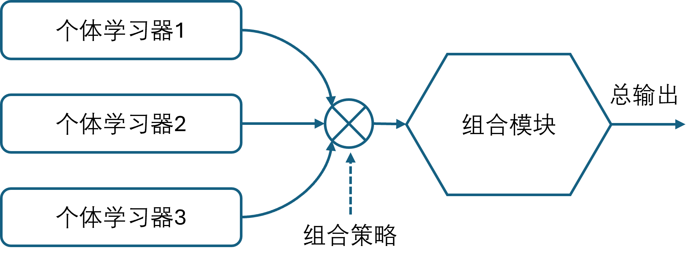
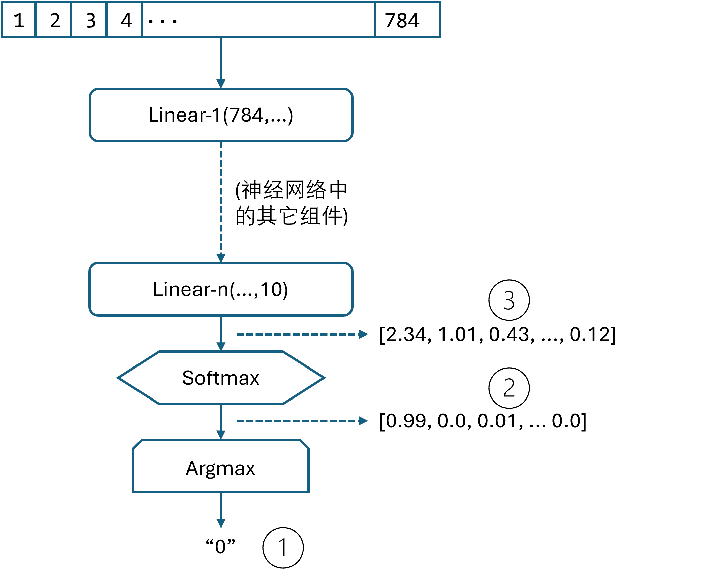

## 12.6 集成学习

当有各种原因（训练数据集有问题，或者网络学习能力不足）造成验证集准确率不高时，我们可以采取集成学习（ensemble learning）的方法来提升性能。说得通俗一些就是“三个臭皮匠顶个诸葛亮”，发挥团队的智慧，根据团队中不同背景、不同能力的成员的独立意见，通过某种决策方法来共同解决一个问题。所以集成学习也称为多分类器系统（multi-classifier system）。

集成学习有两个组件，见图 12.6.1。

- 个体学习器（individual learner）。在传统的机器学习中，个体学习器可以是不同的，比如用决策树、支持向量机等，此时称为异质模式。而在深度学习中都使用神经网路，称为“基学习器”（base learner），相应的学习算法称为“基学习算法”（base learning algorithm）。

- 组合模块（aggregator）。个体学习器的输出，通过一定的策略在组合模块中有机结合在一起，可以形成一个能力较强的学习器，所以有时称为强学习器，而相应地称个体学习器为弱学习器。



图 12.6.1 集成学习的基本概念

个体学习器之间是否存在依赖关系呢？这取决于产生个体学习器的方法。

- 袋装法（bootstrap aggregating，Bagging）：个体学习器可以独立或并行生成，没有依赖关系。它从原始数据集中有回放地随机抽取 $m$ 个样本，形成独立数据集。重复进行 $n$ 次后，形成 $n$ 个独立数据集，用它们训练 $n$ 个模型。但是在神经网络中，这样做并没有帮助，肯定是数据集越大训练的模型越准确。

- 提升（Boosting）系列算法：一系列的个体学习器需要一个个地串行生成，有前后依赖关系，通过调整前一个分类器错分类的样本的权重来训练后续的弱分类器。这种方法不适合于神经网络训练。

- 组合（Stacking）方法：在有了很多弱分类器的基础上，训练一个模型来组合这些弱分类器的输入，形成最终的输出。理论上，这个模型在通用近似定理的支持下，可以覆盖 Bagging 和 Boosting 方法。

### 12.6.1 神经网络中的弱分类器

这一步就是产生“三个臭皮匠”，【代码：H12_6_MNIST_Train.py】训练了三个不同参数的神经网络。第一个“臭皮匠”是 784×64×32×10 的权重矩阵组合，使用 ReLU 激活函数，SGD 优化器：

```python
def build_model1():   # 臭皮匠 1
    model = Sequential(
        layer.Linear(784, 64, init_method="kaiming", optimizer="SGD"),
        activator.Relu(),
        layer.Linear(64, 32, init_method="kaiming", optimizer="SGD"),
        activator.Relu(),
        layer.Linear(32, 10, init_method="kaiming", optimizer="SGD"),
    )
    model.set_classifier_loss_function(layer.SoftmaxCrossEntropy())
```
第二个“臭皮匠”是 784×64×32×16×10 的四层网络，使用 ReLU 激活函数，Adam 优化器：

```python
def build_model2(): # 臭皮匠 2
    model = Sequential(
        layer.Linear(784, 64, init_method="kaiming", optimizer="Adam"),
        activator.Relu(),
        layer.Linear(64, 32, init_method="kaiming", optimizer="Adam"),
        activator.Relu(),
        layer.Linear(32, 16, init_method="kaiming", optimizer="Adam"),
        activator.Relu(),
        layer.Linear(16, 10, init_method="kaiming", optimizer="Adam"),
    )
    model.set_classifier_loss_function(layer.SoftmaxCrossEntropy())
```

第三个“臭皮匠”是 784×64×32×10 的三层网络，参数与第一个相同，但是使用 Tanh 激活函数，SGDM 优化器：

```python
def build_model3():  # 臭皮匠 3
    model = Sequential(
        layer.Linear(784, 64, init_method="xavier", optimizer="Momentum"),
        activator.Tanh(),
        layer.Linear(64, 32, init_method="xavier", optimizer="Momentum"),
        activator.Tanh(),
        layer.Linear(32, 10, init_method="xavier", optimizer="Momentum"),
    )
    model.set_classifier_loss_function(layer.SoftmaxCrossEntropy())
```
训练完毕后用测试集测试，三个模型分别得到 0.9617、0.9572、0.9670 的准确率。
```
模型 model_12_6_SGD - 测试集: loss 0.1516, accu 0.9617
模型 model_12_6_Adam - 测试集: loss 0.1856, accu 0.9572
模型 model_12_6_Momentum - 测试集: loss 0.1236, accu 0.9670
```

### 12.6.2 简单的集成方法

简单的集成方法既 Bagging 有如下几种，这里我们不使用经典机器学习中的算法。

#### 1. 平均法

在回归任务中，输出为一个数值，可以使用平均法来处理多个神经网络的输出值。下面公式中的 $h_i(x)$ 表示第 $i$ 个神经网络的输出，$H(x)$ 表示集成后的输出。

- 简单平均法：所有值加起来除以N。
  $$
  H(x)=\frac{1}{N} \sum_{i=1}^N h_i(x)
  \tag{12.6.1}
  $$

- 加权平均法：给每个输出值一个人为定义的权重。

  $$
  H(x)=\sum_{i=1}^N w_i \cdot h_i(x)
  \tag{12.6.2}
  $$

  权重值如何给出呢？假设第一个神经网络的准确率为 80%，第二个为 85%，我们可以令：$w_1=0.8、w_2=0.85$，这样准确率高的网络会得到较大的权重值。

#### 2. 投票法

对于分类任务，将会从类别标签集合 $\{c_1, c_2, \cdots ,c_n\}$ 中预测出一个值，多个神经网络可能会预测出不一样的值，此时可以采样投票法。

- 绝对多数投票法（majority voting）。当有半数以上的神经网路预测出同一个类别标签时，我们可以认为此预测有效。如果少于半数，则可以认为预测无效。比如 9 个神经网络，5 个预测图片上的数字为 7，则最终结果就是 7。如果有 4 个神经网络预测为 7，3 个预测为 4，2 个预测为 1，则认为预测失败。

- 加权投票法（weighted voting）。与加权平均法类似。

- 相对多数投票法（plurality voting）。即得票最多的标签获胜。如果有多个标签获得相同的票数，随机选一个。

在【代码：H12_6_MNIST_Vote.py】中使用了相对多数投票法，具体过程如下。

(1) 对所有测试样本，用 3 个模型做预测，把测试结果合并成 10000×3 的数组（测试集有 10000 个样本）。
(2) 对每一行检测具体结果，假设三个模型的结果分别为 7、4、7，那么就认为结果为 7。
(3) 如果三个结果为 4、1、7，则采取第三个模型的结果，因为它的准确率最高（96.7%）。

那么就需要一个简单的算法来查找数组中出现次数最多的元素，为方便起见，可以使用一个有趣的函数 `np.bincount()`，它会统计数组中每个数值的出现次数：

```Python
predicts = [7,4,7]
vote_result[i] = np.argmax(np.bincount(predicts), minlength=10)
# [0,0,0,0,1,0,0,2,0,0] -> 7
```
从结果可以看到对于第 7 个位置计数为 2，则分类投票结果为 7。如果三个模型预测结果为 [3,8,2]，则分类结果为 2。对于 10000 个测试样本都做了这种检查，最后得到如下输出：

```
模型 model_12_6_SGD - 测试集: loss 0.1516, accu 0.9617
模型 model_12_6_Adam - 测试集: loss 0.1856, accu 0.9572
模型 model_12_6_Momentum - 测试集: loss 0.1236, accu 0.9670
投票法的结果: 0.9728
```
投票法得到 0.9728 的准确率，比其它三个弱分类器都要好。

### 12.6.3 复杂的集成方法

杂的集成方法即 Stacking 学习法，就是用额外的一个神经网络，通过训练的方式把 3 个神经网路的输出结果作为输入，把图片的真实数字作为标签，得到一个强学习器。一共需要三个步骤，【代码：H12_6_MNIST_Ensemble.py】如下：

```python
if __name__=="__main__":
    generate_feature()    # 1.生成新的特征数据
    train_feature_model() # 2.用新特征数据训练集成模型
    test_feature()        # 3.测试
```

但是用弱分类器的哪个输出做为特征输入是一个需要注意的问题，见图 12.6.2。



图 12.6.2 从弱分类器中抽取特征的方法

#### 1. 生成新的特征数据

在图 12.6.2 中有三个地方可以得到特征输出，说明如下。

（1）用分类值做为输出，比如 0 或者 6 这种数字。这种输出的信息量太小了，假设预测为 0，实际为 6，那么该样本是 $x=0、y=6$，而另外一个正确分类的样本是 $x=0、y=0$，这会让人类都很困惑，就不用说作为强分类器的神经网络了。
（2）用分类概率值做为输出，比如 $[0.99, 0.0, 0.01, ... 0.0]$，这个概率表示分类结果为数字 0，但是由于 0.99 远远大于其它 9 个概率值（有很多值都接近于 0），所以特征不明显，训练效果差。
（3）用最后一层的线性计算结果作为输出，比如 $[2.34, 1.01, 0.43, ..., 0.12]$。这是在做 Softmax 运算前的数值，它要比 Softmax 产生的概率值含有更多的信息，最起码这 10 个数值都在同一个数量级上。

使用（3）这种方法，相当于把 1×784 的向量变成了 1×10 的新特征向量，一共三个弱分类模型，则拼接为 1×30 的新特征向量。对于 MNIST 训练集和测试集都做这样的处理，得到了 60000×30 和 10000×30 两个数据集，前者做为训练集，后者做为测试集。

#### 2. 训练强分类器

然后搭建一个简单的集成模型网络，它有 30×16×10 的权重参数和 Tanh 激活函数，接收 30 个特征，产生 10 个分类。

```python
# 集成模型
def build_model():
    model = Sequential(
        layer.Linear(30, 16, init_method="xavier", optimizer="Adam"),
        activator.Tanh(),
        layer.Linear(16, 10, init_method="xavier", optimizer="Adam"),
    )
    model.set_classifier_loss_function(layer.SoftmaxCrossEntropy())
    return model
```

训练过程很顺利，但是我们不想在这个环节丢失更多信息，所以我们把它的准确率训练到了 0.9920，以下是超参设置：

```python
    lrs = LRScheduler.step_lrs(0.001, 0.99, 5000) # 学习率步进衰减
    params = HyperParameters(max_epoch=50, batch_size=32)
```
#### 3. 测试集成结果

最后一步，使用 `test_feature()` 方法来做测试，它读取步骤 1 中的测试数据，在步骤 2 中训练好的集成模型中做预测，得到输出如下：

```
测试集: loss 0.0928, accu 0.9752
```
得到了 0.9752 的准确率，比投票法的集成结果 0.9728 还要高。不要小看这 0.24% 的提升，对于这个问题在这个水平上来说经很不错了。如果弱分类器是 85% 的准确率水平，那么集成学习就需要提高至少 5% 才算合格。
