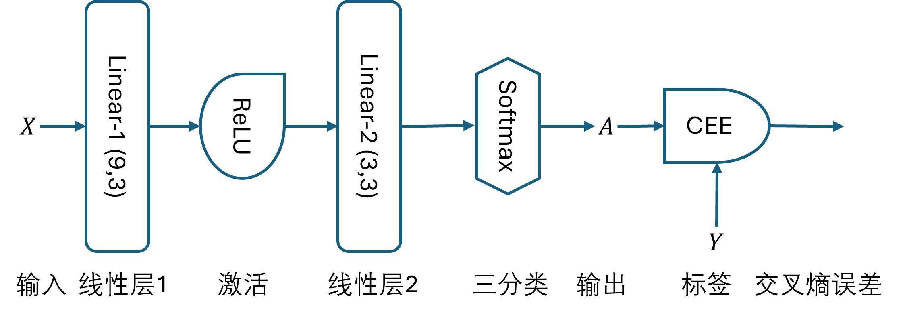
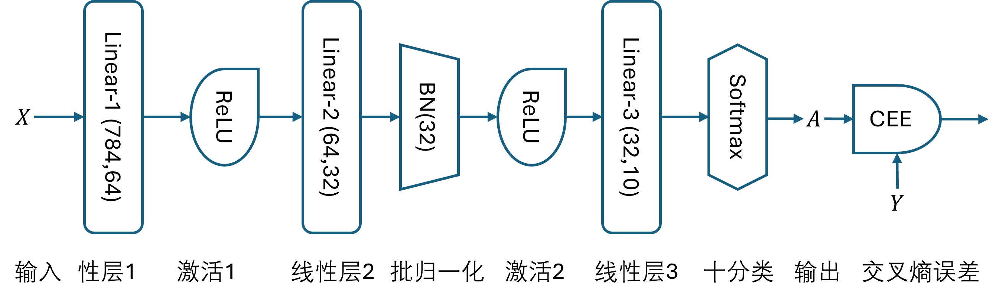
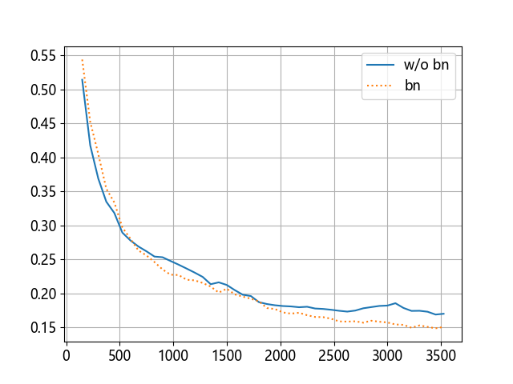
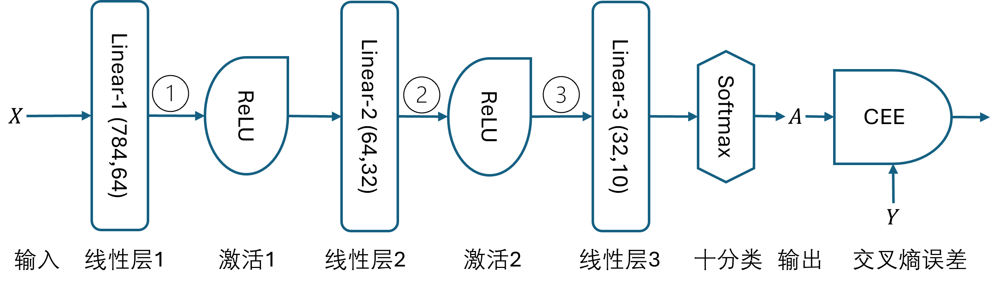
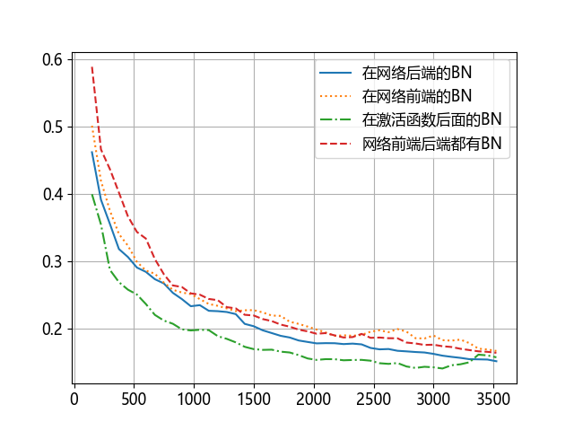
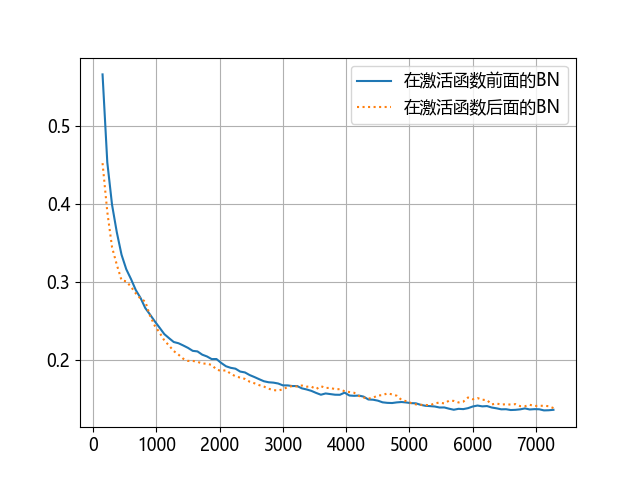

## 12.9 批量归一化的应用

图 12.9.1 第 12.3 节中的网络结构

图 12.9.2 增加了 BN 层的网络结构

图 12.9.3 比较有无 BN 层的损失函数变化曲线

### 12.9.1 BN 层的位置

图 12.9.4 BN 层的位置

图 12.9.5 四种方案的比较

图 12.9.6 比较 BN 层放在激活函数前或后的方案

### 12.9.2 测试和推理时的归一化方法

### 12.9.3 小结
