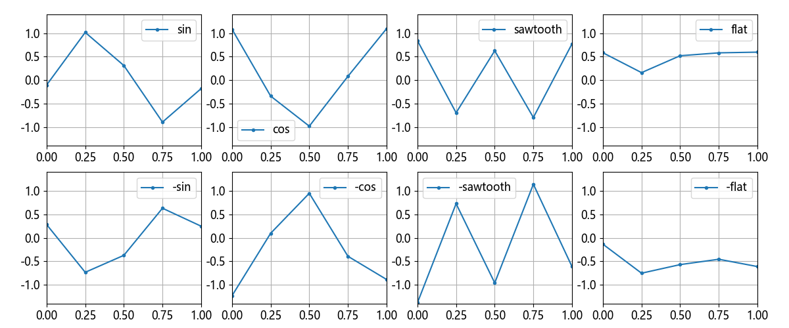

## 13.1 音频信号识别问题

在董大白居住的小区里比较热闹，经常会有一些声音从窗户飘进来，有的是唱歌弹琴的乐音，有的是装修、争吵的噪音，还有一些机器设备工作时产生的有规律的震动。董大白对此比较敏感，所以在网上买了一个高科技产品，吸附在窗户玻璃上。它可以监测玻璃震动，并产生相位相反的声波，以此来抑制噪音。这个产品很贵，而且处于试验阶段，工作效果很不尽如人意。所以，董大白想自己研究一下它的工作原理，看看是否可以给厂商提供改进意见。

第一步就是要进行声音采样。经过了十几天的采样，董大白用计算机+声卡+麦克风+录音软件的一套装置，采集了上百个样本，并统一裁剪成 1 豪秒长度。部分样本的数据如表 13.1.1 所示。

表 13.1.1 部分声音样本数据

|样本|采样点1|采样点2|采样点3|采样点4|采样点5|类别|
|-|-|-|-|-|-|-|
|1|-0.22241|1.29659|-0.23462|-0.66511|-0.00927|0|
|2|0.77759|0.29659|-1.23462|0.33489|0.99073|1|
|3|0.77759|-0.70341|0.76538|-0.66511|0.99073|2|
|4|0.27759|0.79659|0.26538|0.83489|0.49073|3|
|5|0.22241|-1.29659|0.23462|0.66511|0.00927|4|
|6|-0.77759|-0.29659|1.23462|-0.33489|-0.99073|5|
|7|-0.66459|0.80925|-0.95305|1.27335|-1.30395|6|
|8|-0.30100|-0.87193|-0.60541|-0.75333|-0.55287|7|

第二步，董大白想根据这些样本训练出一个神经网络，来预测在实际使用时检测到的音波类别。

**问题：由于是要运行在一个非常小的电子设备上，所以要求参数尽量少，董大白应该如何设计这个神经网络？**

### 问题分析

表 13.1.1 中的样本数据与以往的数据有些不同：它具有 5 个特征值，但是这些特征值是有顺序的，使用时不能打乱顺序。与此类似的是第 12 章中的 MNIST 数据扁平化以后的 1×784 的向量，这 784 个特征的顺序不能被打乱。

由于数据是一维的，可以很方便地可视化，绘制在图 13.1.1 中。



图 13.1.1 音频样本数据可视化

图中展示了所有 8 个类别的一个样本，上下两排是颠倒的关系，比如左上角的是 $\sin(x)$ 的图像，它的下面是 $-\sin(x)$ 的图像。第二个是 $\cos(x)$ 图像，第三个是锯齿波，第四个是持续的水平线，但是都带有一定的噪音。

读者可能会有疑问：5 个特征值能区分出 8 个类别吗？可以的！假设特征值都是 0、1 的数值，那么 $2^5=32$，即 5 个特征值可以表示 32 个类别，况且这些特征值是大约在 $[-1,1]$ 区间内的连续值。**理论上如果只有一个特征值并且它的数值有很强的代表性的话（比如处于不同的数值区间段），就可以分出很多类别。**

这个样本包含有训练集和测试集两个文件，在【数据：data.train13_1.txt】和【数据：data.test13_1.txt】中，所以在【代码：common.DataLoader_13.py】中需要稍微改动一下，增加测试集数据的路径：

```python
class DataLoader_13(object):
    def __init__(self, train_file_path, test_file_path):
        self.train_file_path = train_file_path  # 训练集
        self.test_file_path = test_file_path    # 测试集
```
下面是训练集数据统计信息：
```
--- X (1600) ---                --- Y (1600) ---
最大值: 1.39881                 最大值: 7.0
最小值: -1.39881                最小值: 0.0
均值: 8.881784197001253e-19     分类标签: [0 1 2 3 4 5 6 7]
标准差: 0.7817130258459942
```
验证集有 400 个样本，其他信息与训练集差不多。
