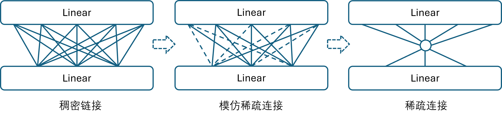

## 13.2 用线性网络解决问题

先解释一下为什么要研究如何用线性网络解决这个问题。

- 温故知新，巩固线性网络知识，认识线性网络能力。在本问题中，笔者一开始认为至少应该用一个有激活函数的双层非线性分类神经网络才能解决，经过试验后感觉网络过于轻松地就能达到 100% 的准确率（当然主要原因是问题本身比较简单），然后忽然想到用单层的线性网络尝试一下。这才重新认识了线性网络的能力，非常强悍！或者解释为“全连接层（full connection，FC）非常强悍”！

- 进一步用两层线性网络（之间没有激活函数）来减少参数个数的问题纯属一时兴起，但是结果确令笔者眼界大开。13.2.2 节中的 5-2-8 的网络结构不但使得参数量大大减少，而且改变了“多层线性网络的叠加是没有用的”这种固执的概念。其实，如果在生成数据时的噪音给的小一些：

  ```python
    noise = np.random.uniform(low=-0.4, high=0.4, size=(count,len(x)))
    #noise = np.random.uniform(low=-0.1, high=0.1, size=(count,len(x)))
  ```
  在【代码：H13_1_DataGenerator.py】中把上面一行代码改成下面的代码，使用 5×1 连接 1×8 的全连接层网络结构都可以。这也印证了笔者在 13.1 节中的一句话：**理论上如果只有一个特征值并且它的数值有很强的代表性的话（比如处于不同的数值区间段），就可以分出很多类别。**

- 线性网络是卷积网络的基础，尤其是在一维的卷积网络中，二者更是相似。在后面的学习中，读者可以把一维卷积网络看作是共享参数的“分段线性网络”。

- 引入了稀疏连接的概念，如图 13.2.1 所示。左侧子图绘制了一个 5×3 的全连接结构，由两个相邻的 Linear 层组成。中间的子图用 Dropout 层连接了两个 Linear 层，通过随机丢弃来模仿稀疏连接，提高泛化能力，而实际的参数量没有减少。右侧子图是真正的稀疏连接，参数量大大减少，在后面要学习的复杂网络中更是如此。



图 13.2.1 从稠密连接到稀疏连接

通常我们把 Linear 层也称作 FC，在卷积网络中主要用于后期的分类。如果有两个 FC 层相邻，必然会产生全连接结构，由此带来大量的参数。在后续要学习的二维卷积网络中，如何减少 FC 的出现是一个重要的话题。


### 13.2.1 单层线性网络

对于这个分类问题，由于特征值较少，所以我们采用一个单层的线性多分类网络即可解决，如图 13.2.2 所示。


图 13.2.2 单层线性网络

由于输入的特征数为 5，输出的类别数为 8，所以用一个 5×8 的线性层做转换，把特征做线性运算后直接送给多分类函数 Softmax，并使用多分类交叉熵作为损失函数。【代码：H13_2_NN_Linear_1.py】中建立模型的函数如下：

```python
def build_model():
    model = Sequential(
        layer.Linear(5, 8, init_method="normal", optimizer="Adam"),
    )
    model.set_classifier_loss_function(layer.SoftmaxCrossEntropy())
    return model
```
训练的超参如下：
```python
params = HyperParameters(max_epoch=10, batch_size=32, learning_rate=0.1)
```
训练过程很快就完成了，在测试集上得到 100% 的准确率：
```
...
轮数 9, 迭代 400, 训练集: loss 0.003167, accu 1.0000, 验证集: loss 0.003951, accu 1.0000
测试集: loss 0.003132, accu 1.0000
```
### 13.2.2 单层线性网络的结果分析

我们把单层线性网络的 5×8 的参数输出如下：
```
  0      1     2     3     4     5     6     7  
W---------------------------------------------------
[[-0.06  2.19  2.29  2.07 -0.41 -3.31 -2.19 -2.41]
 [ 3.55  0.21 -1.25  2.77 -3.58  0.25  3.05 -2.75]
 [-0.88 -4.96  2.54  2.09 -0.69  3.45 -2.38 -4.06]
 [-2.93  0.82 -0.97  3.45  4.27  0.92  2.84 -2.02]
 [ 0.28  1.99  1.09  1.38  0.68 -0.72 -1.36 -0.7 ]]
B---------------------------------------------------
 [ 0.47 -0.18 -1.35  1.37  0.56 -0.39 -1.40  1.12]
```
从这些数字中能看出什么信息呢？单独看是看不出什么规律的，但是如果结合图 13.1.1 就可以看出明显的规律来，如图 13.2.3 所示，我们把上面的权重按列分开成 8 组，每一组对应一类样本。而每组的 5 个权重值对应图 13.2.3 图中 5 个样本特征点。


图 13.2.3 单层线性网络的结果参数分析

我们把**权重参数值**标在了它所对应的特征值点的附近（注意图中的数字不是样本特征值），以左上角的 $\sin(x)$ 数据为例，说明如下。

- 第一个特征为 -0.1，其对应的权重参数为 -0.06，$(-0.1) \times (-0.06) + 0.47=0.476$。
- 第二个特征约为 1，其对应的权重参数为 3.55，$1 \times 3.55 + 0.47=4.02$。
- 第三个特征约为 0.3，其对应的权重参数为 -0.88，$0.3 \times (-0.88) + 0.47=0.206$。
- 第四个特征约为 -1 左右，其对应的权重参数为 -3.57，$(-1) \times (-3.57) + 0.47=4.04$。
- 第五个特征约为 -0.2，其对应的权重参数为 0.28，$(-0.2) \times 0.28 + 0.47=0.414$。

也就是说，对于类别 0 的样本来说，在与特征值对应的权重分量相乘后，**所有的值都大于 0**。而当其它类别的样本与这个权重分量相乘时，由于特征值数值、符号与权重值不匹配，很有可能是负数或者比较小的正数。比如下面这个例子：

```
#类别：  0        1       2       3     4        5       6        7
array([ 11.13,   1.55,  -2.1 ,  -1.36, -11.84,  -4.08,  -1.47,   2.21])
```

这是一个 $sin(x)$ 类别 0 的样本与 5×8 的权重矩阵相乘后得到的结果，可以看到其数值 11.13 为 8 个数中的最大值；而类别 4 是 $-sin(x)$ 样本的乘积，为 -11.84，因为它与 $sin(x)$ 的特征正好相反，所以结果最小。所以，结论是得到的权重矩阵的每一列参数与对应类别的样本特征值做 $\mathbf x \mathbf w+b$ 的运算后都会得到较大的正数，因此很容易分类，相当于 $\mathbf x$ 和 $\mathbf w$ 两个向量的余弦相似度值很大，夹角很小，方向一致。

### 13.2.3 双层线性网络

在单层线性网络中的参数数量为 $5×8=40$ 个（忽略偏置值），能不能用更少的参数呢？输入为 5，输出为 8，这都已经是极限了，如何能再减少呢？在 13.1 节中我们曾经说过：**理论上如果只有一个特征值并且它的数值有很强的代表性的话（比如处于不同的数值区间段），就可以分出很多类别。** 所以我们用图 13.2.4 所示的网络来做一个测试。


图 13.2.4 双层线性网络（一）

在这个网络中，第一层使用了 5×1 的权重矩阵，把原始的 5 个特征值变成了 1 个新特征值，然后**不需要激活函数**，直接连接一个 1×8 的线性层，其目的是为了后续的 Softmax 可以得到 8 组输入。由于数据噪音较大，所以最后只得到了约 60% 的准确率。所以我们放宽条件，使用图 13.2.5 所示的网络做尝试。


图 13.2.5 双层线性网络（二）

与图 13.2.4 的网络的区别是，这里在第一层使用了 5×2 的权重矩阵把 5 个特征值变成了 2 个新特征值，然后接 2×8 的线性层。【代码：H13_2_NN_Linear_2.py】模型定义如下：

```python
def build_model():
    model = Sequential(
        layer.Linear(5, 2, init_method="normal", optimizer="Adam"),
        layer.Linear(2, 8, init_method="normal", optimizer="Adam"),
    )
    model.set_classifier_loss_function(layer.SoftmaxCrossEntropy())
    return model
```
训练所用超参如下：

```python
params = HyperParameters(max_epoch=200, batch_size=32, learning_rate=0.1)
```
最后得到输出结果：
```
...
轮数 199, 迭代 8000, 训练集: loss 0.033880, accu 0.9688, 验证集: loss 0.004225, accu 1.0000
测试集: loss 0.005351, accu 1.0000
```
在测试集上的准确率为 100%。注意，图 13.2.5 这个网络的参数数量为 $5×2+2×8=26$，比图 13.2.2 的网络的 40 个参数量要少很多。

### 13.2.4 双层线性网络的结果分析

在双层线性网络的测试时，我们可以用 debug 方式得到它的线性层 1 的输出。由于测试集一共有 400 个样本，8 个类别的第一个样本数据分别位于 0、50、100、150、200、250、300、350 位置，所以把这 8 个代表性样本在线性层 1 的二维特征输出值打印出来：
```
类别  线性层1的二维特征输出
0  [[  2.35612061,   4.74392143],
1   [  8.18398112, -15.18221539],
2   [ 17.45715731,   7.40147099],
3   [  9.86089654,  -3.13552815],
4   [ -2.37982461,  -5.38946543],
5   [ -8.20768512,  14.53667139],
6   [-17.48086131,  -8.04701499],
7   [ -9.88460054,   2.48998415]]
```
由于是 8 组二维数据，很容易绘制在图 13.2.6 中：


图 13.2.6 双层线性网络的线性层1的输出结果分析

可以看到，线性层 1 完成了非常漂亮的工作，把 8 组类别的样本分到了 8 个方向上，并且基本为中心对称，那么后续的分类任务就非常简单了。线性层 2 的权重参数为 2×8，我们把它们分成 8 组绘制在二维平面上，如图 13.2.7 所示。


图 13.2.7 双层线性网络的线性层2的权重参数分析

可以看到这些权重参数所形成的 8 个向量与图 13.2.6 所示的 8 个类别基本同向，当图 13.2.6 中的某个点与图 13.2.7 中的相同类别的向量 $\mathbf w$ 相乘后，很容易得到一个很大的值，在 Softmax 分类时就会的到很高的概率值。
