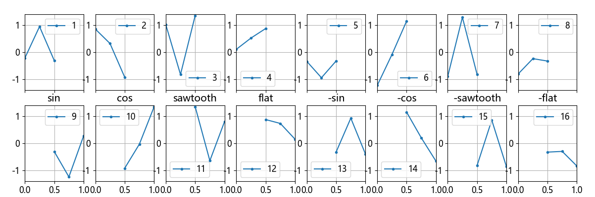
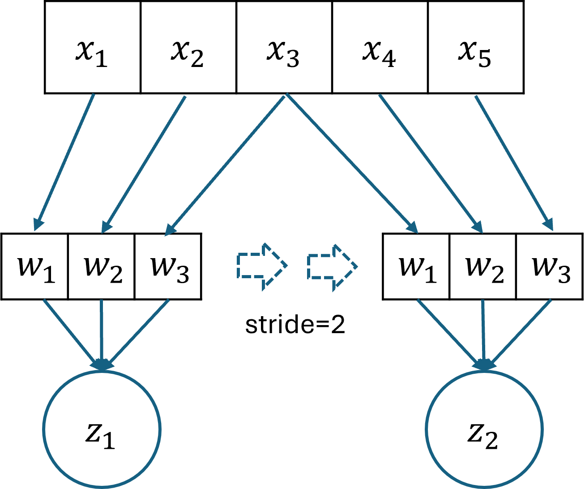
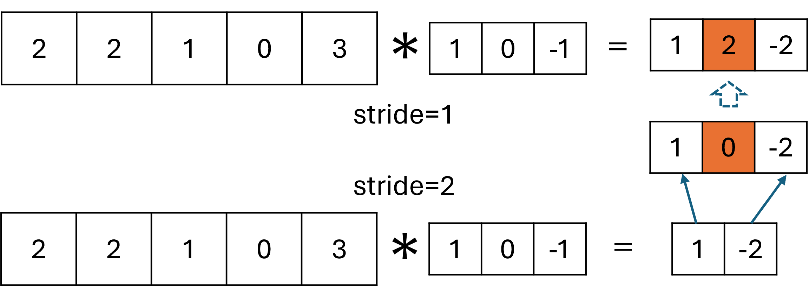
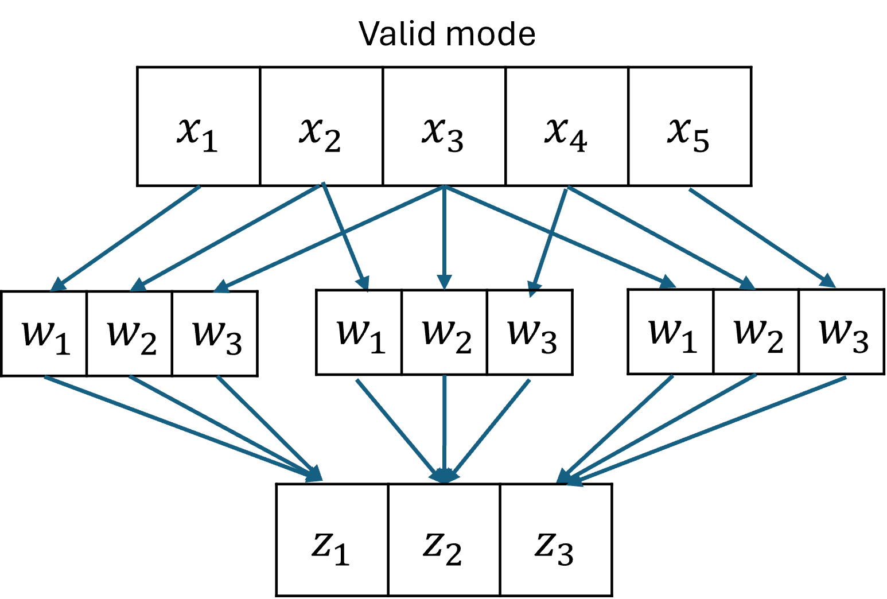
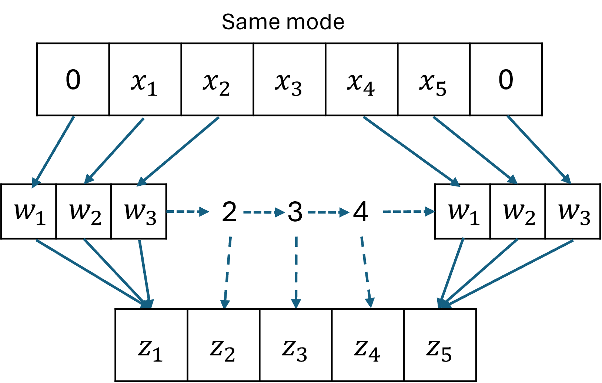
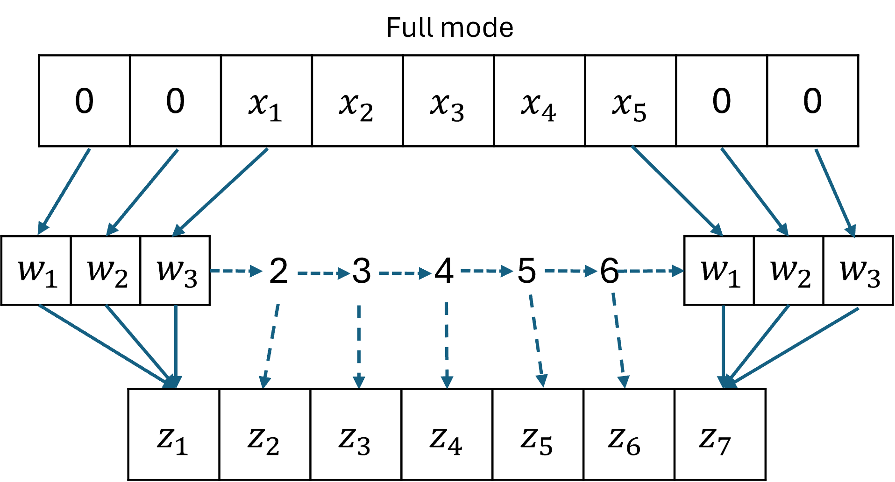

## 13.4 一维卷积的参数

图 13.4.1 音频样本数据可视化

图 13.4.2 五个特征值中的前三个特征值和后三个特征值

### 13.4.1 卷积核的宽度和步长

图 13.4.3 卷积核宽度为 3 步长为 2 的卷积操作

### 13.4.2 步长为 2 时的前向计算

图 11.4.3 步长为 1 和 2 时的卷积结果的差别

### 13.4.3 步长为 2 时的反向传播

### 13.4.4 搭建并训练网络

### 13.4.5 卷积模式与填充

图 11.4.4 不需要填充（valid mode）

图 11.4.5 卷积核宽度为 3 时两边各填充一个 0（same mode）

图 11.4.6 卷积核宽度为 3 时两边各填充两个 0（full mode）
