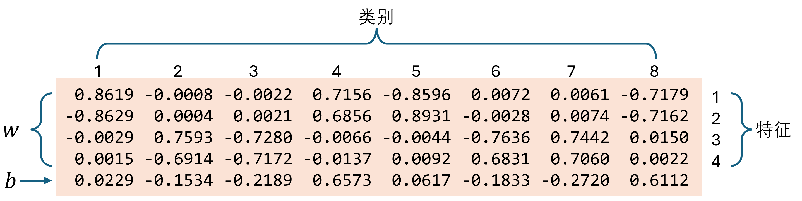

## 13.6 用多个卷积核解决问题

### 13.6.1 使用两个输出通道

图 13.6.1 针对本章的例子的卷积网络

图 13.6.2 新特征的形成过程

### 13.6.2 训练网络

### 13.6.3 增加 $L_1$ 正则

图 13.6.3 权重参数的具体含义

图 13.6.4 卷积得到的特征对分类的贡献

图 13.6.5 各类别的样本卷积输出特征与后续的线性层向量

### 13.6.4 卷积核可以识别的样本上下限【电子资源】

为了进一步搞清楚卷积核是如何工作的，我们做一个样本匹配试验。

（1）在 $[-1,1]$ 之间平分 10 份得到 10 个值，对 5 个特征值分别取 10 个值中的一个，形成 $10^5$ 种组合（即样本数量）。
（2）然后把这些样本在训练好的网络上做一次推理，得到它们的分类结果。
（3）针对每个输出类别，分别找出得分最高和得分最低的样本，并计算所有该类样本的平均特征值，把它们绘制在图 13.6.6 中。

运行【代码：H13_6_2_NN_Test_L1.py】可以得到彩色图。

图 13.6.6 卷积核所能识别的各类样本的最优、平均、最差特征组合

以左上角的 sin 类别为例：

- "high" 表示这个样本分类值最高，比如 0.99；
- "low" 表示这个样本分类值最低，但仍属于本分类，比如 0.42（其它 7 类的分类值都是 0.1、0.2 之类的）；
- "mean" 表示所有该类样本的特征均值。

可以看到，"mean" 特征形态基本符合 sin 图像，但是幅度略小。得分最高的蓝色线 "high" 的第一个点和最后一个点不在 0 值上。得分最低的 "low" 的前半段过于平缓。结合图 13.6.7 两个卷积核的形态，也许就可以理解上述现象了。

图 13.6.7 两个卷积核的形态

左侧的第一个卷积核主要负责 1、4、5、8 类别，sin 是第一类别。该卷积核的中间点值很大，意味着突出五个特征中的第 2、4 个特征（因为步长为 2），只要这两个特征符合 sin 或 -sin 的形态即可正确分类。而对于第 1、5 三个特征，只要它们分别是正数或负数即可。对于第 3 个特征比较模糊。

右侧的第二个卷积核，由于要兼顾 2、3、6、7 四个类别，所以它把 cos、-cos 的第一个特征“魔鬼化”了，很像锯齿形类别，这就提示我们也许**应该用三个卷积核来完成任务**，因为 cos 和 sawtooth 实在是相差太远了。

### 13.6.5 使用三个输出通道【电子资源】

在设置输出通道为 3 后，运行【代码：H13_6_3_NN_Conv.py】重新训练网络，得到的线性层权重值如表 13.6.3 所示。

表 13.6.3 线性层的稀疏权重值（保留小数点后两位）

|类别 $\to$|1(sin)|2(cos)|3(saw)|4(flat)|5(-sin)|6(-cos)|7(-saw)|8(-flat)|
|-|-|-|-|-|-|-|-|-|
|filter-1:$z_1$|0|0.71|0|0|0|-0.74|0|0|
|filter-1:$z_2$|0|-0.92|0|0|0|0.88|0|0|
|filter-2:$z_3$|0|0|0|0.88|0|0|0|-0.86|
|filter-2:$z_4$|0|0|0|0.79|0|0|0|-0.85|
|filter-3:$z_5$|1.03|0|-0.61|0|-0.97|0|0.70|0|
|filter-3:$z_6$|-1.05|0|-0.77|0|0.98|0|0.66|0|

根据表 13.6.3，我们可以得到每个 filter 所选中的类别：
- filter-1，负责 2、6 两类，即 cos 和 -cos；
- filter-2，负责 4、8 两类，即 flat 和 -flat；
- filter-3，负责 1、3、5、7 四类，即 sin, -sin 以及锯齿波。

这种分工就比较合理，因为 1、3、5、7 四类确实很像。2、6 和其它都不一样，4、8 也是如此。

图 13.6.8 是三个卷积核的形状，同样可以看到：卷积核 1 负责 cos 很合理；卷积核 3 负责 sin 和锯齿波也很合理；卷积核 2 对 flat 类别稍微有点儿“误解”，但总体的起伏程度比其它两者要小很多，基本算作是 "flat"。因此得到的结论是：**卷积核的形状与原始数据的特征区域的形状吻合**。

图 13.6.8 三个卷积核的形状

也许有的读者不解：第一个和第三个卷积核的形状只是 cos 和 sin 的前半部分特征，与后半部分特征不符，而且正好相反。答案是：这就要依靠全连接层了，只要对应的权重值正号变负号，那么二者就吻合了。

图 13.6.9 是改进后的拥有三个卷积核的网络所“青睐”的样本形状：

- 如果从蓝色的最优样本看，它完全符合我们的原始样本的定义；
- 而其虚线所代表的平均特征与带噪音的原始样本也很近似；
- 而绿色的最差样本（本类别的下限），就属于灰色地带了。比如 -sin 和 -cos 两张子图中的绿色样本，唯一的区别似乎在于 -sin 的第一个特征值比 -cos 稍微大一些。

运行【代码：H13_6_3_NN_Test.py】可以得到彩色图。

图 13.6.9 卷积核所能识别的各类样本的最优、平均、最差特征组合

