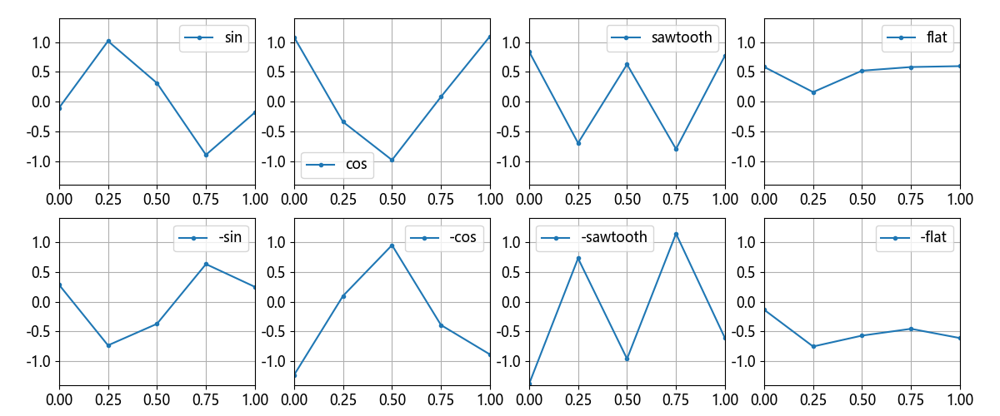

## 13.7 一维池化的概念

### 13.7.1 提高问题难度

图 13.7.1 八类样本合并标签值变为四类

### 13.7.2 原因分析

图 13.7.2 一个宽度为 3 步长为 2 的卷积核识别正弦折线的前后两个特征

图 13.7.3 一个步长为 2 的卷积核对同一类样本的两个实例卷积得到两组不同的特征

图 13.7.4 在图 13.7.3 的基础上增加最大池化后的结果

### 13.7.3 引入池化层

图 13.7.5 最大池化的几个例子

图 13.7.6 平均池化的几个例子
