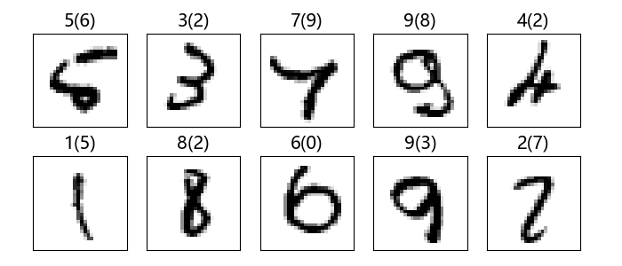
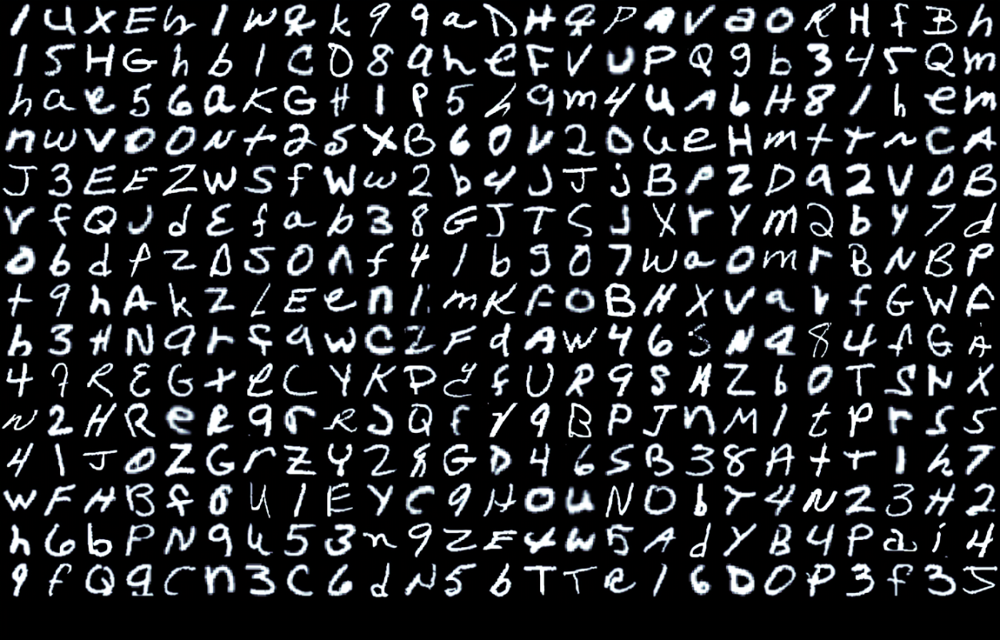
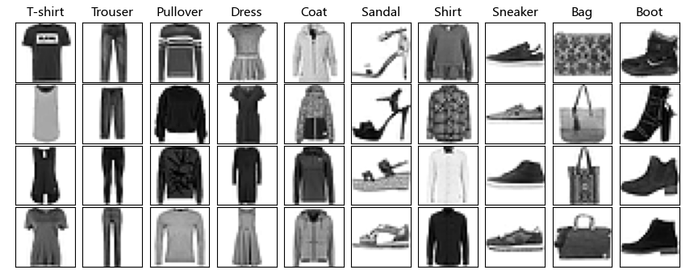
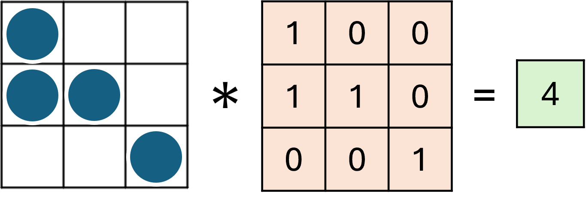
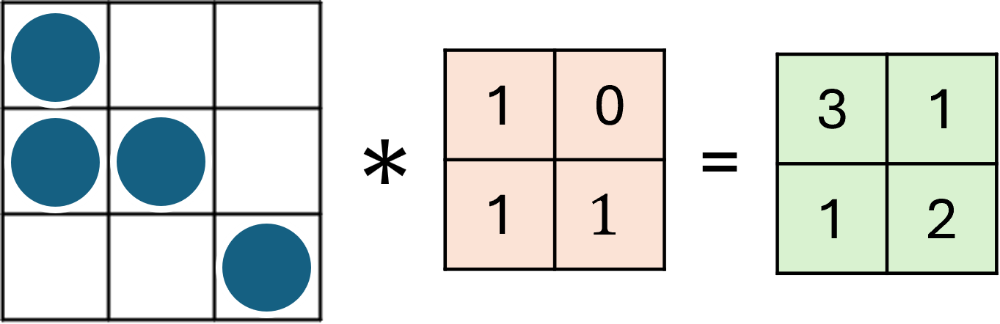
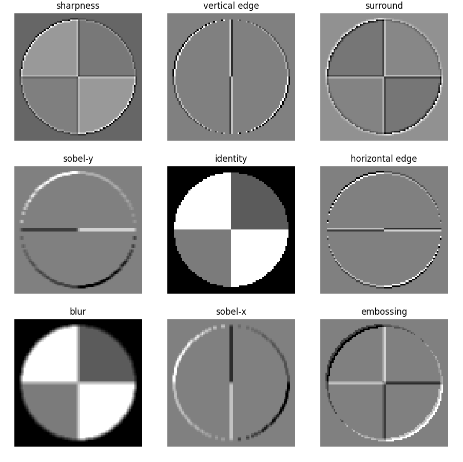

## 14.1 手写字母识别问题

还记得第 12 章中的问题吗？董大白的办公楼有个机器人负责送快递，需要识别的门牌号如图 14.1.1 所示。


图 14.1.1 门牌示例

但是，机器人有比较小的概率会识别错误，董大白就因此收到了好几次别的房间的快递，比如 0514、6210 等房间，猜想是以下几组数字的手写体比较难以辨认，如 [0,6]、[5,2]、[4,9]、[9,0] 等。我们也曾统计过经常被识别错误的一些图片，如图 14.1.2 所示。



图 14.1.2 测试集中识别错误的前 10 张图片

所以，公司想提高机器人识别数字的准确率。另外，公司也想给机器人增加识别字母和一般的时尚类物体的能力，比如表 14.1.1 中的两个数据集中的例子，具体的解释在后面相关小节中给出。

表 14.1.1 Ext-MNIST 和 Fashion-MNIST 数据集

|Ext-MNIST|Fashion-MNIST|
|-|-|
|||

既然在第 13 章中已经解决了一维卷积的问题，使得居室的噪音大大降低，董大白有信心研究二维卷积网络，来为公司解决这个问题。

### 二维卷积与图像

在第 13 章的一维卷积中，我们学习了一个宽度为 3 的一维卷积核是怎样完成任务的。在本章中我们将使用二维卷积核来处理图像。卷积网络之所以能工作，完全是卷积核的功劳，而二维卷积核其实就是一个小矩阵，类似这样：

```
1.1  0.23  -0.45
0.1  -2.1   1.24
0.74 -1.32  0.01
```

这是一个 3×3 的卷积核，还会有 1×1、5×5、7×7、9×9 的卷积核，当然也可以是偶数的宽带和高度，或者高和宽不相等。在卷积层中，我们用输入数据与卷积核相乘，得到输出数据，就类似全连接层中的权重一样，所以卷积核里的数值，也是通过反向传播的方法学习到的。

下面我们看看卷积核的具体作用。在图 14.1.3 中，有一个 3×3 的点阵图像（圆点表示 1，空白格子表示 0），我们使用一个 3×3 的卷积核（由 0、1 二值组成）去做一次卷积运算（对位相乘求和）得到结果为 4，并且可知这是卷积核所有可能的值组合中可以得到的最大卷积结果。虽然卷积核为全 1 时可以得到相同的卷积结果，但是没有意义。



图 14.1.3 卷积核的全视野

但是图片一般都比较大，而且会比较复杂，包含多种特征，所以不可能让卷积核的尺寸于图像的尺寸相同。卷积核一般都比较小，能发现局部图案的前提是卷积核的视野（reveptive field）和目标图案的大小一致，如图 14.1.4 的例子。



图 14.1.4 卷积核的局部视野

2×2 的卷积核去做四次卷积运算。从卷积结果中可以看到，左上角的数值为 3，而其他几个值较小，说明卷积核在原始图片的左上角发现了一个 L 形的图案。因此，我们通常使用卷积核来**发现局部细节特征**，有些特征甚至是人类无法理解的特征。

图 14.1.5 中是使用 9 个不同的 3×3 卷积核在同一张图上运算后得到的结果。



图 14.1.5 卷积核的作用

表 14.1.1 中按位置顺序列出了 9 个卷积核的数值和名称，可以一一对应到图 14.1.5 的 9 张子图中。

表 14.1.1 卷积的效果

||1|2|3|
|---|---|---|---|
|**1**|sharpness<br>0, -1, 0<br>-1, 5,-1<br>0, -1, 0|vertical edge<br>0, 0,  0<br> -1,2,-1 <br> 0, 0, 0|surround<br>1, 1, 1 <br> 1,-9, 1 <br> 1, 1, 1|
|**2**|sobel-y<br>-1,-2, -1 <br> 0, 0, 0<br>1, 2, 1|identity<br>0, 0, 0 <br> 0, 1, 0 <br> 0, 0, 0|horizontal edge<br>0,-1, 0 <br> 0, 2, 0 <br> 0,-1, 0|
|**3**|blur<br>0.11,0.11,0.11<br>0.11,0.11,0.11<br>0.11,0.11,0.11|sobel-x<br>-1, 0, 1 <br> -2, 0, 2 <br> -1, 0, 1|embossing<br>2, 0, 0 <br> 0,-1, 0 <br> 0, 0,-1|

我们先说中间那个图，就是第 5 个卷积核，叫做 identity，因为这个卷积核在与原始图片计算后得到的结果，和原始图片一模一样，所以我们看到的子图 5 就是相当于原始图片，放在中间是为了方便和其它卷积核的效果做对比。表 14.1.2 说明 9 个卷积核的作用。

表 14.1.2 各个卷积核的中文名称及其作用

|序号|英文名称|中文名称|说明|
|---|---|---|-|
|1|sharpness|锐化|如果一个像素点比周围像素点亮，则此算子会令其更亮|
|2|vertical edge|检测竖边|检测出了十字线中的竖线，由于是左侧和右侧分别检查一次，所以得到两条颜色不一样的竖线。|
|3|surround|周边|把周边增强，把同色的区域变弱，形成大色块。|
|4|sobel-y|Sobel<br>纵向算子|纵向亮度差分可以检测出横边，与横边检测不同的是，它可以使得两条横线具有相同的颜色，具有分割线的效果。|
|5|identity|相等|中心为1四周为0的过滤器，卷积后与原图相同。|
|6|horizontal edge|横边检测|检测出了十字线中的横线，由于是上侧和下侧分别检查一次，所以得到两条颜色不一样的横线。|
|7|blur|模糊|通过把周围的点做平均值计算而“杀富济贫”造成模糊效果。|
|8|sobel-x|Sobel<br>横向算子|横向亮度差分可以检测出竖边，与竖边检测不同的是，它可以使得两条竖线具有相同的颜色，具有分割线的效果。|
|9|embossing|浮雕|形成大理石浮雕般的效果。|
