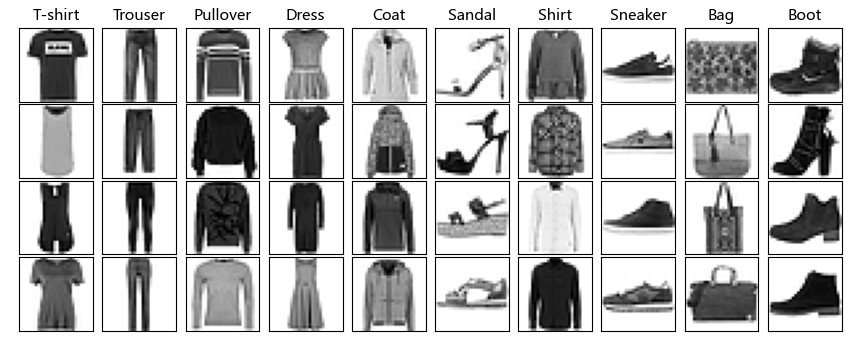

## 14.10 识别单色图片

在本节中我们将以 Fashion-MNIST 数据集作为目标来完成分类任务，并介绍著名的 AlexNet 网络。

### 14.10.1 认识 Fashion-MNIST 数据集

Fashion-MNIST 是一个替代 MNIST 手写数字集的图像数据集。它是由 Zalando（一家德国的时尚科技公司）旗下的研究部门提供。其涵盖了来自 10 种类别的共 7 万个不同商品的正面图片。Fashion-MNIST 的大小、格式和训练集/测试集划分与原始的 MNIST 完全一致。60000/10000 的训练测试数据划分，28×28 的灰度图片，所以在 MNIST 训练代码的基础上，可以直接用它来训练、测试你的机器学习和深度学习算法性能。

图 14.10.1 是部分样本展示，十个类别分别是：T-Shirt（T恤衫）、Trouser（裤子）、Pullover（套头衫）、Dress（连衣裙）、Coat（外套）、Sandal（凉鞋）、Shirt（衬衫）、Sneaker（运动鞋）、Bag（包）、Ankle Boot（短靴）。



图 14.10.1 十类样本的部分图片

以下是它所包含的四个文件如下。

- train-imgages-idx3-ubyte：包含 60000 个训练样本的数据文件。
- train-labels-idx1-ubyte：包含 60000 个训练标签的数据文件。
- t10k-imgages-idx3-ubyte：包含 10000 个测试样本的数据文件。
- t10k-labels-idx1-ubyte：包含 10000 个测试标签的数据文件。

由于文件较大，请读者自行下载后按上述文件名放在`{your_local_git}/data/FashionMNIST/` 目录下。以下是统计信息：

```
---- 训练集 ----
--- × (60000, 1, 28, 28) ---        --- Y (60000, 1) ---
最大值: 255.0                       最大值: 9.0
最小值: 0.0                         最小值: 0.0
均值: 72.9403                       分类值: [0. 1. 2. 3. 4. 5. 6. 7. 8. 9.]
标准差: 90.0211

---- 测试集 ----
--- × (10000, 1, 28, 28) ---        --- Y (10000, 1) ---
最大值: 255.0                       最大值: 9.0
最小值: 0.0                         最小值: 0.0
均值: 73.1465                       分类值: [0. 1. 2. 3. 4. 5. 6. 7. 8. 9.]
标准差: 89.8732
```

### 14.10.2 线条与轮廓的区别

在 14.8 节中的 LeNet-5 网络在处理 EMNIST 的二十六分类问题时可以得到 93% 的准确率，但是在这里的十个分类中只能有 89% 的准确率。这二者的样本都可以看作是“形状”，但是 EMNIST 手写体字母因为笔划比较细，算是“线条”，而 Fashion-MNIST 里面的物品算是“轮廓”。对线条很容易抽取出骨架（skeleton）来，而轮廓包括外面的形状，里面可能还有纹理（texture），没有骨架。所以，识别轮廓需要更多的特征抽取。

比如在图 14.10.1 中很容易混淆的类别如下：

- T-Shirt 和 Dress，二者都没有袖子，区别是前者比后者要宽大一些，因为后者主要是女性穿着。这相当于是要区别一个矩形和一个正方形；
- Pullover 和 Coat，二者都有袖子，但是后者有拉锁，拉索表现为一条很色的线条，需要卷积核把它找到。这相当于图 14.10.2 的例子；
- Shirt 在没有袖子时可能和 T-Shirt 混淆，在有袖子时又与 Coat 分不清楚；
- 一双有花纹的轻便 Sneaker 很可能与设计得厚重一些的 Sandal 区分不开。

比如图 14.10.2，与 14.6 节中的形状识别样本相比，多了两类样本，一个是方形中间有一些洞用来模拟一些镂空或纹理图案；另一个是圆形中间有一个十字，来模拟 Fashion-MNIST 样本中 Coat 的拉链。此时 14.6 节的卷积核就不能胜任了，因为它只能提取斜向的边角特征，对于水平、垂直的像素点无效。


图 14.10.2 从两类样本稍加变化成为四类样本

### 14.10.3 认识 AlexNet 网络

AlexNet 是在 2012 年 ImageNet 图像分类竞赛中提出的一种经典的卷积神经网络，取得了优异的成绩，把深度学习模型在比赛中的正确率提升到一个前所未有的高度。因此，它的出现对深度学习发展具有里程碑式的意义。图 14.10.3 是它的网络结构，可以看到它被分作了上下两层，原因是对于当时来说 GPU 的内存不够，所以要分布在两块 GPU 上训练，参数量为 61.1M。


图 14.10.3 经典卷积神经网络 AlexNet 的结构（图片来自原论文）

#### 1. 卷积+池化层（前五层）

AlexNet 共有五个卷积层，每个卷积层都包含卷积核、偏置、ReLU激活函数和局部响应归一化（local response normalization，LRN）模块。

- 卷积层 C1：使用 96 个核对 3×224×224 的输入三通道彩色图像进行滤波，卷积核大小为 11×11，步长为4。ReLU激活，激活后的图像进行 3×3 的最大池化，步长为 2，池化后的特征图为 27×27（一对）。池化后进行LRN处理。
- 卷积层 C2：使用 256 个卷积核进行滤波，核大小为 5×5，后面接 ReLU，LRN，最大池化，3×3，步长为 2。
- 卷积层 C3：有 384 个核，核大小为 3×3。
- 卷积层 C4：有 384 个核，核大小为 3×3。
- 卷积层 C5：有 256 个核，核大小为 3×3。最大池化，3×3，步长为 2。

其中，卷积层C3、C4、C5互相连接，中间没有接入池化层或归一化层。这一层被称作**特征提取层**。

#### 2. 全连接层（后三层）

- 全连接层 F6：可以看作是用 6×6 的卷积核对 256 个通道做一次卷积得到一个特征值，输出通道为4096，尺寸为 1×1。然后放入 ReLU 函数、Dropout处理。值得注意的是 AlexNet 使用了 Dropout 层，以减少过拟合现象的发生。
- 全连接层 F7：与 F6 层全连接。
- 全连接层 F8：最后一层全连接层的输出是 1000 维 Softmax 的输入，Softmax 会产生 1000 个类别预测的值。

这一层被称作**分类层**（classifier）。

### 14.10.4 AlexNet 的出现的主要贡献

#### 1. 多卷积层

在 AlexNet 之前，做图像研究的学者普遍在手工提取特征问题上花费的时间较多，虽然前有 LeNet 的出现，但是没有引起足够重视，因为 LeNet 的设计也是人为地设计了特征提取方式，比如 12×7=84 这个尺寸就是很典型的例子。因此一直有一种讨论：特征是否可以学习？而不是手工地去指定第一层抽取线条特征、第二层抽取点特征、第三层抽取组合特征等等传统的方法。而 AlexNet 打破了这种传统观点，依靠 end-to-end（端到端）的思想，用了五层卷积，把神经网络看作一个黑盒子，特征完全靠神经网络自动提取，但对于人类来说就是不可解释的，比如图 14.8.7 中的类似二维码的东西。

#### 2. ReLU 激活函数的使用

采用修正线性单元 ReLU 深度卷积神经网络训练时间比等价的Tanh单元要快几倍。而时间开销是进行模型训练过程中很重要的考量因素之一。同时，ReLU 有效防止了过拟合现象的出现。由于 ReLU 激活函数的高效性与实用性，使得它在深度学习框架中占有重要地位。

#### 3. 池化层重叠

以往池化的大小 PoolingSize 与步长 stride 一般是相等的，例如：图像大小为256×256，PoolingSize=2×2，stride=2，这样可以使图像或是特征图缩小一倍变为128，此时池化过程没有发生层叠。但是 AlexNet 采用了层叠池化操作，即 PoolingSize=3×3，stride=2。这种操作非常像卷积操作，可以使相邻像素间产生信息交互和保留必要的联系。论文中也证明，此操作可以有效防止过拟合的发生。

#### 4. Dropout操作

Dropout 操作会将概率小于 0.5 的每个隐层神经元的输出设为 0，即去掉了一些神经节点，达到防止过拟合。那些“失活的”神经元不再进行前向传播并且不参与反向传播。这个技术减少了复杂的神经元之间的相互影响。在论文中，也验证了此方法的有效性。

#### 5. 网络层数的增加

与原始的 LeNet 相比，AlexNet 网络结构更深，LeNet为5层，AlexNet 为 8 层。在随后的神经网络发展过程中，AlexNet 逐渐让研究人员认识到网络深度对性能的巨大影响，而且人们不再纠结与深度的网络是如何工作的，因为计算机对数据的敏感度是人类所无法捕捉和理解的。当然，这种思考的重要节点出现在 VGG 网络（下文中将会讲到），但是很显然从 AlexNet 为起点就已经开始了这项工作。

#### 6. 分布式训练

AlexNet 在使用 GPU 进行训练时，可将卷积层和全连接层分别放到不同的 GPU 上进行并行计算，从而大大加快了训练速度。像这种大规模 GPU 集群进行分布式训练的方法在后来的深度学习中也得到了广泛的应用。

#### 7. 局部响应归一化（LRN）的使用

LRN 是在卷积层和池化层之间添加的一种归一化操作。在卷积层中，每个卷积核都对应一个特征图，LRN 就是对这些特征图进行归一化。具体来说，对于每个特征图上的每个位置，计算该位置周围的像素的平方和，然后将当前位置的像素值除以这个和。LRN 本质是抑制邻近神经元的响应，从而增强了神经元的较大响应。这种技术在一定程度上能够避免过拟合，并提高网络的泛化能力。

### 14.10.5 使用简化版的 AlexNet

由于 AlexNet 是为了 ImageNet 中的 224×224 的三通道彩色图片而设计的，而且分类数量为 1000，所以照搬它的结构来处理 Fashion-MNIST 数据集时，将会带来巨大的冗余，参数太多的话有可能效果非常差。所以我们简化网络结构如图 14.10.4 所示。


图 14.10.4 处理 Fashion-MNIST 数据集的简化版 AlexNet

模型结构解释如下。

- C1：卷积+BN+ReLU，16 个输出通道，3×3 卷积核，用 BN 来代替 LRN（现在已经被弃用），ReLU。在 AlexNet 中这里还有一个最大池化，但是我们的图片尺寸太小，就不做这一步了。而且原卷积核尺寸为 11×11，对于 28×28 的图片来说不合适。原来的单 GPU 上 48 个输出通道对于本问题来说也过于冗余，所以用 16 个通道代替。
- C2：卷积+BN+ReLU，24 个输出通道，3×3 卷积核。
- S1：最大池化，2×2，步长为 2。原结构中这里有一个 3×3 步长为 2 的最大池化，有边缘重叠。笔者在 Fashion-MNIST 上测试了这种有边缘重叠的设计，没有带来有效的帮助。
- C3：卷积+BN+ReLU，32 个输出通道，3×3 卷积核。
- C4：卷积+BN+ReLU，32 个输出通道，3×3 卷积核。
- C5：卷积+BN+ReLU，24 个输出通道，3×3 卷积核。
- S2：最大池化，2×2，步长为 2。最后输出为 7×7 的“图像”，有人分析过这个尺寸的特征图可以保留充分必要的特征，再大或者再小都不合适，再大的话，后面全连接的参数太多，再小的话会有特征丢失的可能。笔者认为要取决于输出的通道数和问题的复杂程度。可以通过在后面的全连接层中配置不同丢弃率的 Dropout 层来测试这个尺寸的特征图时候合适，如果丢弃率为 0.5 时不会降低准确率，说明特征冗余了，尺寸还可再小些。
- F0：把 24×7×7 拉直，也可以看作是用一个 24×7×7 的卷积核对每个通道做一次卷积操作，然后把所有的值拼接成一个向量。
- D1：Dropout，p=0.25，即 25% 的可能性被丢弃。测试过 p=0.5，最后的准确率降低了，说明冗余不大。
- F1：FC 层，权重矩阵形状是 1176×256，即 256 个神经元。
- D2：Dropout，p=0.25，即 25% 的可能性被丢弃。这里 p 值不能太大，因为下一层的神经元数量不是很多。
- F2：FC 层，权重矩阵形状是 256×32，即 32 个神经元。这里不能再接 Dropout 了，否则信息丢失太多。
- F3：FC 层，权重矩阵形状是 32×10，输出 10 类。

运行【代码：H14_10_Fashion_MNIST_Train.py】或【代码：H14_10_Fashion_MNIST_Torch.py】训练，在测试集上得到 92.41% 的准确率。其实四个卷积层的网络在本例中也能得到近似的准确率，只不过我们是想模仿 AlexNet 的五层结构。

### 14.10.6 数据增强

如果想得到更高的测试集准确率怎么办？当然可以使用更复杂的模型，比如 MobileNet、Wide Residual Network（WRN）等。这种追求是无止境的，所以我们在这里介绍一种别的方法：数据增强（data augmentation）。在 9.4 节中提到过这种方法可以应对过拟合问题，其实和本例中的问题近似：网络已经足够复杂了，需要学习的参数很多，但是数据集中的样本单调，特征不明显，会造成过拟合。如果把数据集做一个扩展，会有更多的特征用于学习，将会在一定程度上提高泛化能力。

针对图片的数据增强手段主要有以下几种。

- 平移，左右或者上下平移几个像素，具体数值根据图片尺寸来定，比如 MNIST 中可以平移1~5 个像素。
- 旋转，向左或向右旋转微小的角度，如 5~15 度，对于大的数据集，也有干脆旋转 45 度或 90 度的。
- 缩放，原图中的有效部分缩放 10% 左右，放大时不能超过边界。
- 添加噪音，在整个区域添加高斯噪声。
- 色彩变化，如亮度、对比度、饱和度的调整，或者通道混洗。

观察图 14.10.1 中的图片，可以发现几个特点：

- 衣服类的图片左右对称，在纵向上充满了显示区域，所以无法纵向平移；
- 鞋类的图片在横向上充满了显示区域，所以无法横向平移；
- 所有的图片都很“正”，想必在测试集中的图片也是如此，所以没必要做旋转变化；
- 无法放大，否则有效像素会溢出边界。如果缩小的话，图片将变得更加模糊；
- 原图中没有模糊的部分，所以添加噪音的手段无效。原图中看不清的地方是由于把大的图片缩小到 28×28 后引起的，并非噪音，而是纹理；
- 原图为单通道灰度图片，无法做色彩变化。

所以我们唯一能使用的数据增强手段就是图片翻转，而且是只针对衣服和包类图片左右翻转，而上下翻转是没用的，测试集中不会有倒置的衣服图片。经过这种处理后，训练集的图片数量会从 60000 张变成 102000 张，运行【代码：H14_10_DataAugmentation.py】可以得到增强数据集（用于训练），而在原有测试集上的准确率可以提高到 94.27%。

```
---- 训练集 ----
--- X (102000, 1, 28, 28) ---       --- Y (102000, 1) ---
最大值: 255.0                       最大值: 9
最小值: 0.0                         最小值: 0
均值: 78.3304                       分类值: [0 1 2 3 4 5 6 7 8 9]
标准差: 90.16186
```

鞋类图片不需要左右翻转，因为不对称，而且**猜测测试集中也没有这种图片**，如果非要翻转的话，验证集准确率会降低到 94.02%。这说明翻转鞋类图片确实增加了一些特征，但是对模型来说是一种干扰。

图 14.10.5 是测试集中分类错误的前 10 个样本，标题是正确类别，括号内是预测类别。看到第八个（第二行第三个）样本后，笔者意识到了**猜测错误**：测试集中有反向放置的鞋，估计是数据集制作者“不讲武德”故意而为之，因为在训练集中没有提供一点儿线索（全都是正向放置）。但是我们仍然坚持不翻转鞋类图片，一起以试验结果为准，准确率降低是不能接受的事实。


图 14.10.5 Fashion-MNIST 测试集中部分分类错误样本

其它九个错误样本的分析如下。

- 第一个从样子看应该不是 T-shirt，因为袖子太长。
- 第二个确实错了，应该是裤子（喇叭裤），不是裙子，因为中间有分叉。
- 第三个又是一个“不讲武德”的样本，斜着放置。
- 第四个确实预测错了。
- 第五个不看衣料材质只看外形的话，确实无法区分 Shirt 和 Coat。
- 第六个（第二行第一个）看上去就是运动鞋（Sneaker），不知道为什么标注为凉鞋（Sandal）。
- 第七个如果是 Shirt 的话，过于瘦长了，所以预测为 Dress 可以理解。
- 第九个有点儿冤，这个包的体积太大，背带太短，而且一般的包都是横向较宽。
- 第十个靴子的表面可能设计有浅色图案，被识别为镂空的凉鞋，有情可原。

图 14.10.6 是预测结果的混淆矩阵，可以看到错误最多的是 Shirt 被预测为 T-shirt，80 个错误；其次是 T-shirt 被预测为 Shirt，75 个错误。按理说这两类服装通过袖子长度很容易区分，所以只能猜测是测试样本的问题。有兴趣的读者可以单独对这两类服装做一个二分类试验。


图 14.10.6 Fashion-MNIST 预测结果的混淆矩阵

