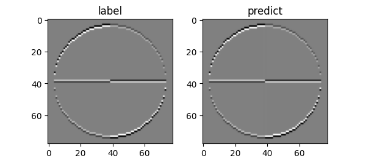

## 14.2 二维卷积

### 14.2.1 前向计算

图 14.2.1 二维卷积概念图

图 14.2.2 二维卷积计算实例

### 14.2.2 计算卷积核梯度

图 14.2.3 卷积核的梯度计算

### 14.2.3 计算偏移的梯度

### 14.2.4 计算卷积层回传梯度

图 14.2.4 卷积运算中的误差反向传播

### 14.2.5 卷积核学习实例

图 14.2.5 原图 $x$ 和经过横边检测算子的卷积结果 $z$

图 14.2.6 真实值和训练值的卷积结果基本无差别
