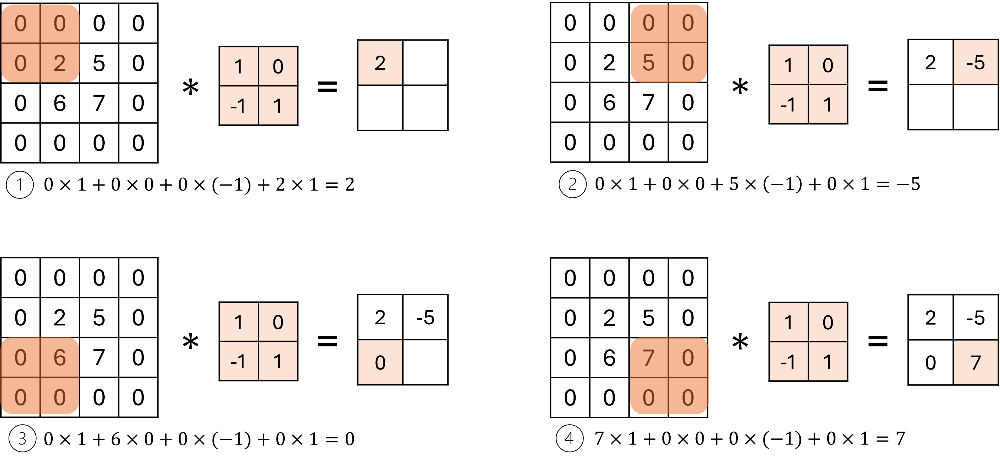
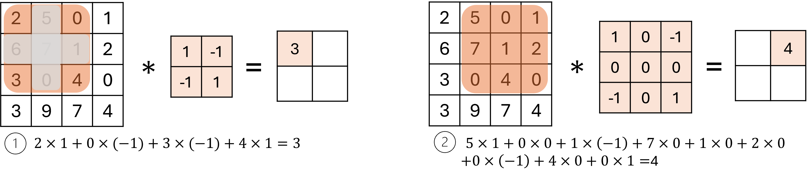
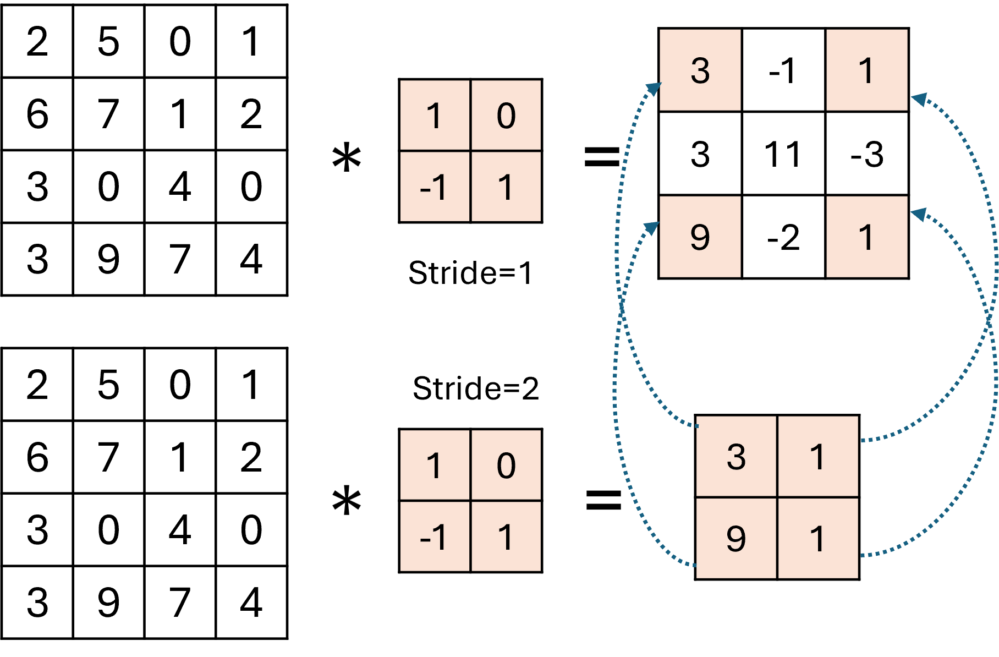

## 14.3 二维卷积的参数

### 14.3.1 步长

图 14.3.1 步长为 2 的卷积

### 14.3.2 填充

图 14.3.2 带填充的卷积

### 14.3.3 膨胀

图 14.3.3 卷积的膨胀

### 14.3.4 输出的尺寸

### 14.3.5 步长不为 1 时的反向传播【电子资源】

使用大于 1 的步长会给反向传播带来不同，见图 14.3.4，它展示了步长分别为 1 和 2 时前向计算结果的区别。

图 14.3.4 步长为 1 和 2 时的结果比较

可以看到，步长为 2 时的结果只是步长为 1 时的结果的四个角的元素值，尺寸为 2×2，从后面的回传误差的尺寸与此相同。此时在做反向传播时有两个需要：一是计算卷积核梯度 $dw$，二是计算回传到 $x$ 的梯度 $dx$。我们分别讨论。

#### 1. 计算卷积核的梯度

根据式（14.2.6）：

$$
d\mathbf W = \mathbf X * d\mathbf Z  
$$

这个卷积操作的步长必须为 1，否则就会丢失特征。此时回传误差矩阵 $d\mathbf Z$ 为 2×2，与 4×4 的 $\mathbf X$ 卷积后得到 3×3 的结果与 $\mathbf W$ 的 2×2 的尺寸不同。所以要把 $d\mathbf Z$ 变成 3×3 的，即对 $d\mathbf Z$ 做膨胀处理：

$$
\begin{pmatrix} dz_{11} & dz_{12} \\ dz_{21} & dz_{22}\end{pmatrix} \to \begin{pmatrix} dz_{11} & 0 & dz_{12} \\ 0 & 0 & 0 \\ dz_{21} & 0 & dz_{22}\end{pmatrix}
$$

然后与 $\mathbf X$ 做卷积运算，得到 $d\mathbf W$。另外一个方法是不膨胀 $d\mathbf Z$ 而是设置卷积的参数为 dilation=2，可以达到同样的效果。

有一种特例：假设 $\mathbf X$ 为 28×28，卷积核为 3×3，步长为 2 时卷积结果为 13×13。反向求 $d\mathbf W$ 时，根据式（14.3.1）：

$$
H_{output} = \frac{28-2 \times (13-1) + 2 \times 0 - 1}{1} + 1=4 \\
W_{output} = \frac{28-2 \times (13-1) + 2 \times 0 - 1}{1} + 1=4
$$

但是 $d\mathbf W$ 应该为 3×3，此时需要把输出结果**去掉最右一列和最后一行**，得到 3×3 的结果。

#### 2. 计算回传误差

根据式（14.2.14）：

$$
d\mathbf X = d\mathbf Z^0 * \mathbf{W}^{rot180} 
$$

这个卷积操作的步长也必须为 1，否则就会丢失特征。此时回传误差矩阵 $d\mathbf Z$ 为 2×2，与 2×2 的 $\mathbf W^{rot180}$ 卷积后得到 1×1 的结果与 $\mathbf X$ 的 4×4 的尺寸不同。所以要做两步操作：

- 通过膨胀处理把 $d\mathbf Z$ 变成 3×3 的；

- 再做 padding=1 的 0 填充，把 $d\mathbf Z$ 变成 5×5 的。

$$
\begin{pmatrix} dz_{11} & dz_{12} \\ dz_{21} & dz_{22}\end{pmatrix} \to \begin{pmatrix} dz_{11} & 0 & dz_{12} \\ 0 & 0 & 0 \\  dz_{21} & 0 & dz_{22}\end{pmatrix} \to \begin{pmatrix} 0 & 0 & 0 & 0 & 0 \\ 0 & dz_{11} & 0 & dz_{12} & 0 \\0 & 0 & 0 & 0 & 0 \\ 0 & dz_{21} & 0 & dz_{22} & 0 \\  0 & 0 & 0 & 0 & 0 \end{pmatrix}
$$

5×5 的 $d\mathbf Z$ 与 2×2 的 $\mathbf W^{rot180}$ 做普通卷积后得到 4×4 的 $d\mathbf X$，与原始 $\mathbf X$ 的尺寸相同。

有一种特例：假设 $\mathbf X$ 为 28×28，卷积核为 3×3，步长为 2 时卷积结果为 13×13。反向求 $d\mathbf X$ 时，先把 $d\mathbf Z$ 膨胀为 25×25（由于此处 $d\mathbf Z$ 不是卷积核，所以不能使用 dilation=2 的卷积），再做 padding=3、dilation=1、stride=1 的卷积，根据式（14.3.1）：

$$
H_{output} = \frac{25-1 \times (3-1) + 2 \times 3 - 1}{1} + 1= 29 \\
W_{output} = \frac{28-1 \times (3-1) + 2 \times 3 - 1}{1} + 1= 29
$$

即卷积结果为 29×29 的误差矩阵，同样**需要去掉最后一行和最右一列**，得到与原始图 $\mathbf X$ 同样大小的 28×28 的误差矩阵。
