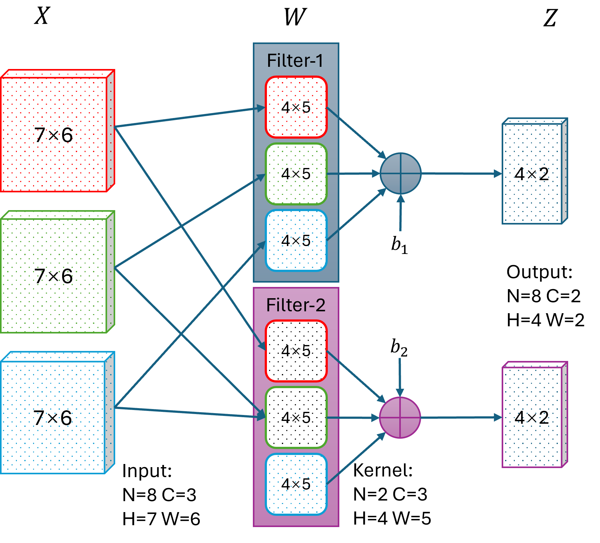
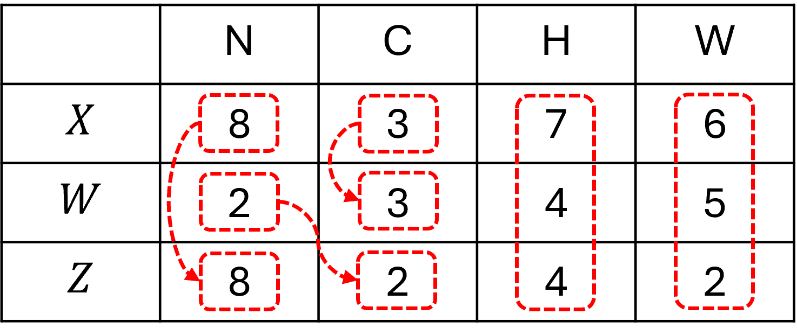
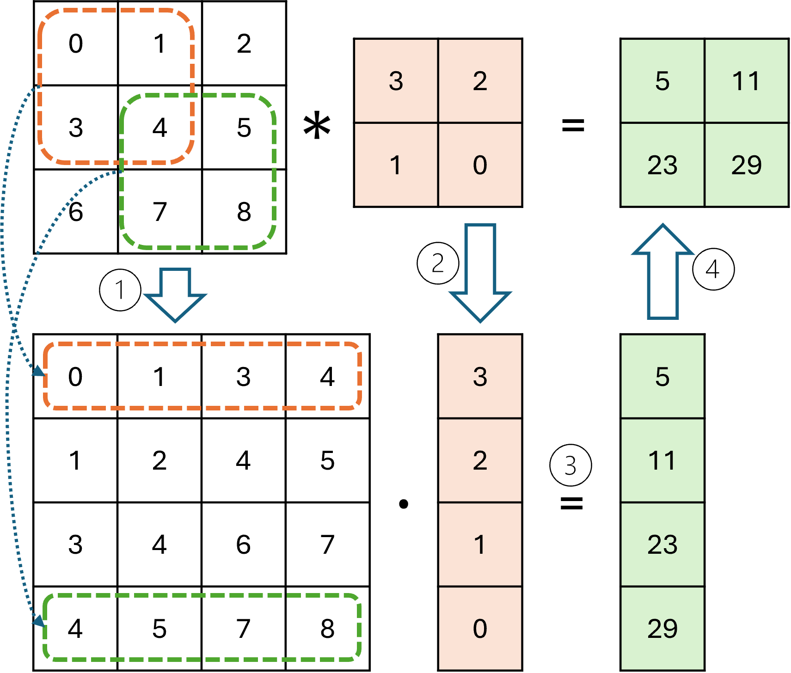
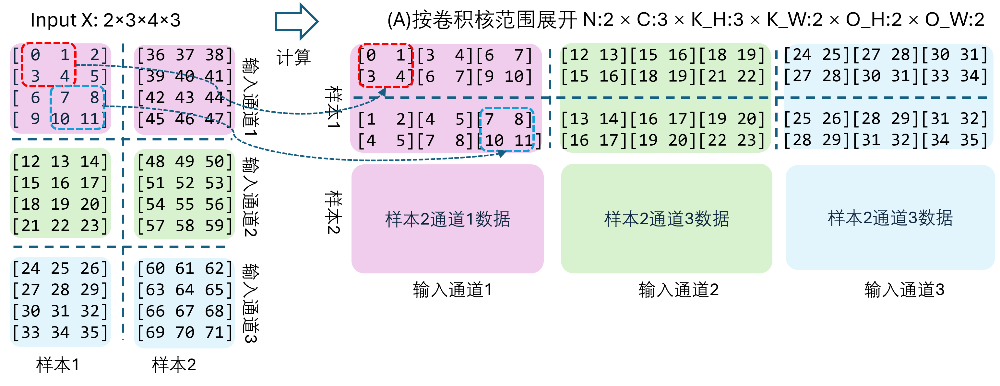
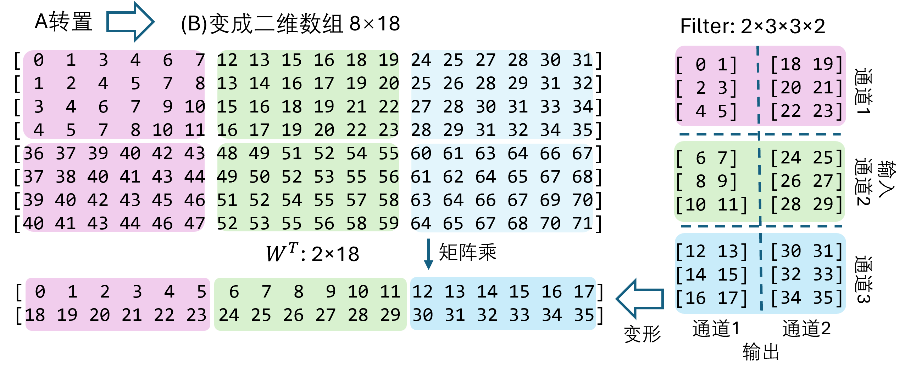

## 14.4 多通道卷积前向计算

### 14.4.1 多通道输入和输出

图 14.4.1 多个输入输出通道时的二维卷积前向计算

### 14.4.2 朴素实现

### 14.4.3 im2col 算法

图 14.4.2 把卷积运算转换成矩阵运算

图 14.4.3 把输入数据 $X$ 做第一次展开到 $A$

图 14.4.4 把 A 做变形到 B 并处理卷积核形状

图 14.4.5 结果后处理
 