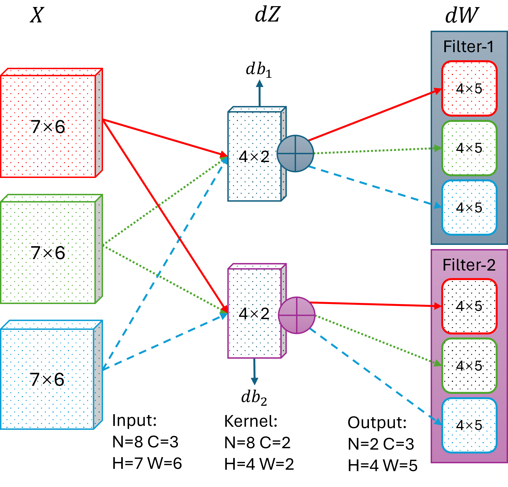
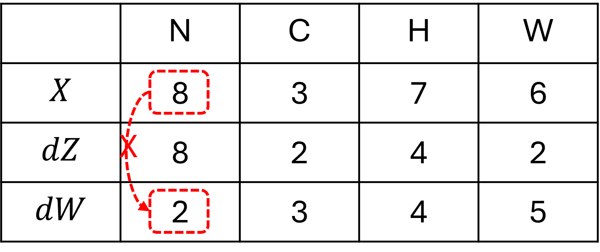
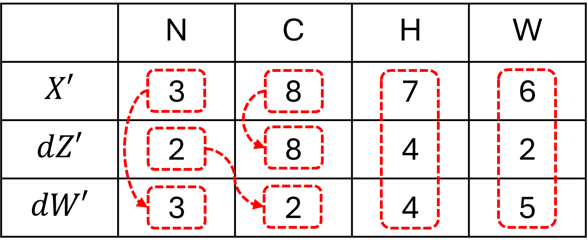
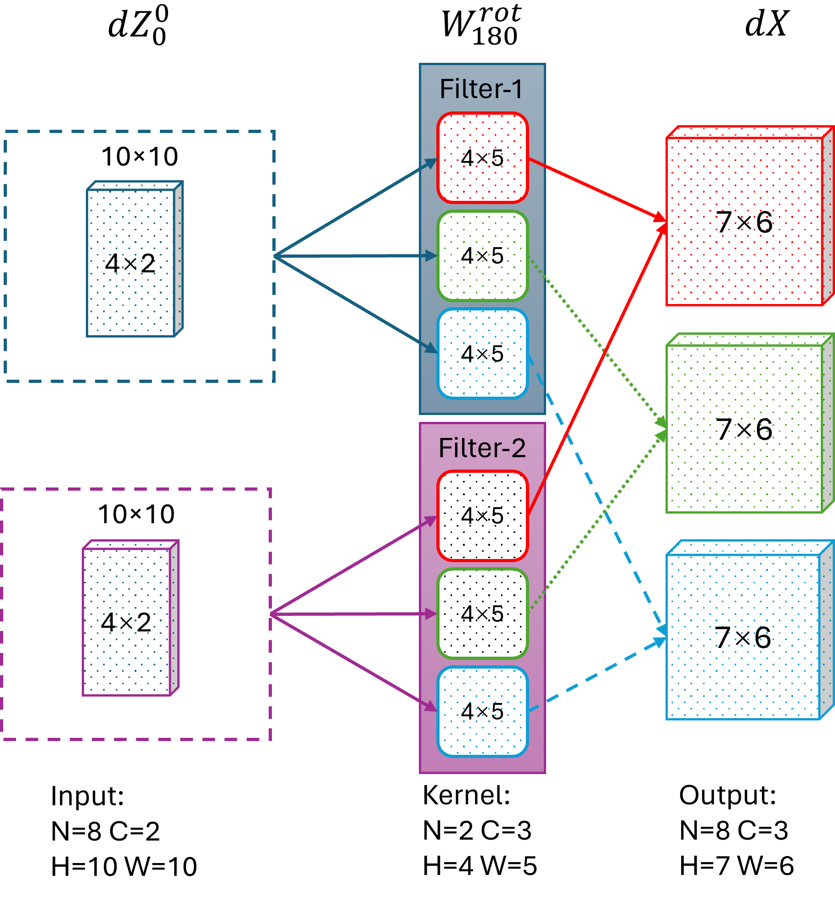
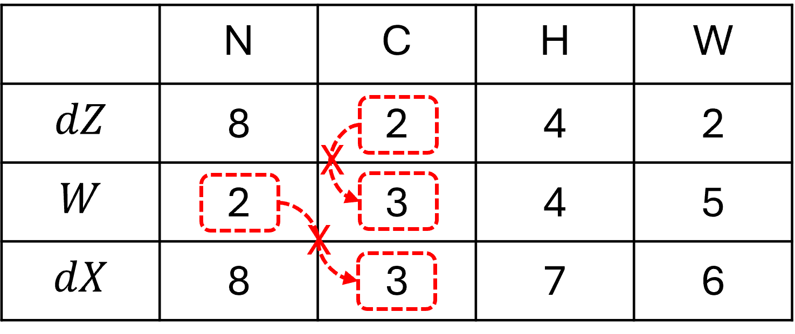
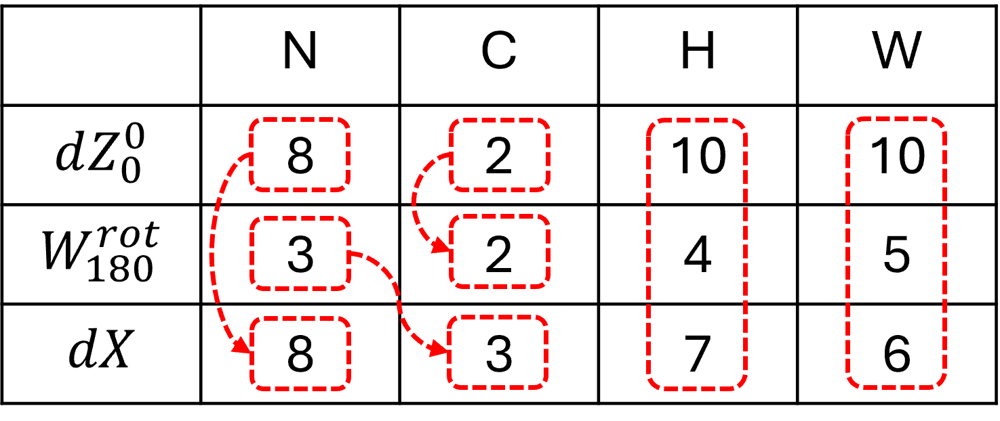

## 14.5 多通道卷积反向传播

### 14.5.1 计算卷积核的梯度

图 14.5.1 多个输入输出通道时的二维卷积计算卷积核梯度 $d\mathbf W$

表 14.5.1 各部分数据的尺寸

表 14.5.2 各部分数据的尺寸转置

### 14.5.2 计算卷积层的回传梯度

图 14.5.2 多个输入输出通道时的二维卷积计算回传梯度

表 14.5.3 各部分数据的尺寸

表 14.5.5 各部分数据处理后的尺寸

### 14.5.3 性能比较

