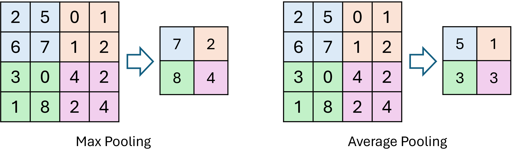
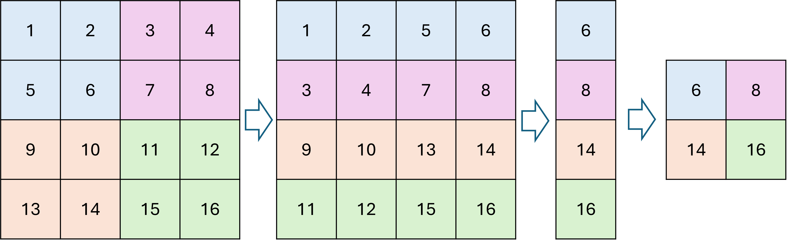
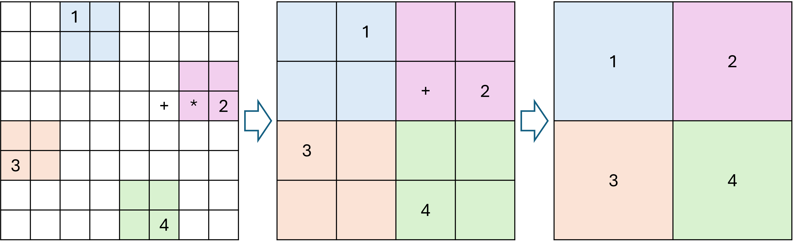
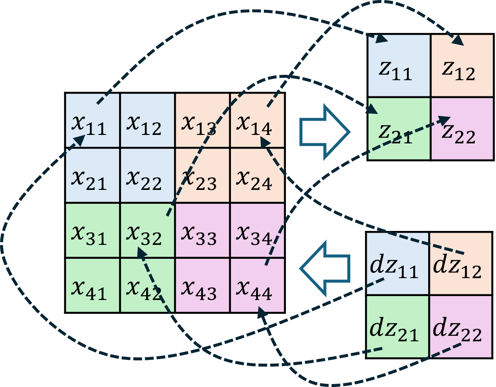
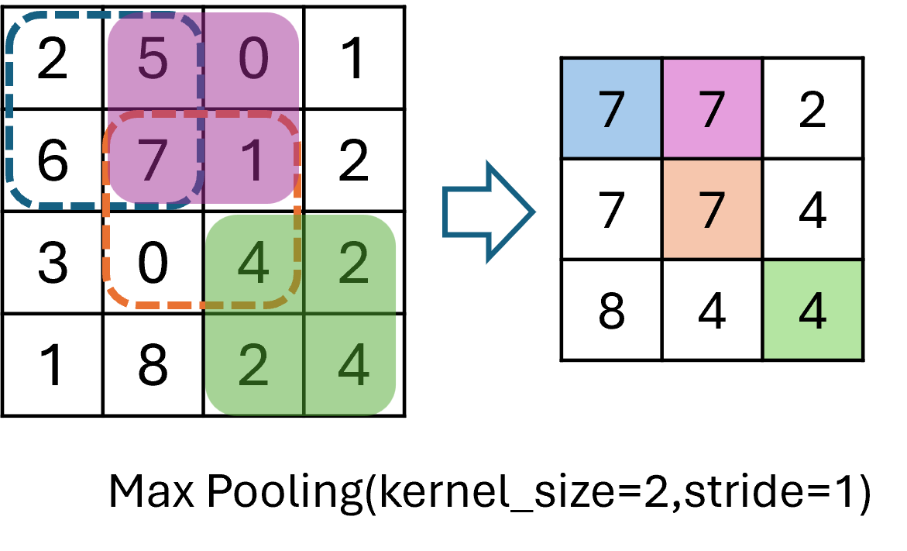

## 14.6 池化层

### 14.6.1 池化的前向计算

图 14.6.1 池化的两种方法

图 14.6.2 池化层的 im2col 原理

### 14.6.2 池化的作用

图 14.6.3 池化的作用示意图

### 14.6.3 池化的反向传播

图 14.6.4 最大池化的前向计算与反向传播（假设$x_{11},x_{14},x_{32},x_{44}$为同组最大值）

### 14.6.4 池化的其它参数

图 14.6.5 步长为 1 的池化
