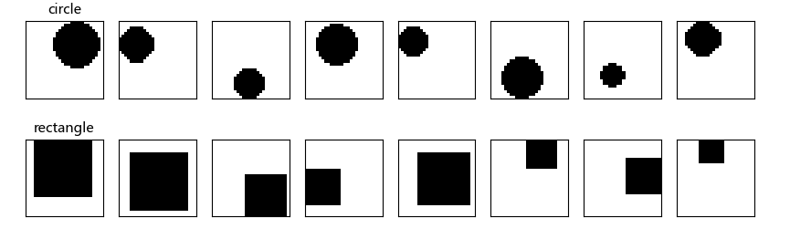
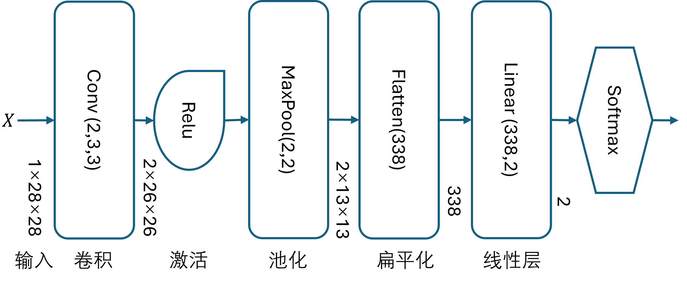
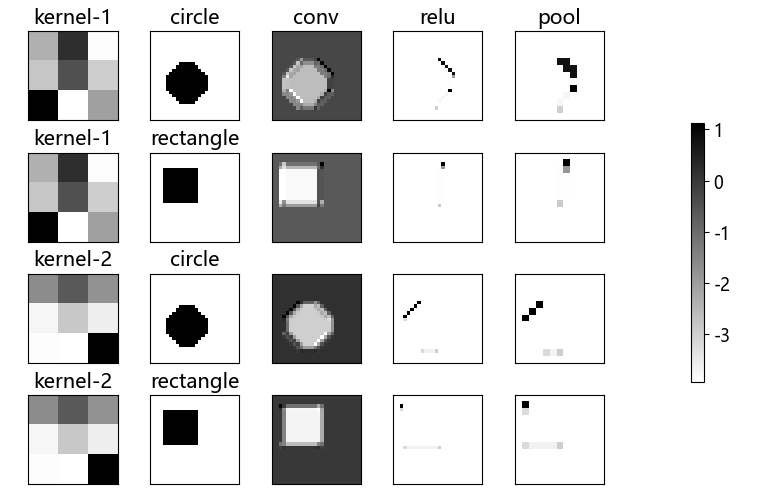
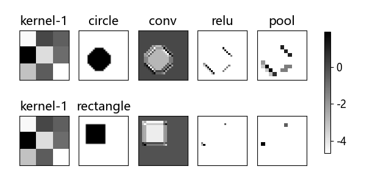
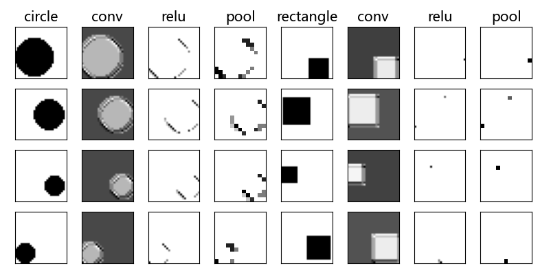
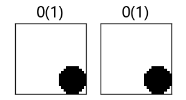
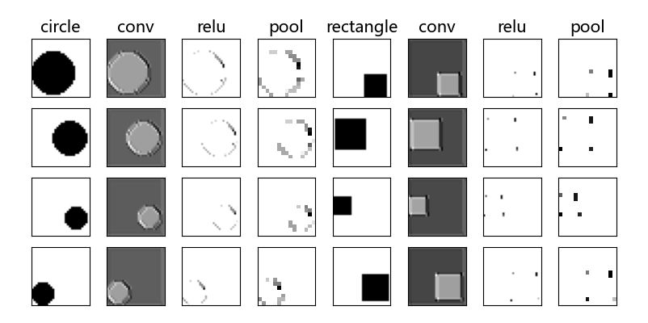

## 14.7 识别形状

图 14.7.1 还有两类形状样本的简单数据集

### 14.7.1 用全连接网络做试验

图 14.7.2 含有卷积-激活-池化-全连接层的简单网络

### 14.7.3 用一个卷积核做试验

图 14.7.4 一个卷积核时两类样本在卷积-激活-池化层的输出可视化

图 14.7.5 不同尺寸、位置的图片的处理结果

### 14.7.4 使用填充

图 14.7.6 在测试集中识别错误的样本

图 14.7.7 加 padding 后的效果

