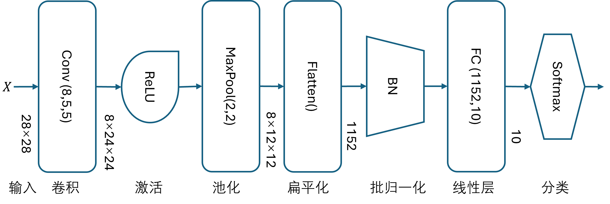
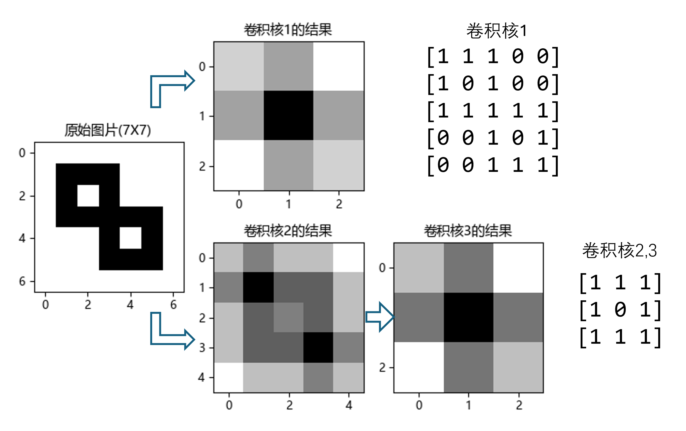
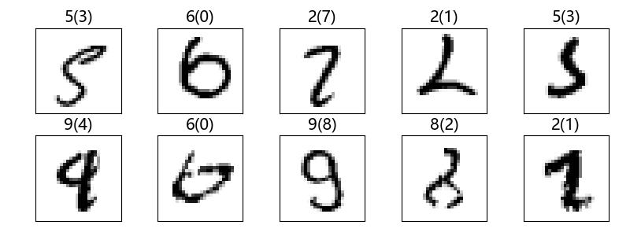
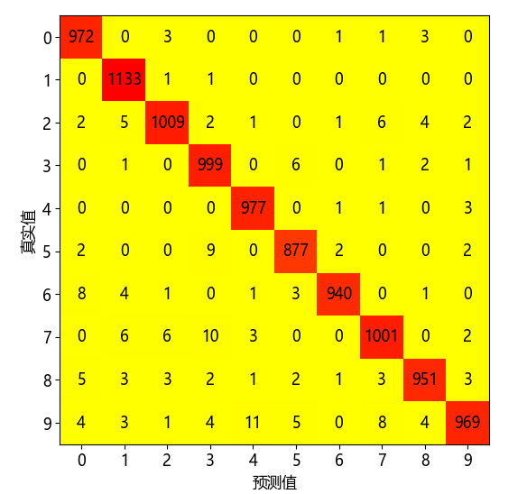
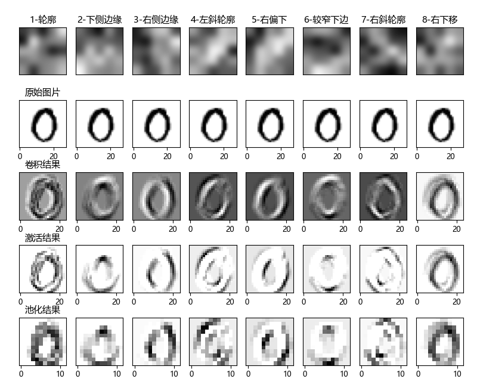
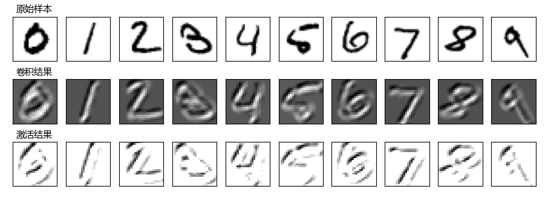

## 14.8 识别手写体数字【电子资源】

在本节中我们将以 MNIST 数据集作为目标来完成分类任务，这是我们第一次使用卷积神经网络来解决实际问题。

### 14.8.1 卷积网络的基本结构

在有了形状识别的基本知识后，我们开始尝试用卷积网络解决 MNIST 手写数字的识别问题。对于卷积层的使用有一些“规矩”如下。

- 网络的第一层一般都是卷积层，这是因为输入的数据一般都是图像，在数据处理时做好归一化等工作后，就需要卷积层对图像进行处理，不能有别的什么因素改变图像。
- 紧接着卷积层是激活函数，对卷积输出的特征图进行激活处理，可以学习复杂模式，增加非线性能力。
- 然后需要接池化层，因为在用激活函数之后，特征图中的像素会有两极分化的趋势，有用的特征会更加明显，此时使用最大池化来提取并强调这些特征，形成缩小四倍的纯特征图。如果后面还需要做卷积，则这一层的池化可以没有，以便于后续的卷积可以对相对较大尺寸的特征图进行新的特征提取，不丢失信息。也有一些新的研究在神经网络中完全抛弃了池化层。
- 在一系列的卷积-激活-卷积-激活-池化之后，需要用 Flatten 层把多通道信息变成一个一维的向量。
- 后续要接带有激活函数的两层以上的全连接层，通过强大而神秘的函数拟合功能把前面形成的二维特征转换成一维特征，用于最终分类。全连接层一般不超过三层。
- 在全连接层的每层之后有时会加上批归一化层（BN），调整数据分布，利用模型训练时快速收敛，也能起到抑制过拟合的效果。
- 有更多的深度网络在卷积层之后也会接一个 BN 层，以得到更好的收敛作用，因为卷积运算有多次叠加，会使得特征值偏移原始分布较远。注意 BN 层要放在激活层之前。假设用 ReLU 激活，如果后面接 BN 层，那么会把 ReLU 过滤为 0 的值变成正值或负值，那么 ReLU 就失去了意义。
- 一般情况下为了能得到较高的准确率，网络都会超容量设计而产生过拟合。如果发现这种情况，需要在全连接层（full connection，FC）增加 Dropout 层，不要放在卷积层内，也不要和 BN 共同使用。如果一定要共同使用，则顺序为：FC-BN-ReLU-Dropout。

为了充分认识卷积、池化的作用，尽量减小全连接层的超强能力带来的影响，我们在本例中只使用单层的线性全连接层，如图 14.8.1 所示。



图 14.8.1 简单的卷积网络

激活层和池化层的顺序有什么讲究吗？当使用最大池化时，激活层和池化层的顺序可以颠倒，结果一致。当使用平均池化时，结果不一致，应该把激活层放在池化层的前面，反之会使得特征模糊，激活后的非线性差。

### 14.8.2 输出通道的数量

下面研究输出通道数量的问题，见表 14.8.1。

表 14.8.1 卷积核为 5×5 时设置不同输出通道的结果

|卷积核数量|2|4|8|12|16|
|:-:|:-:|:-:|:-:|:-:|:-:|
|测试集准确率|96.67%|97.72%|98.23%|98.35%|98.52%|
|测试集误差|0.1089|0.0891|0.0868|0.0681|0.0859|
|**卷积核数量**|**20**|**24**|**28**|**32**|**64**|
|测试集准确率|98.55%|98.62%|98.63%|98.34%|98.55%|
|测试集误差|0.0815|0.0785|0.0941|0.1164|0.1047|

从表 14.8.1 中可以看到一个基本规律：卷积核越多，准确率越高，到了 98% 这个门坎后，再向上增加准确率很困难，投入产出不成正比，反而会造成误差越来越大。所以我们采用 8 个卷积核，然后进行下一组试验，见表 14.8.2。

### 14.8.3 卷积核的大小

表 14.8.2 输出通道为 8 时设置不同卷积核大小的结果

|卷积核大小|3×3|5×5|7×7|9×9|11×11|
|-|-|-|-|-|-|
|测试集准确率|97.52%|98.21%|98.30%|98.32%|98.54%|
|测试集误差|0.0988|0.0897|0.0787|0.0728|0.0581|

这一组比较的结果差不多，较大的卷积核会对准确率有提升，误差也会降低。考虑到我们只采用了一层卷积，所以不妨选择大一些的卷积核尺寸，比如 5×5。目前绝大多数卷积网络的卷积核大小都是 3×3，那么不同尺寸的卷积核会有什么不同的效果呢？请看图 14.8.2 的简单试验。



图 14.8.2 不同尺寸的卷积核在同一张图片上的卷积结果

图 14.8.2 中左侧是 7×7 的原始图片，在其中心 5×5 的区域对角上有两个矩形。我们想用一个与目标区域具有相同形状的卷积核1（5×5）来提取这个特征，得到 3×3 的结果如中间上图。接下来我们用两个相同值和形状的 3×3 的卷积核2、3，先一次卷积得到 5×5 的结果，再做一次卷积得到得到 3×3 的结果，如中间下图。经过归一化后，可以看到“卷积核1的结果”和“卷积核3的结果”这两张图中 9 个位置上相对应的特征值的相对大小基本相同，后者比前者的值要大一些（颜色更深），是因为经过的卷积运算的叠加次数多。即，**一个 5×5 的卷积核可以用两个 3×3 的卷积核先后做两次卷积运算来代替**，前者的参数是 25 个，后者的参数是 18 个。实际应用中在两层卷积之间要加激活层，所以两个 3×3 的卷积核增加了非线性，可以得到更深的网络。

### 14.8.4 数据预处理

首先要注意数据加载部分，如下代码所示【代码：H14_8_MNIST_Train.py】：

```python
def load_minist_data():
    ...
    data_loader.StandardScaler_X(is_image=True) # 标准化到 N(0,1)
    ...
```

在数据标准化部分，就是在函数 `StandardScaler_X()` 内部计算了原始数据的均值 `mean` 和方差 `std`，然后用 `X=(X-mean)/std` 变成均值为 0 方差为 1 的分布。`is_image=True` 参数指定了按通道整体计算四维数据的均值和方差，而不是按二维数据中的字段计算。

而 PyTorch 代码的例子如下：

```python
    datasets.MNIST('data', train=True, download=True,
        transform=transforms.Compose([
            transforms.ToTensor(),
            transforms.Normalize(mean=(0.131,), std=(0.308,)) # 正态分布
        ])),
```
其中 `ToTensor()` 函数是把所有数据均匀归一到 $[0,1]$ 区间（并非正态分布，只是简单地除以255），然后指定均值为 0.131 方差为 0.308 进行标准化，是因为 `transforms.Normalize()` 这个函数必须指定均值和方差才能做转换，而 0.131、0.308 就是把数据归一到 $[0,1]$ 区间后的均值和方差。

### 14.8.5 训练并查看结果


参数设置如下，【代码：H14_8_MNIST_Train.py】：

```python
    params = HyperParameters(max_epoch=10, batch_size=64) # 10轮, 批大小64
    lrs = LRScheduler.step_lrs(0.01, 0.9, 500)  # 初始学习率0.01,每500步降10%
```
训练样本 60000 个，分出 10% 验证集后还剩余 54000 个，除以 64 约为 844，即每一轮需要训练 844 步。对每个要学习的参数都是用 Adam 优化器，训练结果如下：
```
轮数 9, 迭代 8400, 训练集: loss 0.0393, accu 0.9844, 验证集: loss 0.0754, accu 0.9840
测试集: loss 0.0682, accu 0.9828
```
对于这个简单的网络来说，在测试集得到 98.28% 的准确率已经很令人满意了。在 12.3 节中的全连接网络中使用了 784×64+64×32+32×10=52544 个参数（不算 bias）得到 96.47% 的准确率，而本节中的参数个数为：8×7×7+968×10=11040，其实大多数参数还是用在了全连接层上。如果想让准确率达到 99.5% 以上的水平，需要增加很多卷积层以及三层的全连接层。

下面我们“偷看一眼”测试集中前 10 个被识别错误的样本，见图 14.8.3：



图 14.8.3 测试集中前 10 个被识别错误的样本

这就是传说中的“阿拉伯数字草书”，每张图片上面的数字是样本标签，括号内的数字是预测的类别，不得不说这些样本真的很考验神经网络的能力。“偷看一眼”只是缓解了我们的好奇，正确的做法是绘制出混淆矩阵进行分析，如图 14.8.4。



图 14.8.4 混淆矩阵

从矩阵图中可以看到，黄色区域为错误区，数字 9 被识别成 4 的最多，共11个，图 14.8.3 中就有一例。其次是有 10 个数字 7 被识别成 3。再其次是 9 个数字 5 被识别成 3，图 14.8.3 中有两例。红色区域是 TP 的具体数值，由此可知 10 类样本的数量并不相等。


### 14.8.5 可视化卷积结果

由于卷积核是一个小的矩阵，所以我们可以把它当作图片来可视化。而卷积、激活、池化的结果都是图片，所以都可以可视化。见图 14.8.5。



图 14.8.5 可视化卷积结果

- 第一行是 5×5 的卷积核，加了高斯模糊效果，这样通过较深的颜色的位置和走向能看到它的关注点。标题中序号后面显示了它的作用。其中：
  - 卷积核 1 号把图片抽出了一个轮廓，但是特征太模糊，没多大用；
  - 2 号取得较宽的下侧边缘的信息，6 号取得较窄的下侧边缘信息；
  - 3 号取得右侧边缘的信息；
  - 4 号取得左斜 45 度的轮廓，7 号取得右斜 45 度的轮廓；
  - 5 号取得右偏下的边缘信息；
  - 8 号把整体向右下方移动了几个像素，没有什么有用特征。

- 第二行是原始图片，我们用最具有代表性的数字 0 来说明问题，因为它 360 度无死角。

- 第三行是对应的上方的卷积核的卷积结果。

- 第四行是激活结果，这一层的输出对于可视化来说是最有用的。

- 第五行是池化的结果，对人眼来说，由于分辨率太低，所有特征都挤成一团，不易分辨。

从人类的眼光看，卷积核 1、8 的可解释不强，也许用 6 个卷积核可以得到更加清晰的分工。但是机器不这么看：去掉两个卷积核后，准确率就掉到了 98% 以下。

下面我们模仿第四个卷积核人为生成一个由（0,1,-1）三个值组成的卷积核，被称作**二值化**，而它的原始数据在右侧:
```
[[ 0  1  1 -1 -1]   # -0.371942  0.960283  1.361685 -1.013932 -0.551100
 [ 1  0 -1 -1 -1]   #  1.072752  0.427384 -0.766869 -1.136552 -0.949076
 [-1  0 -1 -1  0]   # -0.782557  0.176728 -1.801188 -1.576794  2.168798
 [ 0 -1 -1  1  1]   #  0.176578 -0.786395 -1.605902  0.941071 -0.318206
 [-1  0  1  1  1]]  # -0.720645 -0.029927  1.378436  0.748250  0.774046
```
然后我们用这个二值化的卷积核与 10 个样本做卷积运算和 ReLU 运算，得到图 14.8.6 的结果。



图 14.8.6 手动生成的卷积核效果

如果用数字 0 与图 14.8.5 做比较的话，基本上和第四个卷积核的效果差不多，但是**二值化后的卷积核更容易被人类理解，而且做卷积时只需要与图片数据做加减法就可以了，不需要做乘法**。这也就引出了二值化神经网络的训练和推理问题，但通常在参数较多（上亿级别）的网络中有较好表现（速度快，准确率相同），在参数较少的网络中误差比较大。

### 14.8.6 引入 Pytorch

从本章开始，当网络结构比较复杂时，我们会使用 Pytorch 进行训练以节省时间。比如在本节中的【代码：H14_8_MNIST_Torch.py】是 Pytorch 版本的训练代码。由于笔者的笔记本上有一颗很弱的 NVIDIA GPU T500（4G 显存），在 Windows 11 操作系统中只需要安装 12.3 版本的 CUDA 就可以使用。而在笔者的台式机上有一颗更弱的 Quadro P620（2G显存），但是仍然可以训练小模型，比 Pytorch CPU 版要快两倍。读者如果没有 GPU，Pytorch 在 CPU 上可以使用多进程做训练，速度也能接受。本章后续的训练结果主要是用 Pytorch 得到的。

与此同时，我们仍然会提供完全自己手写的网络作为对比进行原理学习与解释，比如【代码：H14_8_MNIST_Train.py】，但是由于 Numpy 不能在 GPU 上运行，所以速度很慢。我们在 12.5 节中曾经学习过数据并行，所以笔者在【代码：H14_8_MNIST_DP.py】中使用了这种技术，可以指定进程数量并使用多 CPU 进行训练，速度与 Pytoch 的 CPU 版本相当。为此，我们在 `src/common/Layers` 目录下提供了自己手写的一套神经网络操作符，如：`Activators.py, BatchNorm1d.py, BatchNorm2d.py, Classifier.py, Concat.py, Conv1d.py, Conv2d.py, Dropout.py, Flatten.py, Linear.py, LossFunction.py, Pool1d.py, Pool2d.py` 等。为了验证正确性，笔者在 `src` 目录下有一些以`test`开头的测试代码，如 `test_BN1d.py`，它与 Pytorch 对应的操作符做对比，包括前向计算、梯度计算、反向误差三个方面，以保证实现的正确性。

以下为自己实现的操作符：

```python
import common.Layers as layer  # 相当于 torch.nn
import numpy as np
import torch
# 自己实现的操作符
def test_my_op(x):
    bn = layer.BatchNorm1d(x.shape[1])
    z = bn.forward(x) # 前向结果
    dz = x + 1 # 模拟反向梯度
    dx = bn.backward(dz) # 反向误差
    return z, dx, bn.WB.dW, bn.WB.dB
```
以下为 Pytorch 的实现：

```python
# Torch 的相关操作符
def test_torch(batch, num_features):
    x = torch.randn(batch, num_features, requires_grad=True)
    bn = torch.nn.BatchNorm1d(num_features)
    z = bn(x) # 前向结果
    dz = x + 1 # 模拟反向梯度
    z.backward(dz, retain_graph=True) # 反向
    return x.detach().numpy(), z.detach().numpy(), x.grad.detach().numpy(), 
           bn.weight.grad.detach().numpy(), bn.bias.grad.detach().numpy(),
```
以下为结果比较：
```python
if __name__=="__main__":
    num_features = 3
    batch = 4
    x0, z0, dx0, dw0, db0 = test_torch(batch, num_features)
    z1, dx1, dw1, db1 = test_my_op(x0) # 用相同的 x0 进行试验
    print(np.allclose(z0, z1, atol=1e-6, rtol=1e-7))    # 前向
    print(np.allclose(dx0, dx1, atol=1e-6, rtol=1e-7))  # 反向
    print(np.allclose(dw0, dw1, atol=1e-6, rtol=1e-7))  # 参数梯度
    print(np.allclose(db0, db1, atol=1e-6, rtol=1e-7))  # 参数梯度
```

为了学习原理，读者可以继续在此搭建自己的操作符，并在 `Layer/__init__.py` 中引用，就可以被上层应用代码使用，相当于 Pytorch 中的 `nn.Module`。
