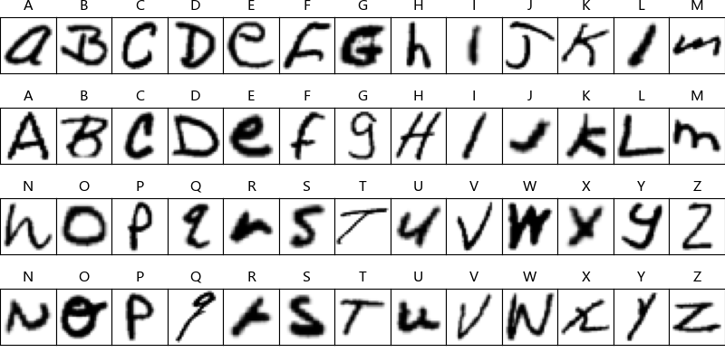
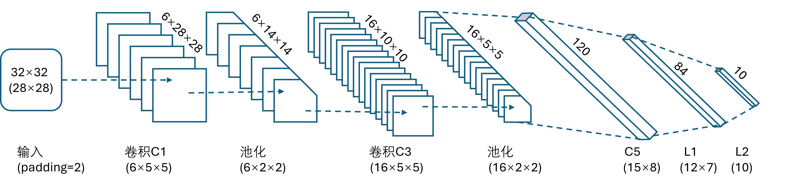
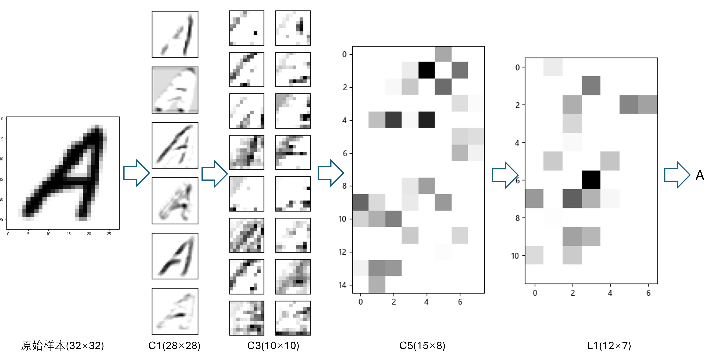
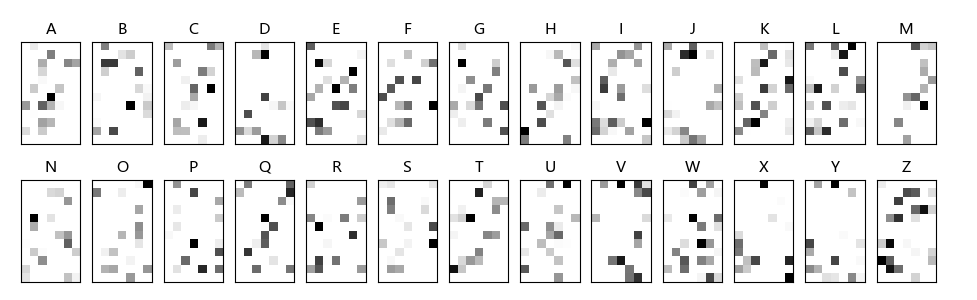

## 14.9 识别手写体字母

### 14.9.1 认识 EMNIST 数据集

图 14.9.2 EMNIST 样本预览

### 14.9.2 认识 LeNet 网络

图 14.9.3 经典卷积神经网络 LeNet-5 的结构

### 14.9.3 代码实现

### 14.9.3 结果分析

图 14.9.4 在测试集中识别错误的样本

图 14.9.5 混淆矩阵

图 14.9.6 LeNet-5 各层特征图

图 14.9.7 C5 层 26 个字母的特征图
