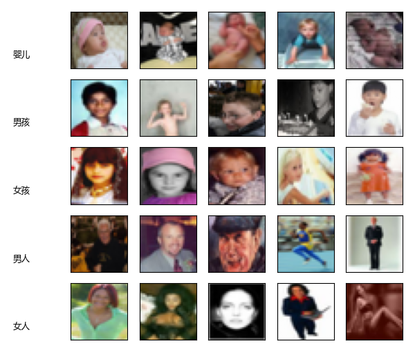

## 15.1 彩色图片分类问题

我们在第 14 章使用了 MNIST、EMNIST 和 Fashion-MNIST 三个数据集来练习如何使用卷积网络进行分类，但是这三个数据集都是单通道的灰度图，背景很纯净，前景也比较简单，与现实的彩色世界有差距。所以，本章我们将使用一些彩色数据集来进一步研究卷积神经网络的能力。

CIFAR（Canadian Institute for Advanced Research）是加拿大政府牵头投资的一个先进科学项目研究所。Hinton、Bengio 和他的学生在 2004 年拿到了 CIFAR 投资的少量资金，建立了神经计算和自适应感知项目。这个项目集结了不少计算机科学家、生物学家、电气工程师、神经科学家、物理学家、心理学家，加速推动了深度学习的进程。从这个阵容来看，深度学习已经和传统机器学习的数据挖掘分道扬镳了，使用了不一样的思路。深度学习强调的是自适应感知和人工智能，是计算机与神经科学交叉；数据挖掘强调的是高速、大数据、统计数学分析，是计算机和数学的交叉。

CIFAR 包含两个图像数据集，一个是 10 分类的 CIFAR-10，一个是 100 分类的 CIFAR-100。

### 15.1.1 CIFAR-10 数据集

CIFAR-10 是由 Hinton 的学生 Alex Krizhevsky、Ilya Sutskever 收集的一个用于普适物体识别的数据集，这三个人后来提出了 AlexNet 卷积网络架构。表 15.1.1 是类别、名称和数量。

表 15.1.1 CIFAR-10数据的类别、名称和数量

|类别|中文名称|英文名称|数量||类别|中文名称|英文名称|数量|
|-|-|-|-|-|-|-|-|-|
|0|飞机|airplane|6000||5|狗|dog|6000|
|1|汽车|automobile|6000||6|蛙|frog|6000|
|2|鸟|bird|6000||7|马|horse|6000|
|3|猫|cat|6000||8|船|ship|6000|
|4|鹿|deer|6000||9|卡车|truck|6000|

CIFAR-10 由 60000 张 32×32 的 RGB 彩色图片构成，共 10 个分类。50000 张作为训练集，10000 张作为测试集。分为 6 个文件，5 个训练集数据文件，每个文件中包含 10000 张图片，随机打乱顺序。1 个测试数据文件，也是 10000 张图片。这个数据集最大的特点在于将识别迁移到了普适物体，而且应用于多分类。图 15.1.1 是 CIFAR-10 的样本数据

图 15.1.1 CIFAR-10 样本数据

### 15.1.2 CIFAR-100 数据集

CIFAR-100 一共有 20 个大类别（superclass）、100 个小类别（class），隶属关系如表 15.1.2 所示。

表 15.1.2 CIFAR-100 数据集分类说明

|序号|大类别|小类别|序号|大类别|小类别|
|-|-|-|-|-|-|
|1|人类|婴儿、男孩、女孩、男人、女人|11|食品|容器瓶、碗、罐头、杯子、盘子|
|2|中型哺乳动物|狐狸、豪猪、负鼠、浣熊、臭鼬|12|花|兰花、罂粟、玫瑰、向日葵、郁金香|
|3|小型哺乳动物|仓鼠、老鼠、兔子、鼩、松鼠|13|果蔬|苹果、蘑菇、桔子、梨、甜椒|
|4|水生哺乳动物|海狸、海豚、水獭、海豹、鲸鱼|14|家具|床、椅子、沙发、桌子、衣柜|
|5|鱼|水族鱼、比目鱼、鳐鱼、鲨鱼、鳟鱼|15|建筑|桥、城堡、房子、道路、大楼|
|6|爬行动物|鳄鱼、恐龙、蜥蜴、蛇、乌龟|16|家电|时钟、电脑键盘、灯、电话、电视|
|7|昆虫|蜜蜂、甲虫、蝴蝶、毛毛虫、蟑螂|17|风景|云、森林、山、平原、海|
|8|猛禽|熊、豹子、狮子、老虎、狼|18|树|枫木、橡树、棕榈、松树、柳树|
|9|大型草食动物|骆驼、牛、黑猩猩、大象、袋鼠|19|车1|自行车、公共汽车、摩托车、皮卡、火车|
|10|无脊椎动物|螃蟹、龙虾、蜗牛、蜘蛛、蠕虫|20|车2|割草机、火箭、有轨电车、坦克、拖拉机|

部分样本如图 15.1.2 所示，每类样本只显示一张图片。数据集中每类样本有 600 张32×32 的 RGB 彩色图片，其中 500 张是训练集，100 张是测试集。 

图 15.1.2 CIFAR-100 样本数据

图中是按照小类别序号顺序展示的样本图片，与表 15.1.2 中的序号没有对应关系。比如，人眼最容易识别出来的人类图片序号分别是 2（婴儿）、11（男孩），35（女孩），46（男人）、98（女人），图 15.1.3 展示了更多的样本。说实话，这些人眼都不容易分辨出来的图片，用神经网络捕捉其特征加以分类识别确实是一件很不容易的事情，所以神经网络所捕捉的特征一定不完全是人眼所关注的特征，因此在某种程度上来说神经网络确实不可解释，它是从高维特征中抽取低维表示并加以区分。比如图 15.1.3 中的第二张男孩的图片和婴儿没什么区别，这也难怪 CIFAR-100 在各种经典神经网络上都没有很高的准确率。

图 15.1.3 CIFAR-100 样本数据中的人类图片

### 15.1.3 任务研究方法

图像分类是计算机视觉中的一个基础任务，为了训练和评估模型，研究者和开发者们通常会使用一些标准的数据集。表 15.1.3 是一些广泛使用的图像分类数据集。

表 15.1.3 图像分类数据集

|序号|中文名称|描述|类别数量|图片数量|图像尺寸|
|-|-|-|-|-|-|
|0|MINST|手写数字的数据集|10|70000|28*28灰度|
|1|CIFAR-10|涵盖多种日常物体|10|60K|32*32彩色|
|2|CIFAR-100|涵盖多种日常物体|100|60K|32*32彩色|
|3|ImageNet|手动标注|2000|14M|-|
|4|STL-10|源自ImageNet|10|113K|96*96彩色|

ImageNet 是一个由斯坦福大学的李飞飞教授主导创建的庞大的图像数据库，它根据 WordNet 的层级结构组织图像，专注于名词类别。这个数据库拥有超过1400万张图片，覆盖了21841个不同的类别，并且这些图片都是按照同义词集合进行分类的。ImageNet 对于推动计算机视觉和深度学习的研究具有重要意义，并且其数据对学术研究者是免费提供的。

ImageNet Large Scale Visual Recognition Challenge (ILSVRC) 是基于 ImageNet 数据集的比赛，从 2010 年开始举行至 2017 年结束。ILSVRC2012 是 ImageNet 中特别著名的一个子集，它包括1000个类别，拥有约128万张训练图像、5万张验证图像和10万张测试图像。ILSVRC 包括图像分类、目标定位、目标检测等任务，比赛中诞生了许多著名的深度学习网络模型，如 AlexNet、VGG、GoogLeNet、ResNet 等，如表 15.1.4 所示。

表 15.1.4 历届ILSVRC的经典网络架构

|年份|经典架构|特点|层数|计算量|
|-|-|-|-|-|
|2012|AlexNet|首次应用 ReLu、dropout 等技巧|8|0.7 GFlops|
|2013|ZFNet|在 AlexNet 的基础上引入特征可视化|8|-|
|2014|GoogLeNet|同时增加深度和宽度|22|1.5 GFlops|
|2014|VGG|层间设置连续卷积层|19|19.6 GFlops|
|2015|ResNet|首次引入残差结构|152|11.3 GFlops|
|2016|ResNeXt|在 ResNet 的基础上引入分组卷积|101|-|
|2017|SENet|在空间维度进行 Squeeze 和 Excitation|154|12.5 GFlops|
