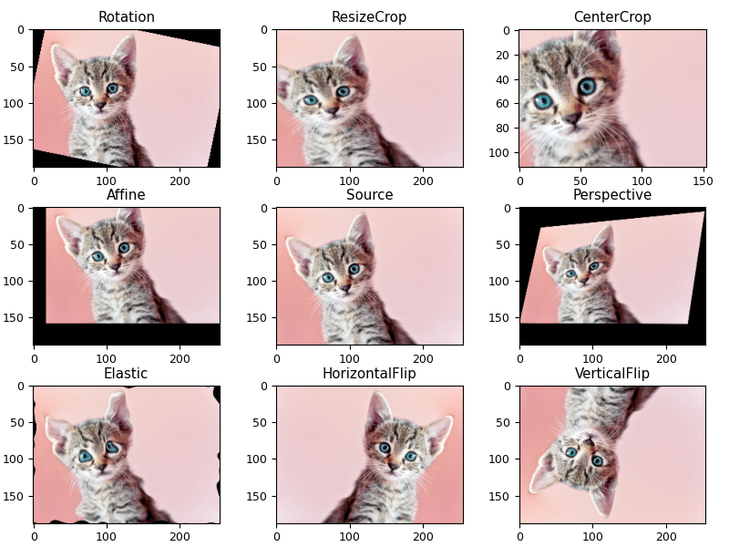

## 15.2 图像数据处理基本知识

在本节中，我们先讲述关于图像数据集处理的基本知识。

### 15.2.1 数据集的均值和标准差

一个比较小的数据集，我们很容易把它们都读入内存，然后使用 torch 函数轻松得到其均值和标准差：

```
mean, std = np.mean(X), np.std(X)
```
但是当数据集很大时，只能分段读取批量数据，而且对彩色图片来说，应该按照通道来计算而非具体像素值。此时该如何计算呢？均值比较容易计算，只要把所有数据相加，最后除以样本数量 $m$ 和图片尺寸（假设所有图片统一高宽为 $h$、$w$）即可：

$$
[\mu_R,\mu_G,\mu_B] = \frac{1}{m \cdot h \cdot w} \sum_{i=1}^m \sum_{k=1}^h \sum_{i=l}^w x_{i,j,k,l} \tag{15.2.1}
$$

注意式（15.2.1）是对于每个样本 $x$ 在其 0、2、3 维数据上做求和计算，把第 1 维（即通道 $j$）留出来，这样就会得到三个均值 $\mu_R、\mu_G、\mu_B$，分别代表 R、G、B 三通道。具体代码如下：

```python
# 用批量数据计算计算均值和标准差
    sample_count = 0
    for x, _ in data_loader:
        sample_count += x.shape[0]  # 样本数量
        rgb_sum_m += torch.sum(x, axis=(0,2,3)) # 0，2，3维的数据求和
    total_count = sample_count * x.shape[2] * x.shape[3] # 图片的数量m、宽度w、高度h
    rgb_mean = rgb_sum_m / total_count # 求均值
```
计算标准差的时候就没这么简单了，因为局部的标准差的平均值不等于总体的标准差，但是我们可以利用方差的表达式

$$
D(X)=E[X-E(X)]^2=E(X^2)-E(X)^2
$$ 

来做计算。$E(X)^2$ 是均值的平方 `rgb_mean ** 2`，前面计算过均值了，很容易得到。$E(X^2)$ 是样本像素本身的平方，即：`torch.square(x)`，然后求其和：

```python
rgb_sum_s += torch.sum(torch.square(x), axis=(0,2,3))
```

而 $\sqrt{D(X)}$ 就是标准差，可以写成：

```python
DX = rgb_sum_s / total_count - rgb_mean ** 2 # 求方差D(X)=E(X^2)-E(X)^2
rgb_std = torch.sqrt(DX)  # 标准差等于方差的平方根
```
完整代码如下，遍历一遍就可以计算出两组数据：
```python
# 用批量数据计算计算均值和标准差
def compute_mean_std_batch(data_loader):
    sample_count = 0  # 样本数量
    rgb_sum_m = torch.zeros(3)  # 三通道的均值
    rgb_sum_s = torch.zeros(3)  # 三通道标准差
    sample_count = len(data_loader.dataset) # 样本数量
    for x, _ in data_loader:  # 按批量遍历数据集
        rgb_sum_m += torch.sum(x, axis=(0,2,3))  # 样本像素值累加
        rgb_sum_s += torch.sum(torch.square(x), axis=(0,2,3))  # 样本像素值的平方累加
    total_count = sample_count * x.shape[2] * x.shape[3] # 计算总数量
    rgb_mean = rgb_sum_m / total_count  # 求均值
    DX = rgb_sum_s / total_count - rgb_mean ** 2 # 求方差D(X)=E(X^2)-E(X)^2
    rgb_std = torch.sqrt(DX)  # 求标准差
    return rgb_mean, rgb_std
```

最后可以得到 CIFAR-10 数据集的基本信息：
```
测试集样本数量: 50000
均值和标准差: tensor([0.4914, 0.4822, 0.4465]) tensor([0.2470, 0.2435, 0.2616])
测试集样本数量: 10000
均值和标准差: tensor([0.4942, 0.4851, 0.4504]) tensor([0.2467, 0.2429, 0.2616])
```
有了以上数据后才能在 Pytorch 中准备数据集时指定标准化的具体数值：

```python
datasets.CIFAR-10('data', train=True, download=True, # 训练集
    transform=transforms.Compose([
        transforms.ToTensor(),
        transforms.Normalize((0.4914, 0.4822, 0.4465), (0.2470, 0.2435, 0.2616)),]))
datasets.CIFAR-10('data', train=False, download=True, # 测试集
    transform=transforms.Compose([
        transforms.ToTensor(),
        transforms.Normalize((0.4942, 0.4851, 0.4504), (0.2467, 0.2429, 0.2616)),]))
```

### 15.2.2 建立验证集

由于 CIFAR-10 中只有训练集和测试集，验证集需要我们自己事先从训练集中无回放地随机抽取，因此要创建一个验证集类，需要从 `data.Dataset` 类继承，并实现以下几个方法：

```python
class my_dataset(torch.utils.data.Dataset): # 继承data.Dataset类
    def __init__(self, trainset, choice, transform):
        self.transform = transform
        self.images = trainset.data[choice].copy()
        self.labels = [trainset.targets[i] for i in choice]

    def __len__(self):  # 返回数据集的长度
        return len(self.images)
        
    def __getitem__(self, index):  # 读取一个数据（而非批量）并返回
        image, label = self.images[index], self.labels[index]
        if self.transform:
            image = self.transform(image)
        sample = (image, label)
        return sample        
```
其中：
- `choice` 是一个列表，在调用 `my_dataset` 时事先准备好，是原始数据集中的样本的索引号码并打乱顺序，比如 `choice[0:45000]` 中的样本作为训练集，`choice[45000:50000]` 中的样本作为验证集。
- `transform` 是数据预处理，从外面建立好处理逻辑后传进来。

最后得到三个数据集：

```
数据集  总数    批次    批量
训练集  45000   704     64
验证集  5000    79      64
测试集  10000   157     64
```

另外请注意 `len(data_loader.dataset)` 是总样本数，`len(data_loader)` 是批次数，即总样本数除以批量大小，比如 $50000/64 =781.25 \approx 782$。

### 15.2.3 图像增强

为了得到更高的准确率，通常把卷积神经网络设计得又深（很多层卷积）又宽（很多输出通道），但是当样本数量与之不匹配时，就会出现过拟合现象：在训练集上误差接近 0，但是在测试集上表现很差。数据集的采集、清洗和标注在大多数情况下都是一个非常昂贵且费时费力且乏味的事情。使用数据增强技术，一方面可以减轻相关人员的工作量，另一方面也可以帮助公司削减运营开支。此外，有些数据由于涉及到各种隐私问题可能用钱都买不到，又或者一些异常场景的数据几乎是极小概率时间，这时候数据增强的优势便充分的体现出来了，可谓省时省力省钱。

图像增强的手段非常丰富，在图 15.2.1 中只列出了其中的八种比较简单的方法，并把它们的名称写在了小标题上：旋转（rotation）、放大剪裁（resize crop）、中心剪裁（center crop）、平移（affine）、透视（perspective）、变形（elastic）、水平翻转（horizontal flip）、垂直翻转（vertical flip）。中间那幅图是原图（source），便于读者比较。



图 15.2.1 八种简单的图像增强方法

当使用原始数据训练完毕后发现过拟合现象，可以在 `dataset` 中定义图像增强方法，然后加载前面保存的模型参数继续训练，不需要从头开始训练。万一修改了模型，比如增加了一层 BN 或 Dropout，就只能从头开始训练了。

```python
    transform=transforms.Compose([
        transforms.ToTensor(),
        transforms.Normalize((0.5071, 0.4856, 0.4409), (0.2673, 0.2564, 0.2762)),
        # 数据增强
        transforms.RandomHorizontalFlip(p=0.5),  # 水平翻转
        transforms.RandomRotation(15),  # 旋转
        transforms.RandomAffine(0, translate=(0.1,0.1)),  # 平移
        transforms.RandomCrop(32, padding=4),  # 剪裁
    ])),
```

在使用由 Pytorch 提供的如上述代码的图像增强时，每一轮的样本数量不变，但是由于数据增强的随机设置，每两轮之间的样本会有差异，这就相当于增加了样本数量，但是需要多训练几轮。另外，不能把所有样本都做增强而不保留原始样本作为训练数据，这也就是为什么上述代码中的方法前面都有 `Random` 前缀。如 `RandomHorizontalFlip(p=0.5)` 指定 50% 的概率翻转，`RandomRotation(15)` 从 -15 到 +15 度之间旋转，等等。对于没有 `Random` 前缀的方法，如 `ElasticTransform(alhpa=100.0)`，可以使用 `RandomApply(transforms, p=0.5)` 来包装，用 `p=0.5` 参数指定发生概率。

假设在 `transforms.Compose()` 链中有 8 个随机方法并假设其发生概率 $p$ 相同，如果想保持原始图片不被修改的概率为 50%，应该如何设置 $p$ 值呢？令 $(1-p)^8=0.5$，则 $p=0.083$，也就是每个随机方法的概率设置为 0.083，这比直觉的数值要小很多。

还有很多高级的图像增强方法，比如针对单图的图内处理和针对批量多图的图间混淆等，有兴趣的读者可以参考相关资料进行学习。
