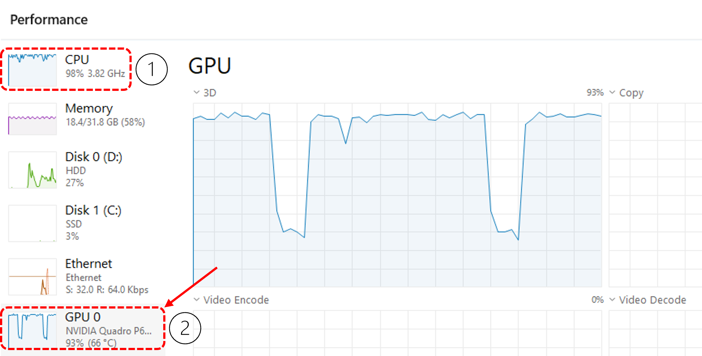
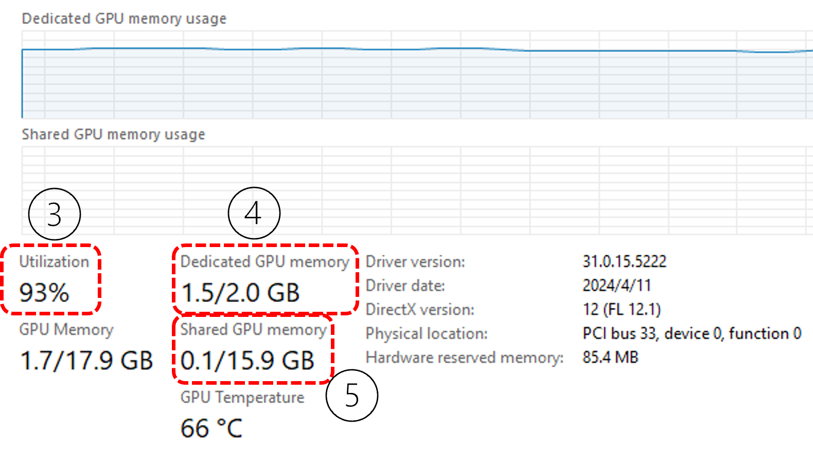

## 15.3 使用 GPU训练【电子资源】

面对彩色数据集，用 CPU 做训练所花费的时间实在是太长了，所以本节将学习如何使用 Pytorch 和 GPU 来训练神经网络。基本步骤是：`操作系统 -> Python 环境 -> 显卡驱动 -> CUDA 工具包 -> cuDNN 加速包 -> Pytorch 框架`。对于没有 GPU 的读者来说，安装并使用 CPU 版本的 Pytorch 也是可以接受的，因为在训练时它可以使用多进程让所有 CPU 满负荷运行。

### 15.3.1 Windows 11 下的 CUDA 环境搭建

笔者使用的笔记本电脑是 Windows 11 操作系统，首先用任务管理器查看是否有独立显卡，如 GPU 0、GPU 1 等，比如笔者的计算机上有两块卡，`GPU 0 - Intel(R) Iris(R) Xe Graphics` 和 `GPU 1 - NVIDIA T500`，第二块就是独立显卡。

如果计算机中有 NVIDIA 的独立显卡，则其驱动程序就已经被安装好了，可以在 `NVIDIA Control Panel -> System Information -> Components` 列表中查看 NVCUDA64.DLL 的版本号，比如笔者的计算机上会显示为 `31.0.15.3818  NVIDIA CUDA 12.2.148 driver`。如果这里的 CUDA 版本太低，比如 8 或 9，则需要在 NVIDIA 网站上寻找与你的 GPU 匹配的新版本的驱动程序，下载安装后一般会达到 CUDA 12 以上。

接下来需要到 NVIDIA 网站下载安装 CUDA Toolkit 12.0 以上的版本，`Windows -> x86_64 -> 11 -> exe(local) -> Download`。在安装过程中，如果你的计算机中没有 Visual Studio 开发工具，可能会报错，此时不要跳过，也不要退出，而是去 Visual Studio 网站下载免费的开发社区版本，在里面选 Python 或 C++ 组件开发即可。安装完后回到安装 CUDA 暂停的界面上，回退一步，再前进一步，就可以看到“发现了 Visual Studio”的信息，继续安装 CUDA。

安装完毕后，用命令行程序 `nvidia-smi.exe` 检查基本信息如下：

```
+---------------------------------------------------------------------------------------+
| NVIDIA-SMI 538.18                 Driver Version: 538.18       CUDA Version: 12.2     |
|-----------------------------------------+----------------------+----------------------+
| GPU  Name                     TCC/WDDM  | Bus-Id        Disp.A | Volatile Uncorr. ECC |
| Fan  Temp   Perf          Pwr:Usage/Cap |         Memory-Usage | GPU-Util  Compute M. |
|=========================================+======================+======================|
|   0  NVIDIA T500                  WDDM  | 00000000:01:00.0 Off |                  N/A |
| N/A   77C    P3              N/A /  15W |   1570MiB /  2048MiB |     70%      Default |
+-----------------------------------------+----------------------+----------------------+
| Processes:                                                                            |
|  GPU   GI   CI        PID   Type   Process name                            GPU Memory |
|=======================================================================================|
|    0   N/A  N/A     20656      C   ...\envs\python.exe                       N/A      |
+---------------------------------------------------------------------------------------+
```
输出中有 `CUDA Version、NVIDIA T500、Processes` 等信息即可证明安装成功！此卡有 2G 内存，当前占用 1570 MiB 内存，70% 的 GPU 使用率。

至于 cuDNN，可以装也可以不装，如果在后续使用中报错说“没有找到加速库”之类的信息，再回来安装也可以。从 NVIDIA 网站上下载与 CUDA 版本匹配的压缩文件，解压后把 `bin、lib` 两个目录中的文件拷贝到 CUDA 目录下对应的子目录 `bin、lib` 中即可，CUDA 的安装位置可以在 `Environment Variables -> CUDA_PATH` 中找到。

最后一步，去 Pytorch 网站找到安装说明，比如：`Stable(2.3.0) -> Windows -> Pip -> Python -> CUDA 12.1`（没有 GPU 的就选择 `CPU` 选项），就可以在本机已经安装好的 Conda 或普通 Python 3.10 的环境中运行如下命令：
```
pip3 install torch torchvision --index-url https://download.pytorch.org/whl/cu121
```

除了 `torch` 包以外，`torchvision` 必须装，因为要用它下载数据集，并提供了一些经典的卷积网络模型。


### 15.3.2 数据加载器与 GPU 使用率的关系

Pytorch 提供了 `DataLoader` 类，在有 GPU 时使用方法如下：
```python
    train_loader = torch.utils.data.DataLoader(
        datasets.CIFAR-10('data', train=True, download=True, batch_size=batch_size,
            shuffle=True, num_workers=4, pin_memory=True, persistent_workers=True)
``` 
参数说明如下。

- `'data'`，目录名称，是 CIFAR-10 数据下载存储的位置，在本书的代码的根目录的 data 目录下。
- `train=True`，训练数据。与之相对的是 `train=False` 表示测试数据。
- `download=True`，使用前下载，如果已经下载过则做一次验证，表显示`Files already downloaded and verified`。
- `batch_size=batch_size`，批量大小。
- `shuffle=True`，使用前是否打乱顺序。对于训练集来说应该为 True，对于测试集来说为 False。
- `num_workers=4`，在 CPU 中开启的线程数用于准备批量训练数据，因为 GPU 计算非常快，那么把数据“喂给” GPU 的速度应该更快，单线程不能满足要求。如果值为 0，则是在当前进程中准备数据。
- `pin_memory=True`，把数据放在 CPU 锁页内存中，可以直接拷贝到 GPU 内存，避免从 CPU 分页内存中拷贝，提高数据传输速度。
- `persistent_workers=True`，加载数据的子进程在每轮（epoch）训练后不关闭，在下一轮中继续使用。

在图 15.2.2 中显示了训练时计算机的各种性能指标。



图 15.2.2 计算机的各种性能指标

- 性能指标（1）为 CPU 利用率，这里为 98% 是因为笔者的计算机同时运行着其它训练程序（使用 CPU 训练），实际上应该在50% 以下。
- 性能指标（2）为 GPU 利用率，在 95% 左右才能说明 GPU 已经被充分使用。如果该值比较低的话就增加 `num_workers` 的值。在右侧的图形显示中可以看到使用率曲线有规律的下降再上升，是因为训练和测试的交替进行造成的。

图 15.2.3 中显示了训练时 GPU 的细节指标。



图 15.2.3 计算机的 GPU 性能指标

- 性能指标（3）是 GPU 使用率。
- 性能指标（4）是 GPU 的专用内存使用率。应该让它尽量接近 2.0 GB 上限。如果没达到，可以增加批量大下，比如目前为 128，则增加到 256 试试看看。
- 性能指标（5）是共享内存使用率。当 2GB 的专用内存不够用时，GPU 不会报“内存溢出”错误，而是使用共享内存进行交换，但此时的计算速度就会明显下降。

### 15.3.3 训练中的误差

训练中的误差（loss）包括训练误差（train loss）、验证误差（validation loss）、测试误差（test loss）。我们在前面的章节中虽然已经学习过以上这些概念，但是在使用 Pytorch 时，仍然需要注意一些细节。

首先，`torch.nn.CrossEntropyLoss()` 函数是一个“二合一”函数，即线性层给出分类值后，它会先调用 `Softmax()` 再调用 `cross_entropy()` 得到误差，在 `loss.backward()` 时会联合以上两个函数做反向传播计算。

其次，`torch.nn.CrossEntropyLoss()` 的缺省参数为 `reduction='mean'`，在得到每个批次的误差后，会除以批量数得到平均值作为当前批次的误差。在一轮（epoch）训练中，会得到多个批次的误差，把这些误差累加起来，在本轮结束时再除以一轮中的迭代次数 `len(data_loader)` 得到平均值，就可以得到运行误差`running loss`，在本轮训练结束时显示。所以，它与计算准确率不同：

- 当**计算准确率**时，需要把每个批次的预测准确率相加，最后**除以总样本数** `len(data_loader.dataset)`；
- 当**计算平均误差**时，需要把每个批次的误差相加最后**除以总批次** `len(data_loader)`。

很多资料中这里是错误的：使用 `CrossEntropyLoss()` 缺省参数时得到的 loss 累计值除以总样本数将会得到很小的误差，不能反映真实的误差情况。如果指定 `CrossEntropyLoss(reduction='none')`，则需要除以总样本数。 

如果验证集一般比较小，所以可以全批量一次性完成误差计算，要注意不要使得 GPU 的内存溢出。而测试集和训练集一样，需要分批次计算。

在每次迭代训练后应该显示当前批次误差，每轮训练结束后应该显示两个误差值：运行误差、验证集误差。如果没有验证集，比如后面要提到的 CIFAR-100 数据集中，每类样本只有 500 张图片，共 100 类，导致训练样本太少，无法提取出有效的验证集，此时可以考虑使用测试集作为验证集。但这不是标准做法，可以在教学试验中使用，不能用于科研论文或工程实践等专业领域。
