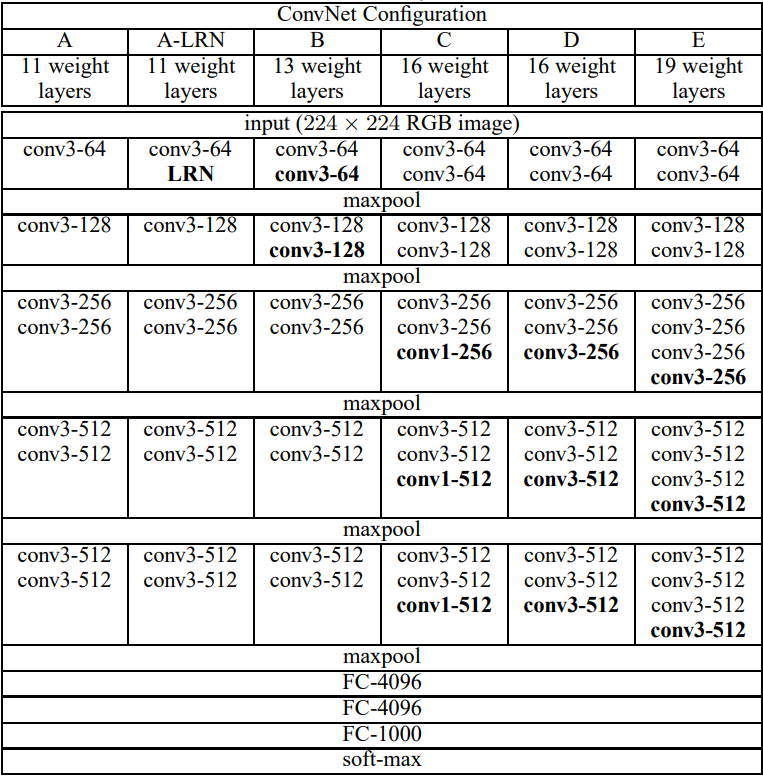
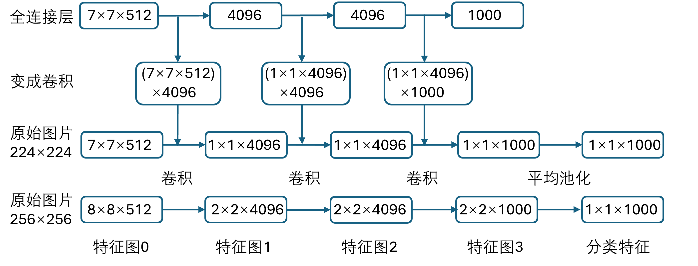
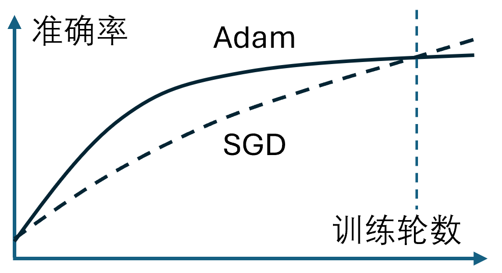

## 15.4 大力出奇迹的 VGG

### 15.4.1 认识 VGG 网络

表 15.4.1 各种配置的 VGG 的结构

这些参数量是如何计算的呢？以 VGG13 为例，分三种：

- 卷积层参数量 = 输入通道数×卷积核高×卷积核宽×输出通道数，比如表 15.4.3 中的层号 1，3×3×3×64=1728；

- 全连接层参数量 = 输入通道数×输出通道数，比如表 15.4.3 中的层号 11，25088×4096=102760448；

- 对应的偏置参数（其实可以忽略不计）。

最后的总数与输入图片的尺寸无关，即使是输入 3×32×32 的图片，参数量也是这么大，竟然达到了 1.33 亿。当考虑到反向传播时，实际占用的内存还需要额外的内存，普通的 SGD 只需要一倍内存保存梯度，而 Adam 需要三倍内存用于反向计算：梯度结果，一阶矩估计，二阶矩估计。

表 15.4.3 VGG13 的参数量计算

|层号|类型|输入通道|高度|宽度|输出通道|权重|偏置|
|-|-|-|-|-|-|-:|-:|
|0|输入图片|3|224|224||||
|1|conv3×3|3|224|224|64|1,728|64|
|2|conv3×3|64|224|224|64|36,864|64|
||maxpool2×2|64|112|112|0|0|64|
|3|conv3×3|64|112|112|128|73,728|128|
|4|conv3×3|128|112|112|128|147,456|128|
||maxpool2×2|128|56|56|128|0|0|401,408|
|5|conv3×3|128|56|56|256|294,912|256|
|6|conv3×3|256|56|56|256|589,824|256|
||maxpool2×2|256|28|28|256|0||
|7|conv3×3|256|28|28|512|1,179,648|512|
|8|conv3×3|512|28|28|512|2,359,296|512|
||maxpool2×2|512|14|14|512|0|0|100,352|
|9|conv3×3|512|14|14|512|2,359,296|512|
|10|conv3×3|512|14|14|512|2,359,296|512|
||maxpool2×2|512|7|7|512|0|0|25,088|
|11|FC|25088|||4096|102,760,448|4096|
|12|FC|4096|||4096|16,777,216|4096|
|13|FC|4096|||1000|4,096,000|1000|
||总计(字节)|||||133,035,712|12,136|

### 15.4.2 VGG 的特点

图 15.4.1 测试时全连接层变成卷积层

### 15.4.3 训练简化的 VGG 网络

### 15.4.4 使用数据增强

### 15.4.5 使用单层全连接分类

图 15.4.2 Adam 和 SGD 的比较
