## 15.5 稀疏连接的 GoogLeNet

### 15.5.1 认识 1×1 卷积

图 15.5.1 单通道的 1×1 卷积

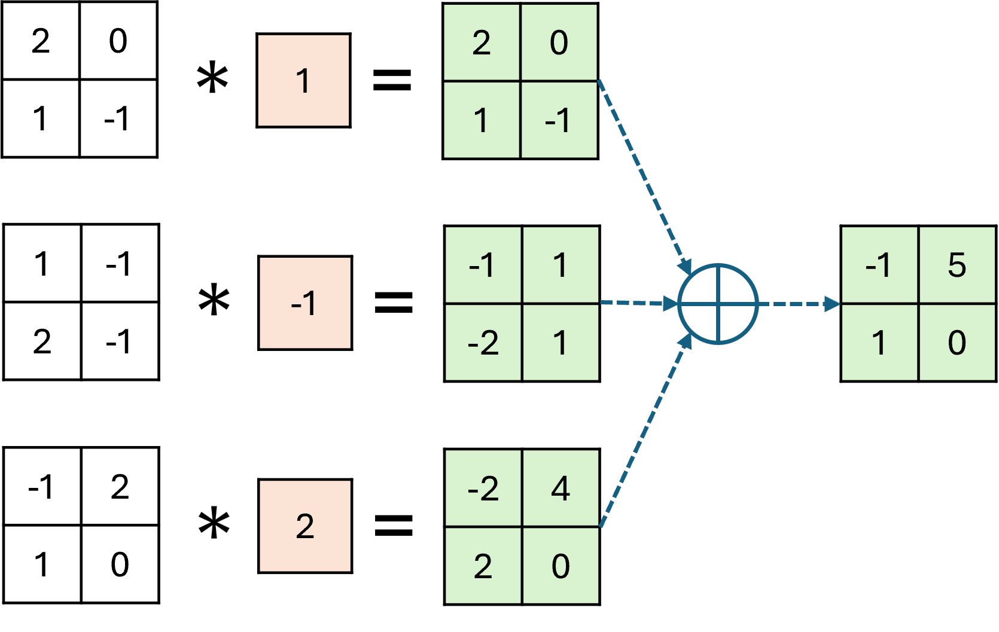

图 15.5.2 三通道输入的 1×1 卷积

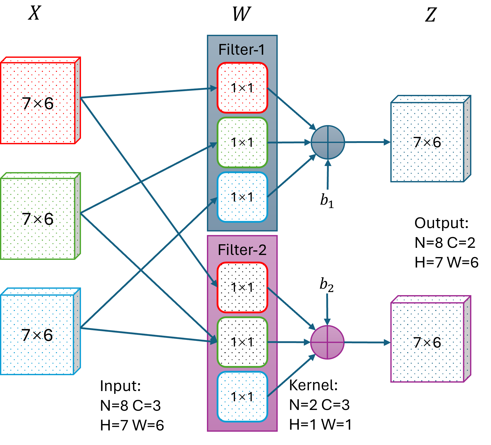

图 15.5.3 多通道输出的 1×1 卷积

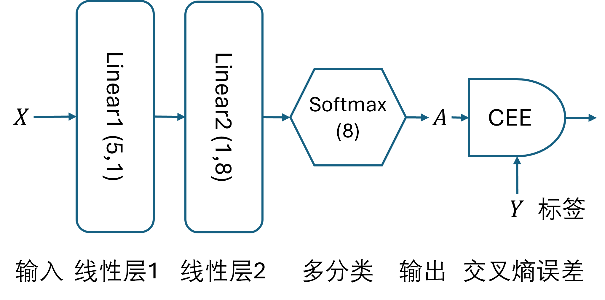

来自图 13.2.3 用双层线性网络做分类

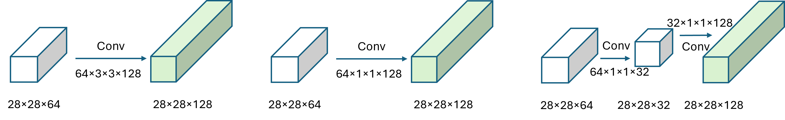

图 15.5.4 1×1 卷积与 3×3 卷积的对比

### 15.5.2 认识 GoogLeNet

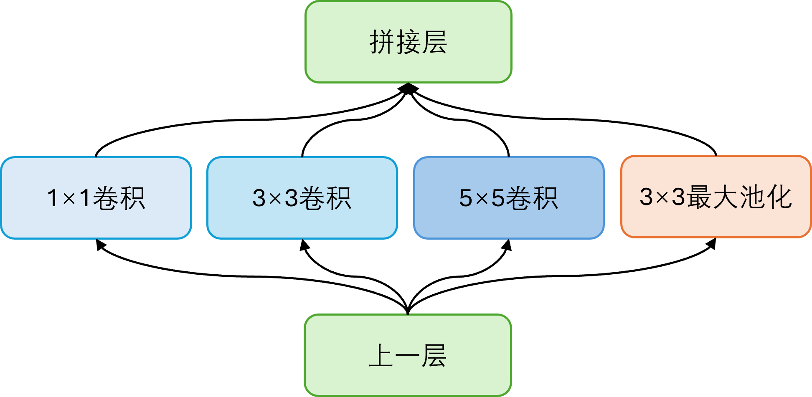

图 15.5.5 Inception 的基本结构

图 15.5.5 Inception 四个通道的输出比较

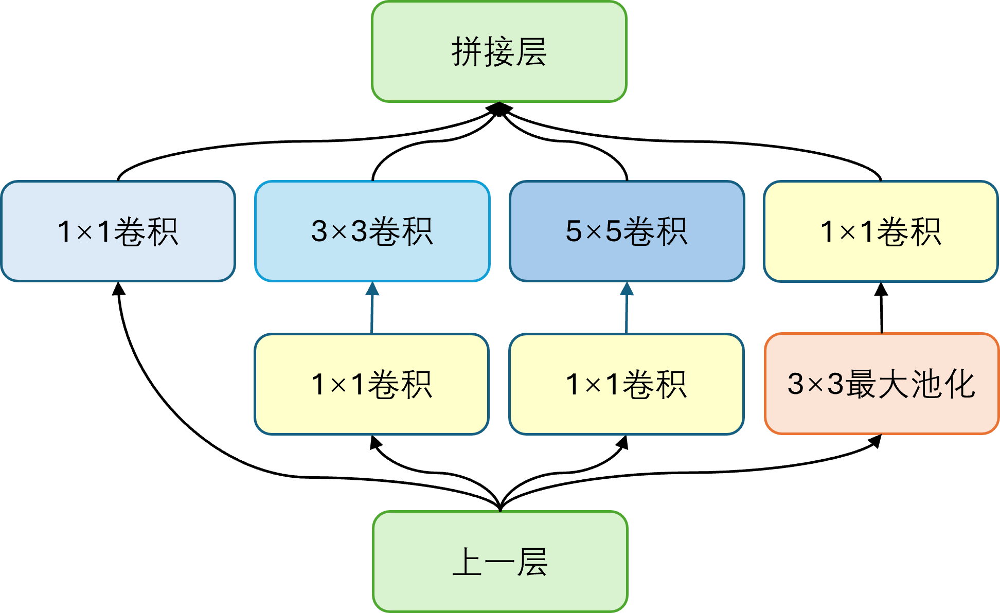

图 15.5.6 Inception 的高级结构

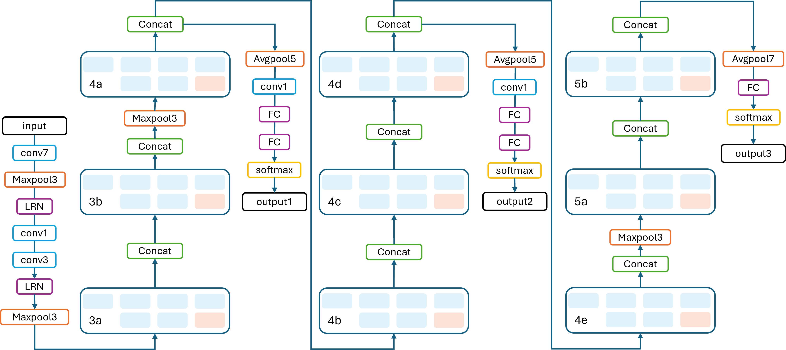

图 15.5.7 GoogLeNet 网络结构图

表 15.5.1 网络中各层的主要参数（来自原论文并略有改动）

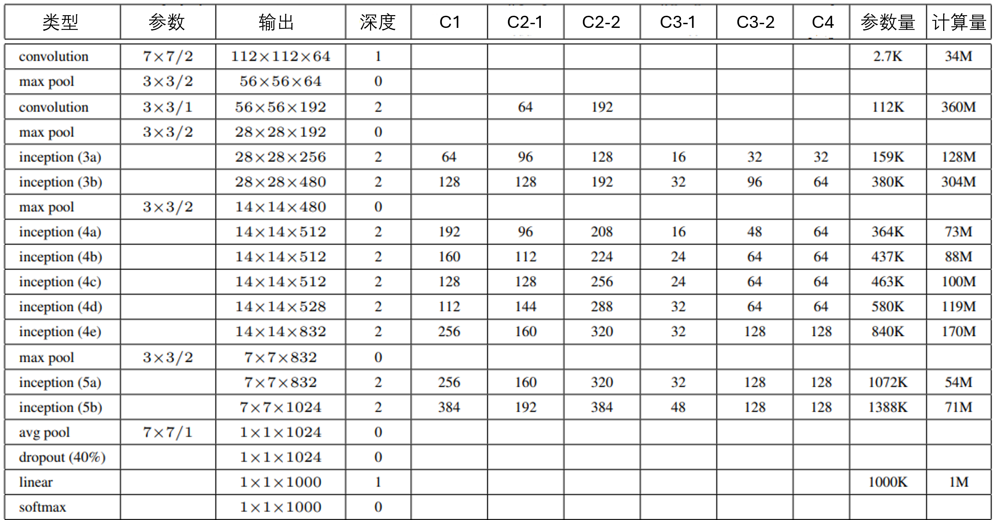

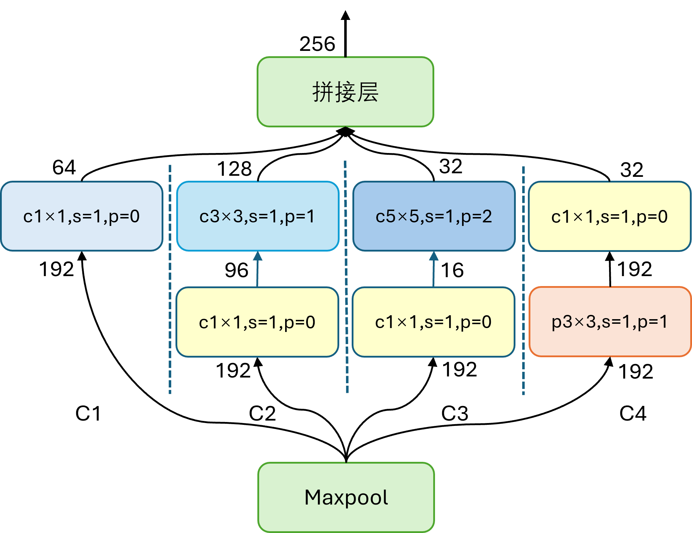

图 15.5.8 Inception 3a 内部参数

### 15.5.3 在 CIFAR-10 数据集上的表现

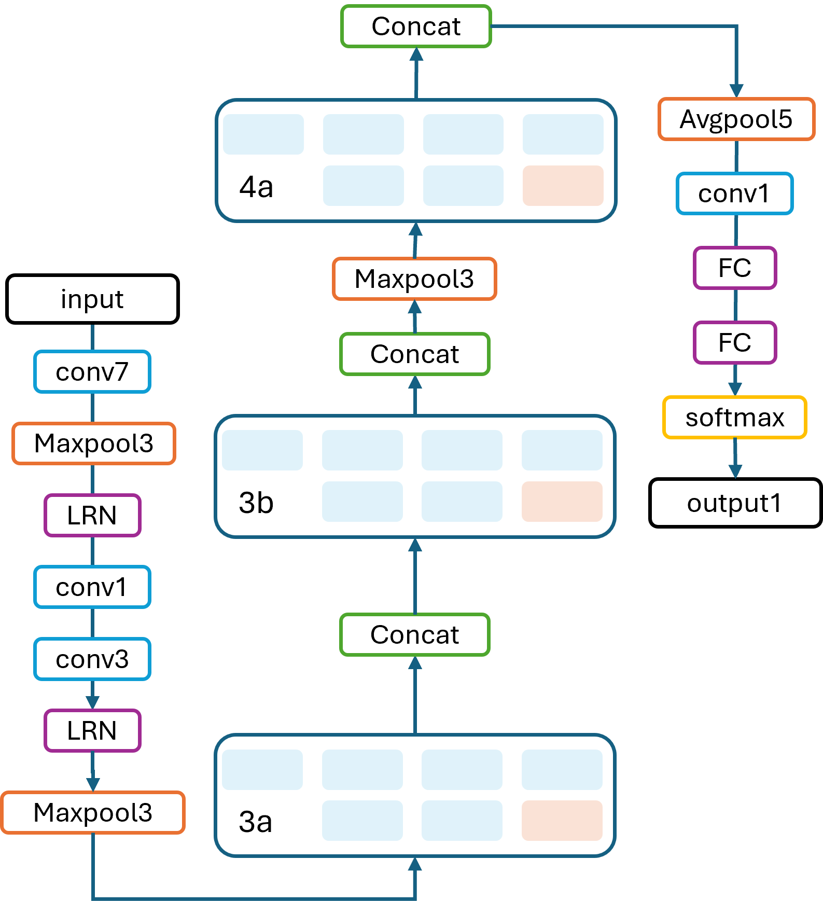

图 15.5.9 简化模型1

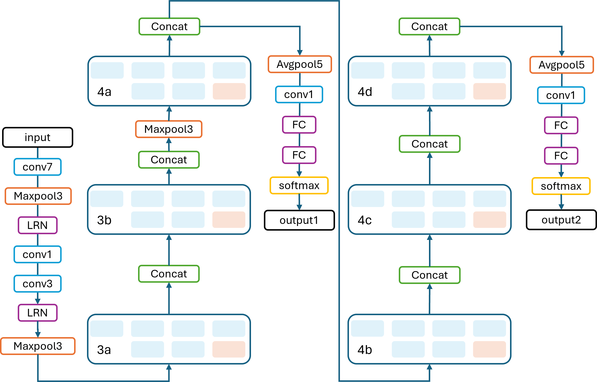

图 15.5.10 简化模型2

### 15.5.4 GoogLeNet 的后续发展
