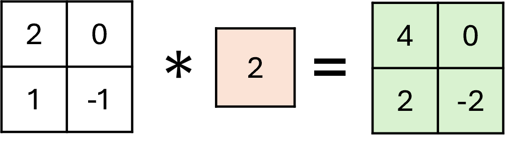

## 15.5 稀疏连接的 GoogLeNet

在 GoogLeNet 中大量使用了 1×1 的卷积，所以我们先学习一下这种卷积操作的具体作用。

### 15.5.1 认识 1×1 卷积

#### 1. 形式与作用

图 15.5.1 中是最简单的 1×1 卷积，可以看到这种卷积并没有什么用，它只是简单地把原始数据中的所有数值都乘以卷积核的值而已。



图 15.5.1 单通道的 1×1 卷积

图 15.5.2 是三通道输入的 1×1 卷积，每个通道对应一个 1×1 卷积核并具有不同值，相乘后得到新的 2×2 卷积结果再相加成为新的特征图。所以它的主要作用是**在通道级别上合并特征**。在本例中还起到了降维的作用，但降维并不是目的，因为还可以利用 1×1 卷积进行升维。


图 15.5.2 三通道输入的 1×1 卷积

图 15.5.3 是常见的应用场景。三个输入通道，两个输出通道，六个卷积核都是 1×1 的，最终会得到和原图 $X$ 同样大小的两个特征图 $Z$。


图 15.5.3 多通道输出的 1×1 卷积

#### 2. 稀疏实现

回忆图 13.2.3，它用两个相连的 FC 层（中间没有激活函数）来处理输入为 5（特征数） 输出为 8（分类数）的问题。因为特征数和分类数是不能改的，如果用 5×8 的 FC 层的话将会有 40 个参数。面对这种比较简单的分类问题，40 个参数太多了，其中的很多参数其实是可以省掉的，如果用 L1 或 L2 正则的话就可以看到这一点，这就是一个稀疏表示的问题。而用一个 5×1 的FC层接一个 1×8 的 FC 层，一共只有 13 个参数就可以解决这个问题，相当于是人为设计的一个稀疏连接。


来自图 13.2.3 用双层线性网络做分类

对应到卷积问题上，可以看图 15.5.4 中的对比。


图 15.5.4 1×1 卷积与 3×3 卷积的对比

图 15.5.4 中：
- 左图，使用 3×3 卷积加 padding 从 64 通道原始图得到 128 通道的特征图，卷积核参数量为 64×3×3×128=73728；
- 中图，当特征较少时不需要通过卷积增加感受野，则使用稀疏的 1×1 卷积，参数量为 64×1×1×128=8192；
- 右图，使用 64×1×1×32 的卷积先进行**降维**，然后使用 32×1×1×128 进行**升维**，这样的话参数量为 64×1×1×32+32×1×1×128=6114，比中图中的情况还少。

#### 3. 升维降维与特征变化

也许有读者会担心当三个通道的特征通过线性合并**降维**为一张特征图时，会不会有特征损失？其实不必担心，因为卷积核的值是经过训练的，以图 15.5.2 为例，假设左侧三个通道的图中的左上角像素点标记为 $a_1、b_1、c_1$，那么输出的特征图中左上角的值为 $1\cdot a_1-1\cdot b_1+2\cdot c_1=-1$，可以看到它包含了三个通道对应点的所有信息。当反向传播时，该点上的误差依然可以通过这个表达式传回给左侧的三张图的 $a_1、b_1、c_1$ 三个点上，所以特征不会损失。

那么在图 15.5.4 右图所示的**升维**的情况中，使用 1×1 卷积核会产生新的特征吗？答案是会的，因为几个通道内的特征通过线性组合就可以形成一个新的特征，再加上卷积之后还有激活函数，**增加了网络的深度和非线性拟合能力**。

最后一种情况就是图 15.5.4 中图的情况，先降维后升维，这样做的目的是什么呢？有可能有这种情况：在第一个 64 通道的图中特征有些冗余，经过 64×1×1×32 的卷积做一个过滤（因为后面还接了激活函数），然后把精简的 32 通道再通过线性组合升维到 128 通道形成新特征。

### 15.5.2 认识 GoogLeNet

#### 1. 困境分析
代号 Inception，V1 是 GoogLeNet 的最早版本，在 2014 年提出的，并在当年的 ImageNet 大赛的分类和检测任务中取得新的最优成绩。之后又有了 V2、V3、V4等版本。之所以名为“GoogLeNet”而非“GoogleNet”，是为了向早期的 LeNet 致敬。

提高深度神经网络性能的最直接方法是增加其规模。这包括增加网络的深度（层数）及其宽度（每层的单元数量）。这是训练更高质量模型的一种简单且安全的方法，特别是考虑到大量标记训练数据的可用性。然而，这个简单的解决方案有两个主要缺点。

- 第一个缺点是**海量参数**。更大的尺寸通常意味着更大数量的参数，这使得扩大的网络更容易过度拟合，特别是在训练集样本数量有限的情况下。

- 另一个缺点是**巨量计算**。计算资源的使用急剧增加。例如，在深度视觉网络中，如果两个卷积层链接在一起，则它们的滤波器数量的任何均匀增加都会导致计算量呈二次方增加。如果增加的容量使用效率低（例如，如果大多数权重最终接近于零），那么大量计算就会被浪费。

VGG 网络通过五层卷积块（内含多层卷积）增加了网络深度，通过提高输出通道数量到 512 增了网络宽度，导致参数达到 1.3 亿以上，就是以上缺点的具体体现。解决上述缺点的根本方法是将全连接层甚至一般的卷积层都转化为稀疏连接。一方面现实生物神经系统的连接也是稀疏的，另一方面有研究表明：对于大规模稀疏的神经网络，可以通过分析激活值的统计特性和对高度相关的输出进行聚类来逐层构建出一个最优网络。这点表明臃肿的稀疏网络可能被不失性能地简化。虽然数学证明有着严格的条件限制，但生物学中的 Hebbian 准则有力地支持了这一点：如果两个神经元常常同时产生动作电位（fire together），则其之间的连接会变强，反之则同时变弱（wire together），就好像一只狗听到铃铛响（听觉神经）就会流口水（控制神经）。

#### 2. 解决方法

解决以上问题的根本方法就是把全连接的网络变为稀疏连接（卷积层其实就是一个稀疏连接），当某个数据集的分布可以用一个稀疏网络表达的时候就可以通过分析某些激活值的相关性，将相关度高的神经元聚合，来获得一个稀疏的表示。这种方法也印证了一个现象：先摇铃铛，之后给一只狗喂食，久而久之，狗听到铃铛就会口水连连。这也就是狗的“听到”铃铛的神经元与“控制”流口水的神经元之间的链接被加强了，而赫布理论（Hebbian principle）的含义就是如果两个神经元常常同时产生动作电位，或者说同时激动（fire），这两个神经元之间的连接就会变强，反之则变弱（neurons that fire together, wire together）

早些时候，为了打破网络对称性和提高学习能力，传统的网络都使用了随机稀疏连接。但是，计算机软硬件对非均匀稀疏数据的计算效率很差，所以在 AlexNet 和 VGG 中又重新启用了全连接层，目的是为了更好地优化并行运算。所以，现在的问题是有没有一种方法，既能保持网络结构的稀疏性，又能利用密集矩阵的高计算性能。大量的文献表明可以将稀疏矩阵聚类为较为密集的子矩阵来提高计算性能，据此提出了名为 Inception 的结构来实现此目的。如图 15.5.5 所示。


图 15.5.5 Inception 的基本结构

采用不同大小的卷积核意味着不同大小的感受野，因为在图片中有可能有近大远小的透视效果。

卷积核大小采用 1、3、5，主要是为了方便对齐。设定卷积步长 stride=1 之后，只要分别设定 padding=0、1、2，那么卷积之后便可以得到相同维度的特征，然后这些特征就可以直接拼接在一起了。比如输入图片为 8×8，则 `conv(k=1,s=1,p=0)` 会得到 8×8 的特征图，`conv(k=3,s=1,p=1)`、`conv(k=5,s=1,p=2)` 也会得到 8×8 的特征图，那么把它们拼接在一起传入下一层就很容易。

池化操作对于卷积网络的成功至关重要，因此在每个结构内并行添加额外的池化操作也应该具有额外的效果。也就是说它在旁路提取了上一层的大视野特征，而且不会损失维度。使用 `maxpool(k=3,s=1,p=1)` 的池化在 8×8 的图片上也会得到 8×8 的特征图。

最后拼接意味着不同的视觉尺度特征的融合，注意这里不是相加，而是串接（concat）。

图 15.5.5 是一个 Inception 块中四个通道的输出比较，第一张图片是原图，权重时随机初始化的，不过也能看出它们的不同作用。比如，1×1 通道做了与原图明暗相反的变化，3×3 通道捕捉了很多边缘，5×5 通道捕捉了几个特征区域，maxpool 通道只是简单地降维尺寸。


图 15.5.5 Inception 四个通道的输出比较


但是，使用 3×3 和 5×5 的卷积核仍然会带来大的计算量。为此，采用 1×1 卷积核来进行降维，如图 15.5.6 所示。


图 15.5.6 Inception 的高级结构

对图 15.5.6 的几点说明如下：

- 最左侧的 1×1 卷积不需要再降维；
- 中间的 3×3 和 5×5 都用 1×1 先进行降维，以减少参数量，原理如图 15.5.4 右图。并且这个 1×1 卷积后面还接了激活函数，增加了网络深度；
- 右侧的池化后面接一个 1×1 卷积，也是为了增加网络深度，并有组合不同通道的特征的作用。

具体实现如下：

```python
class Inception(nn.Module):
    def __init__(self, in_ch, c1_out, c2_out, c3_out, c4_out):
        super(Inception, self).__init__()
        self.c1 = nn.Sequential(  # Conv 1 x 1
            nn.Conv2d(in_ch, c1_out, kernel_size=1), nn.BatchNorm2d(c1_out), nn.ReLU(),
        )
        self.c2 = nn.Sequential(  # Conv 1 x 1 -> Conv 3 x 3
            nn.Conv2d(in_ch, c2_out[0], kernel_size=1), nn.BatchNorm2d(c2_out[0]), nn.ReLU(),
            nn.Conv2d(c2_out[0], c2_out[1], kernel_size=3, padding=1), nn.BatchNorm2d(c2_out[1]), nn.ReLU(),
        )
        self.c3 = nn.Sequential(  # Conv 1 x 1 -> Conv 5 x 5
            nn.Conv2d(in_ch, c3_out[0], kernel_size=1), nn.BatchNorm2d(c3_out[0]), nn.ReLU(),
            nn.Conv2d(c3_out[0], c3_out[1], kernel_size=5, padding=2), nn.BatchNorm2d(c3_out[1]), nn.ReLU(),
        )        
        self.c4 = nn.Sequential(  # Pool 3 x 3 -> Conv 1 x 1
            nn.MaxPool2d(kernel_size=3, stride=1, padding=1),
            nn.Conv2d(in_ch, c4_out, kernel_size=1), nn.BatchNorm2d(c4_out), nn.ReLU(),
        )        
    
    def forward(self, x):
        x1 = self.c1(x)
        x2 = self.c2(x)
        x3 = self.c3(x)
        x4 = self.c4(x)
        cat = torch.cat((x1, x2, x3, x4), dim=1)
        return cat
```

#### 3. 网络结构

使用 Inception 块的网络结构如图 15.5.7 所示，其参数如表 15.5.1 所示。


图 15.5.7 GoogLeNet 网络结构图

图 15.5.7 说明如下。

- 采用了模块化的结构，方便增添和修改。比如，当觉得网络深度不够时，可以增加一个 3c 或 4f 或 5c 块。

- 全网 22 层（注意每个 Inception 块中有两层），如果算上池化层则为 27 层。

- 在网络的初始阶段（图 15.5.6 左侧）仍然使用传统的大核卷积核池化，以便快速减少图片尺寸，同时不丢失特征。LRN 在当前的实现中被 BN 取代。经过三次卷积和两次池化后，图片的尺寸从 224 降到了 28，然后才开始进入 Inception 堆叠阶段。

- 网络最后采用了平均池化来代替全连接层，事实证明可以将准确率提高 0.6%。但是，在最后还是加了一个全连接层，主要是为了方便以后微调。

- 虽然移除了全连接，但是网络中依然使用了 Dropout。

- 由于网络很深，为了避免梯度消失，网络额外增加了两个辅助的输出用于向前传导梯度，即在图 15.5.6 的 4a 后面和 4d 后面。这两个输出也计算误差，最后三个误差相加 `loss = 0.3×loss1 + 0.3×loss2 + loss3`，同时进行反向传播。在测试的时候只需要 `loss3`。

表 15.5.1 网络中各层的主要参数（来自原论文并略有改动）


通过构建密集的块结构来近似最优的稀疏结构，从而达到提高性能而又不大量增加计算量的目的，模型的参数大小约 6.8M，但性能却很优异。

为什么在两个辅助输出部分的平局池化后还接了卷积和两个 FC，而在总输出部分只有一层 FC？这是因为两个辅助输出的前端网络深度不够，所以用一个 1×1 的卷积来混合特征并降维，然后使用两个 FC 来增强拟合能力。

#### 4. Inception 块内部的参数

以 Inception 3a 为例说明其输入输出的数据形状，见图 15.5.8。


图 15.5.8 Inception 3a 内部参数

从 Maxpool 中输出的是 192×28×28 的特征图，输入到 Inception 块的四个通道中：

- C1，经过 c1×1,s=1,p=0 的卷积后，得到 28×28 的特征图。其中，c1×1 表示卷积核，s=1 表示步长，p=0 表示填充，计算方法为式（14.3.1），下同；

- C2，经过 c1×1,s=1,p=0 和 c3×3,s=1,p=1 的卷积后，得到 28×28 的特征图；

- C3，经过 c1×1,s=1,p=0 和 c5×5,s=1,p=2 的卷积后，得到 28×28 的特征图；

- C4，经过 p5×5,s=1,p=1 的最大池化和 c1×1,s=1,p=0 的卷积后，得到 28×28 的特征图。

所以，四个通道输出的特征图全都是 28×28，它们的输出通道分别是64、128、32、32，使用 `concat` 方法横向连接在一起，得到 256 个输出通道。

从表 15.5.1 可以看到，随着网络的深入，1×1 的卷积核通道数逐渐减少，3×3 和 5×5 的卷积核输出通道逐渐增加，总体比例上以 3×3 卷积核为主力。

### 15.5.3 在 CIFAR-10 数据集上的表现

#### 1. 使用简化的模型1

由于 GoogLeNet 是为 224×224 的图片设计的，网络太深的话特征向量都缩小到 1 了，所以我们使用简化的模型来做试验，如图 15.5.9 所示。


图 15.5.9 简化模型1

该简化模型只使用了原始结构中的辅助输出 1 来做总输出，丢掉后面的网络组件，输入数据仍然保持 32×32 的尺寸，总参数量约为 2M。在这个模型上，我们使用了如下数据增强方法：
```python
transforms.RandomHorizontalFlip(p=0.4),
transforms.RandomVerticalFlip(p=0.4),
transforms.RandomRotation(degrees=(0,15)),
transforms.RandomAffine(degrees=0, translate=(0.2,0.2)),
transforms.RandomCrop(32, padding=4),
```
使用 `SGDM(momentum=0.9, nesterov=True, lr=0.0001, weight_decay=1e-6)` 优化器，批量为 128，共 100 轮，最终在测试集上得到 69.68% 的准确率。运行【代码：H15_4_GoogLeNet_Simple1_Cifar10_Train.py】可以进行训练与测试。

#### 2. 使用简化模型2

在 15.3 节的 VGG 中我们曾经在 CIFAR-10 上得到 91.99% 的准确率，所以上述 69.68% 的准确率不能令人满意。既然简化模型 1 过于简化，我们多增加几层 Inception 块试试，如图 15.5.10 所示。


图 15.5.10 简化模型2

这次使用原始模型中的辅助输出 2 作为总输出，仍保留辅助输出 1，误差的比例为 `loss = loss1 * 0.3 + loss2`，总参数量约为 4.2M。与简化模型 1 相比，多出来的部分并没有池化层，所以输出特征维度还可以接受。数据增强方法和简化模型 1 相同便于对比，优化器使用 `Adam(lr= 0.001, weight_decay=1e-6)`，批量 128，共 100 轮，最终得到 83.21% 的准确率。运行【代码：H15_4_GoogLeNet_Simple2_Cifar10_Train.py】可以复现结果。

#### 3. 使用全模型

看起来简化模型的性能（约为 70% 和 83%）不能与 VGG 相比，这次使用全模型来做试验，即图 15.5.6。由于后面还有池化层，所以我们不得不使用 `transforms.Resize(96)` 来提高原始数据的尺寸，以保证后面的特征输出有意义。注意，测试集需要同时提高尺寸，否则会发生训练轮数越多测试集准确率越低的情况。训练结果如下，在第 83 轮时得到最好值：

```
...
Epoch:83/100 (lr=0.00044) 100 %[**************************************************]0.0455
Running loss:0.1369, Test loss: 0.4377, Accu: 9036/10000 (90.36%)
...
```

正常的预测输出只有 `output3`，值为 90.36%。我们可以稍微修改一下模型中的判断条件，去掉对 `self.training` 的判断，就可以得到三个输出：
```
Test Loss1: 0.4800, Correct1: 8899/10000 (88.99%)  # output 1
Test Loss2: 0.4539, Correct2: 9023/10000 (90.23%)  # output 2
Test Loss3: 0.4377, Correct3: 9036/10000 (90.36%)  # output 3
```
从结果中可以看到，三个输出的准确率并非按照 70%、83%、90% 的梯次排列，而是非常接近（89%、90.2%、90.3%），这说明了一个事实：

- 网络的前端部分（被称为浅层）非常重要，它是整个网络的基础；
- 网络后端对于最终预测时的准确率的贡献不如想象得那么大；
- 但是如果没有网络后端（被称为深层），前端的训练也不能达到很高的准确率。

这给了我们一种提示：在训练时使用深层网络，在预测时使用浅层网络，这样可以使得预测的成本（内存、设备、速度）大大降低。在 GoogLeNet 网络中，后端没有很多的 FC 层，所以即使去掉后端也不会有太大的影响。

### 15.5.4 GoogLeNet 的后续发展

GoogLeNet 凭借其优秀的表现，得到了很多研究人员的学习和使用，因此研究人员又对其进行了进一步发掘改进，产生了若干升级版本。其中最有特色的是用若干个 $N×1$ 及 $1×N$ 卷积核代替 $N×N$ 卷积核，以及用两个 3×3 卷积核代替 5×5 卷积核，这都使得网络更加稀疏。有兴趣的读者可以自行学习并试验。
