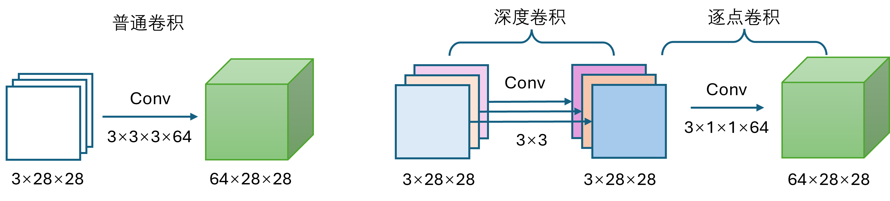
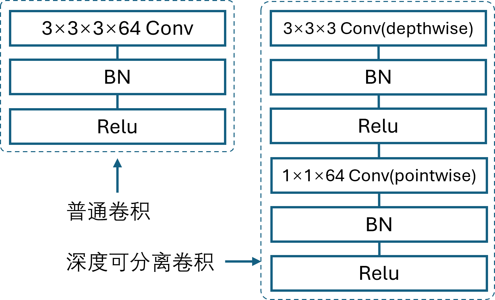
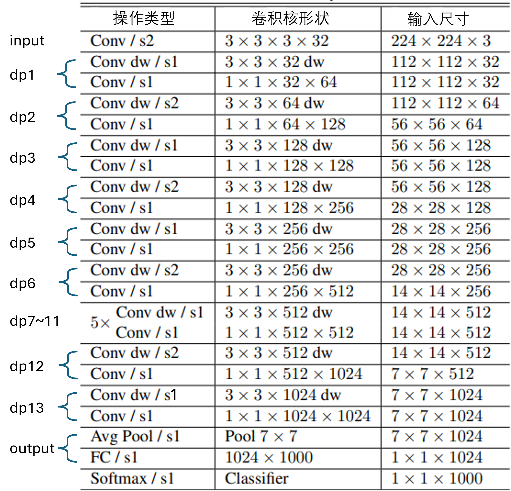
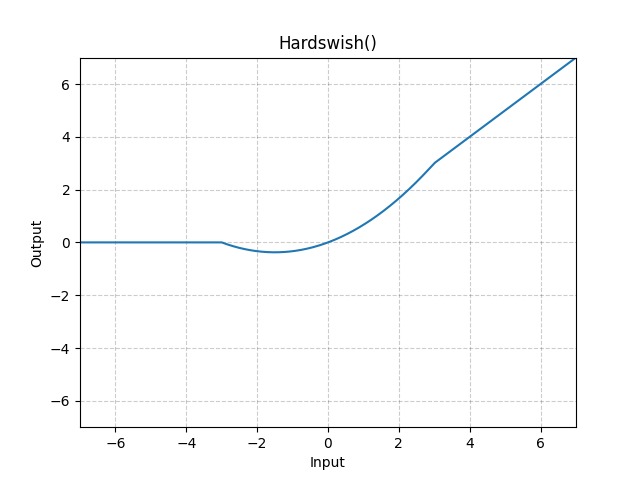

## 15.7 深度可分离的 MobileNet

### 15.7.1 两种卷积的比较

图 15.7.1 普通卷积与深度可分离卷积的参数比较

### 15.7.2 认识 MobileNet 网络

图 15.7.2 普通卷积与深度可分离卷积的结构比较

表 15.7.1 MobileNet的网络结构（来自原论文并略有改动）

### 15.7.3 MobileNet 在 CIFAR-100 上的表现

### 15.7.4 两个附加因子

### 15.7.5 MobileNet 的后续发展

图 15.7.4 Hardwish激活函数图像
