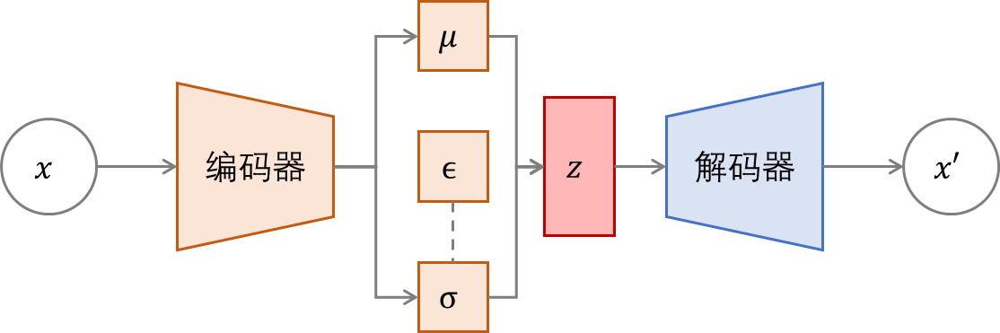
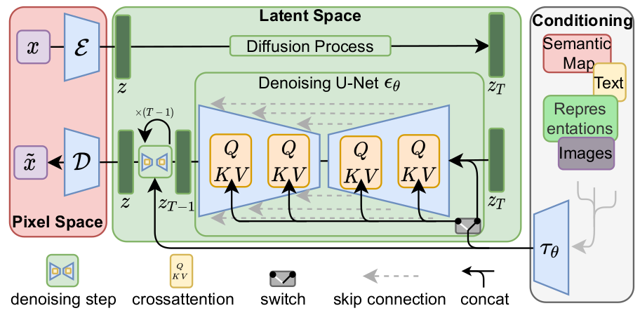

## 16.10 图像生成

### 16.10.1  技术路线-VAE变分自编码

 

图 16.10.1 VAE模型结构  

### 16.10.2  技术路线-GAN对抗神经网络

 

图 16.10.2 GAN网络结构   

### 16.10.3 技术路线-扩散模型

 

图 16.10.3 Stable Diffusion 模型结构   

 

图 16.10.4 Stable Diffusion 文本到图像的生成流程   

### 16.10.4 图像生成小结

 

图 16.10.5 Stable Diffusion 生成图像效果比较   
