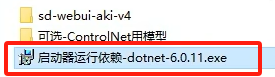
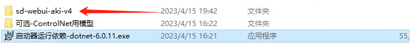
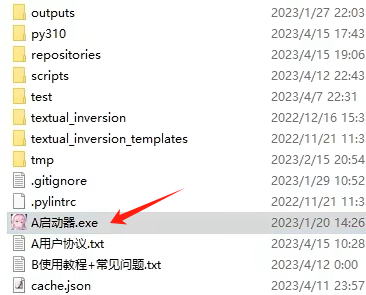
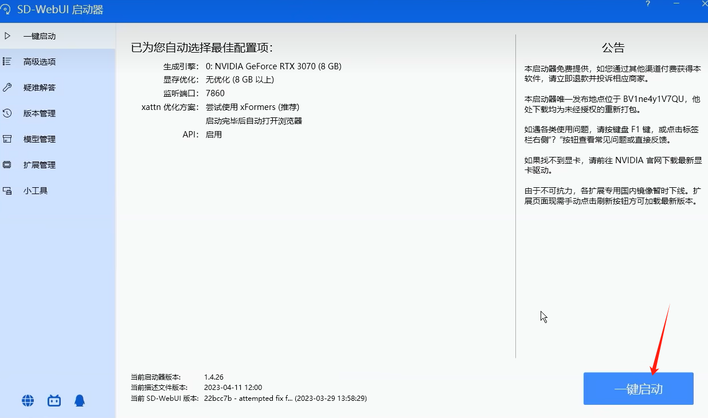
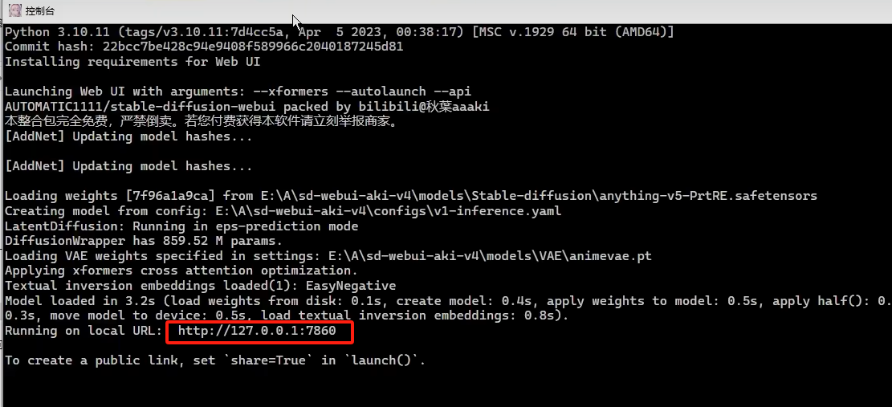
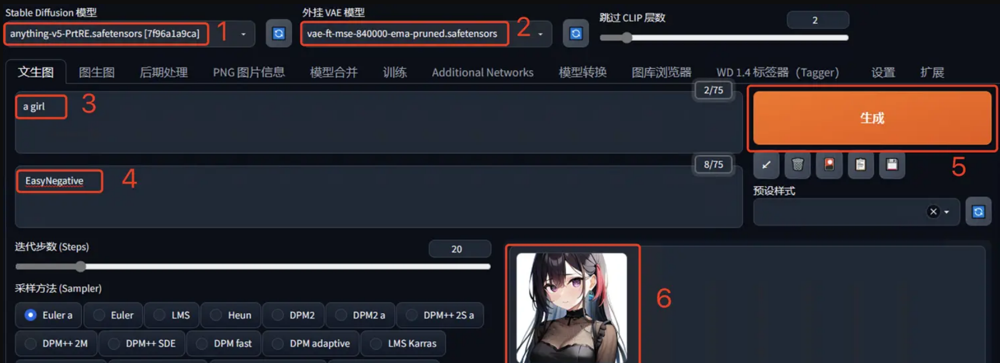

## 16.11 实践部署

### 图像生成部署

#### 1.使用开源代码部署

创建python 3.10.6版本的环境
运行下面语句，创建环境

```
conda create --name lmd python=3.10.6
```

激活环境输入`conda activate lmd` 回车。

再来克隆stable diffusion webui项目（下面简称sd-webui）

```
git clone https://github.com/AUTOMATIC1111/stable-diffusion-webui.git
```

下载stable diffusion的训练模型

地址：https://huggingface.co/CompVis/stable-diffusion-v-1-4-original/tree/main

点击file and versions选项卡，下载一个自己看好的训练模型。

注：这个模型是用于后续生成AI绘图的绘图元素基础模型库。

后面如果要用waifuai或者novelai，其实更换模型放进去sd-webui项目的模型文件夹即可。

下载好之后，请把模型更名成model.ckpt,然后放置在sd-webui的models/stable-diffusion目录下。

开启运行ai绘图程序sd-webui

```python
cd stable-diffusion-webui
# 进入项目的根目录。执行
webui-user.bat
```

直到系统提示，running on local URL: http://127.0.0.1:7860

点击链接，进入webUi界面。

#### 2.使用整合包部署

在云盘下载整合包 sd-webui-aki-v4.9.7z 文件。

进行解压缩。内容入下图所示：
双击启动运行依赖exe文件，即可自动为项目环境配置依赖环境，环境是虚拟独立在已有python环境之外的，很方便。

  

图 16.6.8 整合包环境的安装 

安装完成后进入整合包的文件夹中：

  

图 16.6.9 主程序文件夹 

进入目录，双击启动器；打开启动器，选择一键启动：




图 16.6.10 启动流程 


和运行起来开源的代码的项目一样，都会启动一个web服务，并提供一个URL链接，使用浏览器打开链接，即可打开页面（整合包对页面也进行了汉化处理）：

  

图 16.6.11 服务启动 

#### 3.模型推理

只需简单 5 步即可生成图像：

1. **Stable Diffusion 模型**：默认使用 `anything-v5` 模型，无需选择。
2. **外挂 VAE 模型**：它类似滤镜，可以让生成的图像颜色更丰富。
3. **提示词**：输入想要生成图像的描述（需为英文）。
4. **反向提示词**：输入不希望出现在图像中的元素。
5. **点击生成**：其他参数保持默认，点击“生成”按钮即可。

生成速度取决于计算机性能，稍等片刻后即可查看生成图像。点击可放大，右键可下载。

  
 
图 16.6.12 主页面效果 

