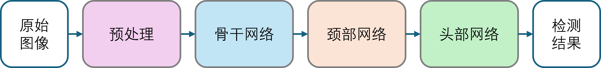
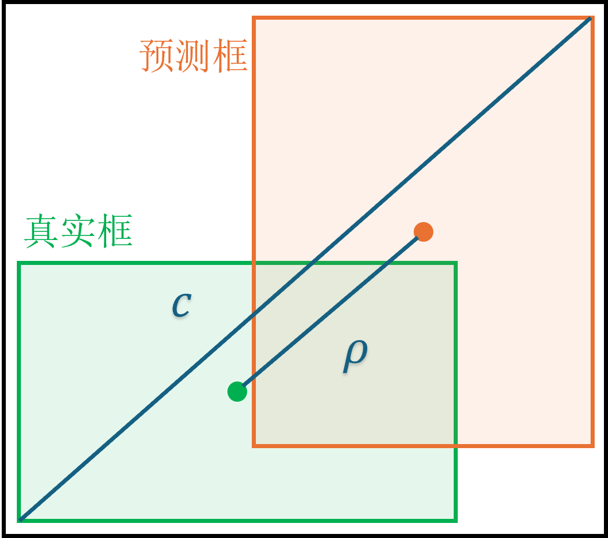

## 16.2 目标检测任务

 

图 16.2.1 目标检测任务示意图  

### 16.2.1 单阶段目标检测

### 16.2.2 图像预处理

 

图 16.2.2 Mosaic数据增强  

 

图 16.2.3 自适应图片缩放  

### 16.2.3 YOLOv5 网络

 

图 16.2.4 目标检测任务拆解  

 

图 16.2.5 YOLOv5 总体结构

 

图 16.2.6 YOLOv5 结构中的各个组成单元

 

图 16.2.7 头部网络输出的特征张量  

 

图 16.2.8 非极大值抑制效果  

### 16.2.4 损失函数

 

图 16.2.9 CIOU损失函数物理意义  

