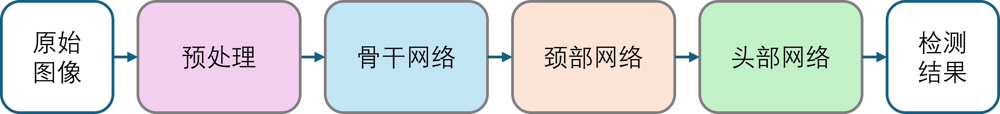
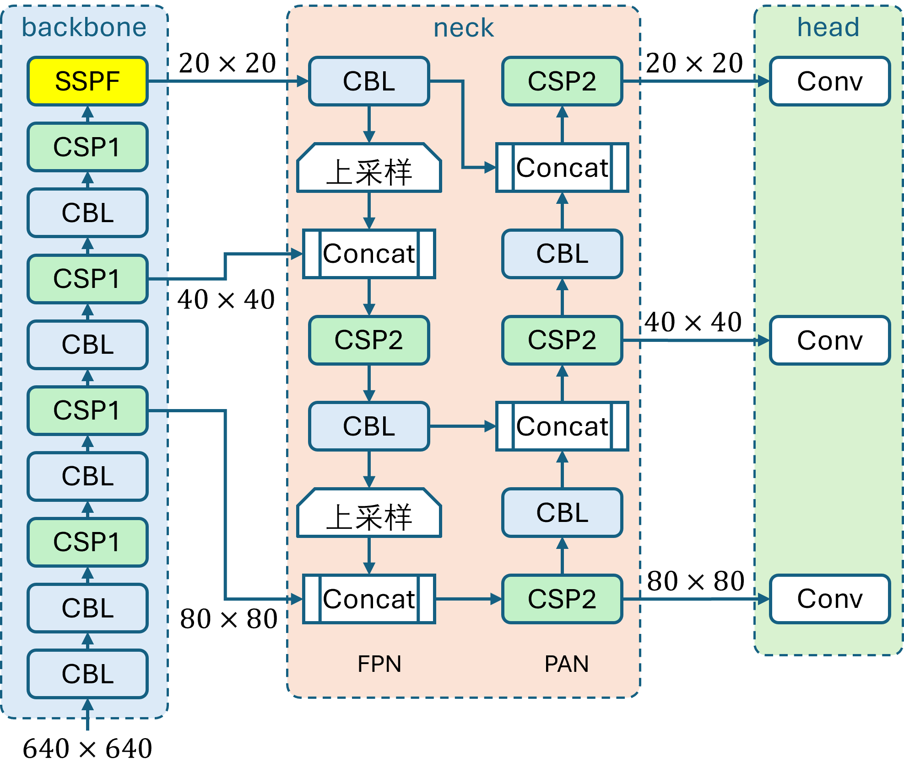
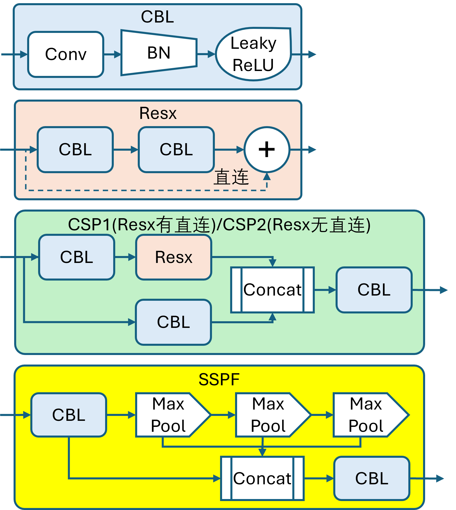
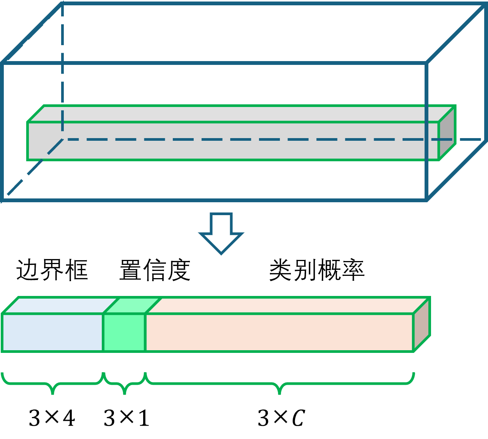
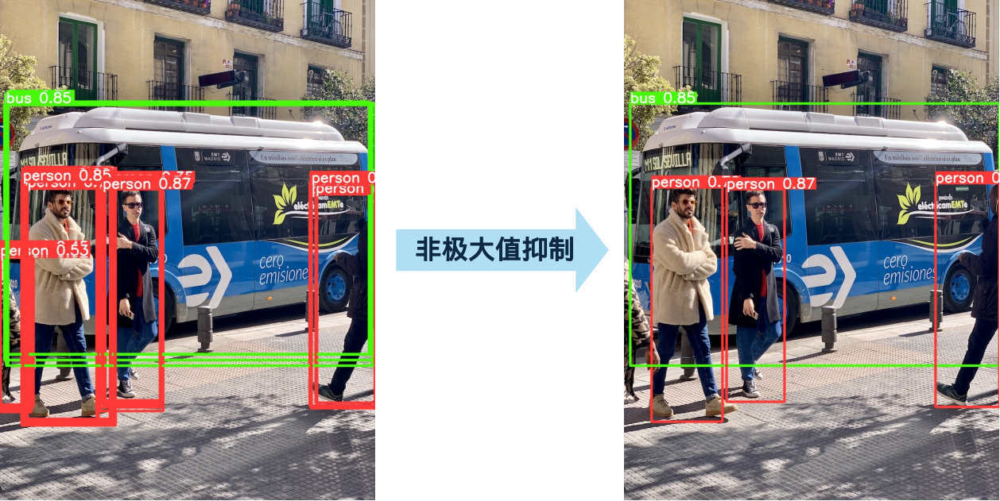
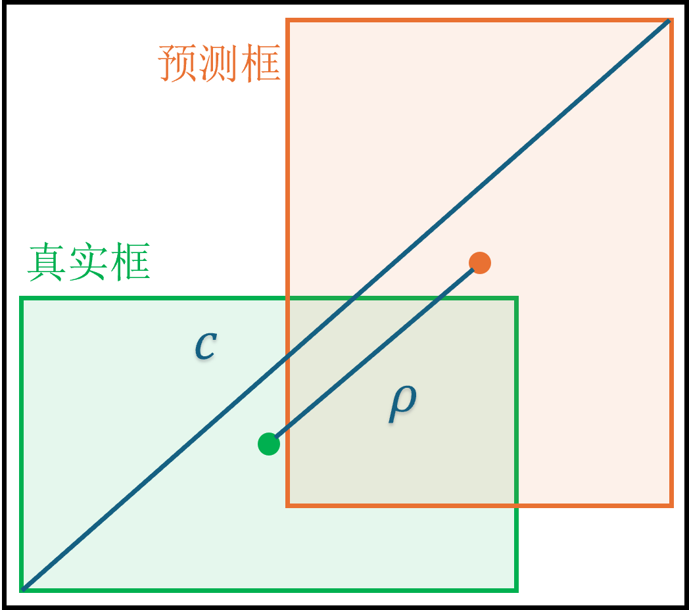

## 16.3 YOLOv5 网络

 

图 16.3.1 目标检测任务拆解  

 

图 16.3.2 YOLOv5 总体结构

 

图 16.3.3 YOLOv5 结构中的各个组成单元

### 16.3.1 骨干网络

### 16.3.2 颈部网络

### 16.3.3 头部网络

 

图 16.3.4 头部网络输出的特征张量  

 

图 16.3.5 非极大值抑制效果  

### 16.3.4 损失函数

 

图 16.3.10 CIOU损失函数物理意义  

