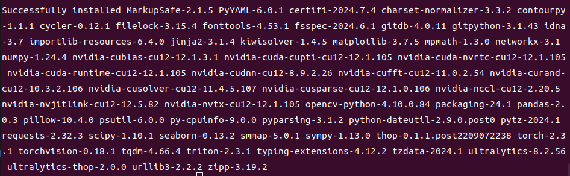
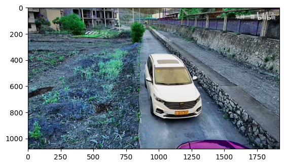
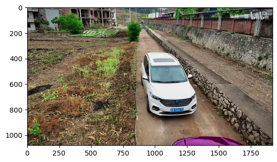
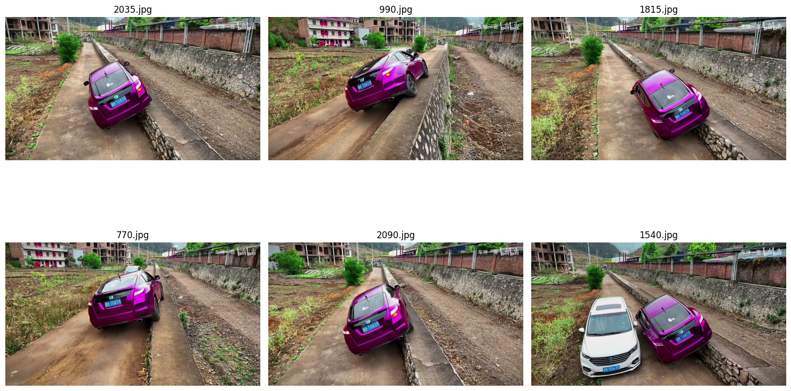
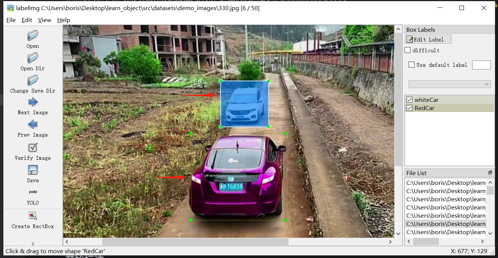
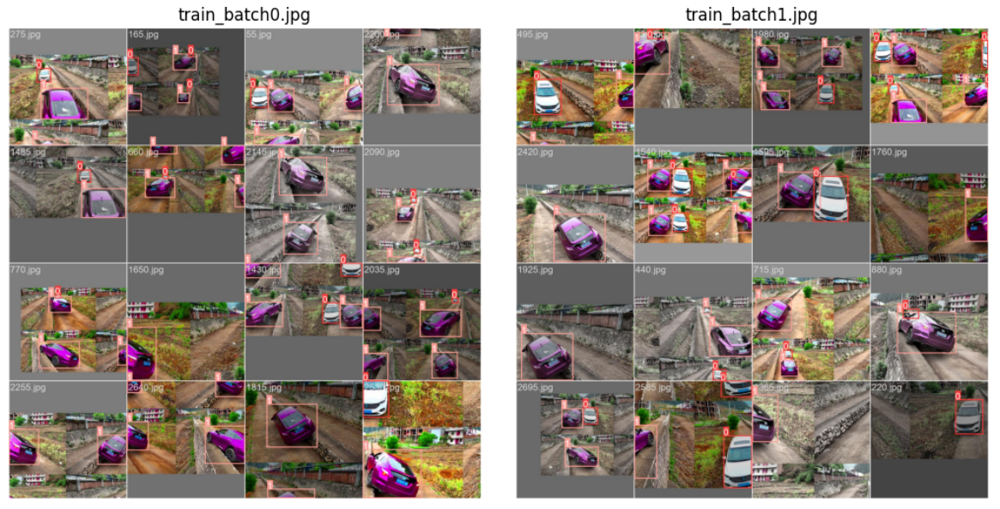
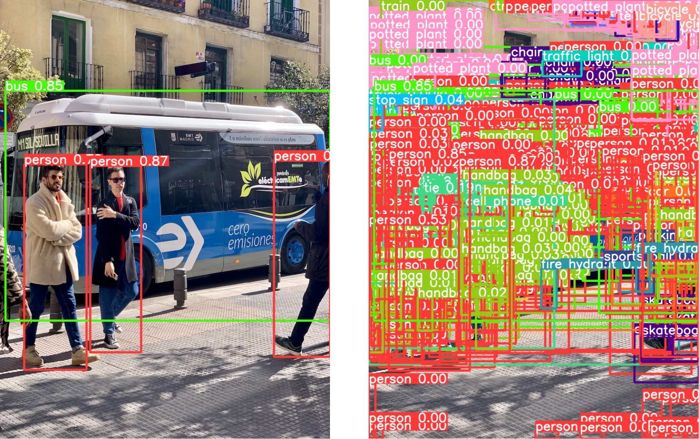
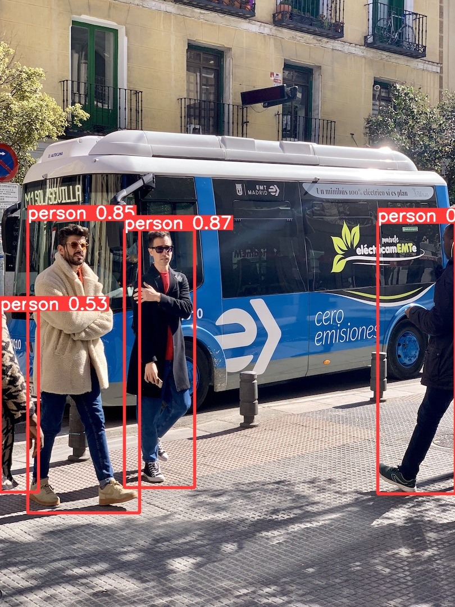

## 16.4 目标检测实践部署

随着含有智能驾驶的汽车走近大众视野，计算机视觉技术作为环境感知类技术得到了非常广泛的应用，车载目标是别更是成为智能驾驶汽车的基础功能。我们就一个“狭路会车“的场景作为案例，向大家介绍如何实际部署YOLOv5目标检测框架。

### 16.4.1 准备环境

#### 创建conda环境

建议环境：Python>=3.8.0, PyTorch>=1.8.0

```bash
$ conda create -n yolo_v5 pyhton=3.8
$ conda activate yolo_v5
```

#### 拉取YOLOv5代码

克隆yolo代码

```bash
$ git clone https://github.com/ultralytics/yolov5 
```

安装依赖项

```bash
$ cd yolov5
$ pip install -r requirements.txt
```

显示以下内容，环境就装好了。

  

图 16.5.1 环境的安装 


### 16.4.2 数据集构建

那么如何构建自己的数据集呢？我们

我们利用一段会车视频进行数据集的构建 ```src/case/datasets/BVN.mp4```：

```python
import cv2
import matplotlib.pyplot as plt

# 打开视频文件
video = cv2.VideoCapture("src/case/datasets/BVN.mp4")

video.isOpened()
# 读取一帧
ret, frame = video.read()
```

下边将图片展示处理，使用imshow()函数，将默认的BGR格式，转换成RGB格式。

```python
plt.imshow(cv2.cvtColor(frame, cv2.COLOR_BGR2RGB)) # 转换成RGB格式
```




图 16.5.2 抽帧一张图片 

在```src/case/dataset/demo_images```目录下生成了从视频中抽帧的图片集，展示图片集中的6张图片：

 

图 16.5.3 图集展示 

#### 图片数据集标注

Labelimg是一款开源的数据标注工具，可以标注三种格式。

- VOC标签格式，保存为xml文件。
- yolo标签格式，保存为txt文件。
- createML标签格式，保存为json格式。

标注工具在对应conda环境中安装，并运行。 

```bash
$ pip install labelImg
$ !labelImg # 运行labelimg
```

 

图 16.5.4 labelImg图片示例 


标注完成后，保存的标签文件在```src/case/datasets/demo_images/demo_labels/```目录下，且生成txt文件和源图片文件名相同。Label文件内容形式如下：

```
0 0.522396 0.184259 0.078125 0.101852
1 0.474740 0.444907 0.343229 0.434259
```

其中，第一个数字是类别（0代表白车、1代表红车），后四个数字是归一化后的坐标，其数值代表相对于图片宽高的比例。数据集至此构建完成。

### 16.4.3 模型训练

####  分割训练集和验证集

被分割的图片和标签被分别存放在```src/case/datasets/images/```，```src/case/datasets/labels/```目录下。

```
/train：    训练集图片或标签。
/val：      验证集图片或标签。
```

#### 开始训练

运行train.py时将运行日志实时输出到jupyter。

```bash
$ python src/case/train.py --batch 16 --epochs 50
```

训练数据以batch的形式被输入网络进行学习（这里设置16张图片为一个batch）。

 

图 16.5.5 训练结果展示 

训练结果文件存在```src/case/runs/train/exp/weights/```目录下

### 16.4.4 模型推理

#### 图片检测

```python
$ python detect.py --weights src/case/yolov5s.pt --source src/case/datasets/images/val/

# --weights: 指定训练好的权重文件路径。
# --source: 指定输入源，可以是摄像头（0表示内置摄像头，1表示外接摄像头），也可以是视频文件或图片文件夹。
```

#### 视频检测

```python
$ python detect.py --weights src/case/runs/train/exp/weights/best.pt --source src/case/datasets/BvN.mp4 --view-img

# --weights: 指定训练好的权重文件路径。
# --source: 指定输入源，可以是摄像头（0表示内置摄像头，1表示外接摄像头），也可以是视频文件或图片文件夹。
# --view-img: 是否在检测过程中显示图像。
```

### 16.4.5 运行参数

#### weights
```--weights``` 参数用于指定网络模型，默认设置的是 ```yolov5s.pt```， 如果想要使用其他网络模型，可以打开 GitHub 的 YOLOv5 官方开源项目，在 Release 中找到对应版本的模型进行下载。

```python
parser.add_argument("--weights", nargs="+", type=str, default=ROOT / "yolov5s.pt", help="model path or triton URL")
```

参考格式类型

```bash
$ cd src/case
$ python detect.py --weights yolov5s.pt
```

####  source
```--source``` 参数用于给网络模型指定输入，可以对图片，视频等进行目标检测。

```python
parser.add_argument('--source', type=str, default='data/images', help='source')  # 文件或者文件夹, 0是调用笔记本摄像头
```

参考数据类型

```bash
$ python detect.py --weights yolov5s.pt --source 0                               # webcam
                                                 img.jpg                         # image
                                                 vid.mp4                         # video
                                                 screen                          # screenshot
                                                 path/                           # directory
                                                 ...
```

补充：当我们对视频进行目标检测时，通常会在运行时调用 ```view-img``` 参数，从而能够实时查看视频每一帧的检测效果。

####  image-size

`--img-size` 参数用于缩放图片以适应神经网络输入，模型通过训练确定标注框的位置，并在输出时将标注框等比例缩放至原图。输入与输出图片尺寸保持一致，无改变。在 YOLOv5 官方开源项目的 Release 中，不同 `.pt` 模型有对应的 `img-size`，例如，`yolov5s.pt` 模型是在 $640 \times 640$ 分辨率下训练的，因此使用该模型时应将 `img-size` 设置为 640。

```python
parser.add_argument('--img-size', type=int, default=640, help='inference size (pixels)')
```


####  conf-thes
```--conf-thres``` 参数用于设置置信度，当检测目标的概率大于 default 默认值时，就会在图片中被标注出来。

```python
parser.add_argument('--conf-thres', type=float, default=0.25, help='object confidence threshold')
```

- default = 0.25：检测目标的概率大于 0.25 时，就会在图片中被标注出来
- default = 0：无论检测目标的概率多少，图片中所有的检测框都 会 被标注出来
- default = 1：无论检测目标的概率多少，图片中所有的检测框都 不 被标注出来

当置信度被设置低的时候，选出来的检测框就会变多，如下图所示（左侧为default=0.25，右侧为0）。

 

图 16.5.6 置信度参数配置示例 

#### device
```--device``` 参数用于选择代码运行所使用的设备，例如 cuda 或者 cpu ，若 default 默认值为空，则会自动检测。

```python
parser.add_argument('--device', default='', help='cuda device, i.e. 0 or 0,1,2,3 or cpu')
```


#### classes
```--classes``` 参数用于指定想要检测的类别。

```python
parser.add_argument('--classes', nargs='+', type=int, help='filter by class: --class 0, or --class 0 2 3')
```

如果只想检测 人 这个类别，我们可以调用 --classes 0 ，具体运行效果如下图所示：

 

图 16.5.7 classes参数配置示例 

####  project

```--project``` 参数就是我们预测结果保存的路径。

```python
parser.add_argument('--project', default='runs/detect', help='save results to project/name')
```

#### name
```--name``` 参数就是我们预测结果保存的文件夹名字。

```
parser.add_argument('--name', default='exp', help='save results to project/name')
```


- default = 0.25：检测目标的概率大于 0.25 时，就会在图片中被标注出来
- default = 0：无论检测目标的概率多少，图片中所有的检测框都 会 被标注出来
- default = 1：无论检测目标的概率多少，图片中所有的检测框都 不 被标注出来

当置信度被设置低的时候，选出来的检测框就会变多，如图 16.1.13 所示（左侧为default=0.25，右侧为0）。

 

图 16.1.13 置信度阈值的作用  
