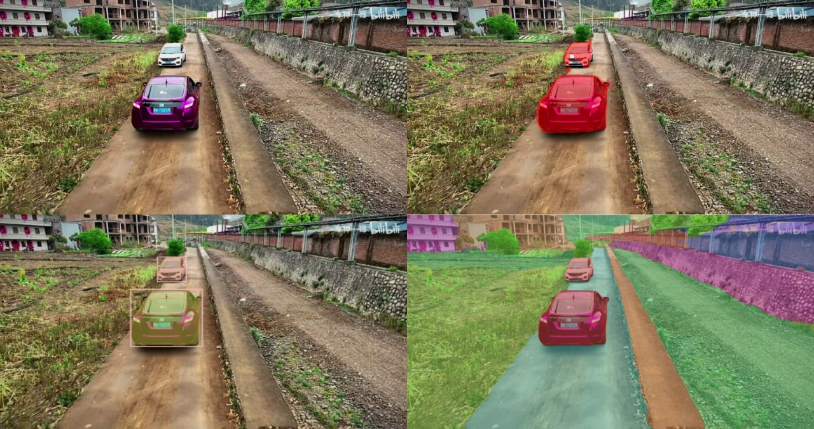

## 16.4 语义分割任务

 

图 16.4.1 处理前图像（左上）、语义分割（右上）、实例分割（左下）、全景分割（右下）  

### 16.4.1 技术路线与常见算法

### 16.4.2 DeepLab系列

 

图 16.4.2 普通卷积（左） vs 空洞卷积（右）  

### 16.4.3 DeepLab V3+ 网络

 

图 16.4.3 DeepLabv3+ 网络架构  
