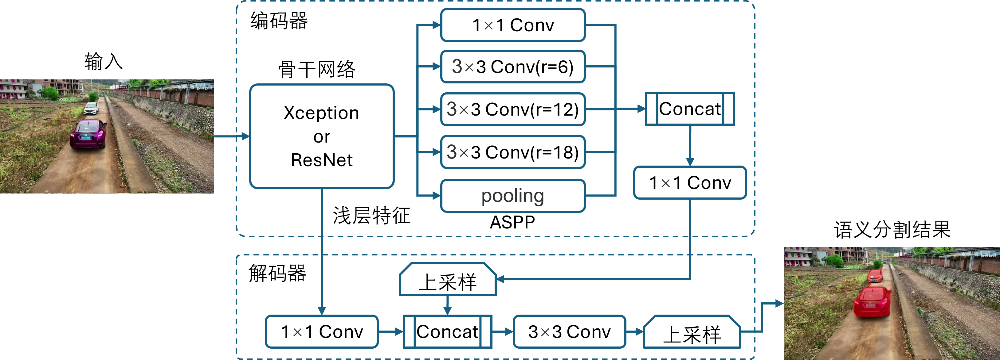
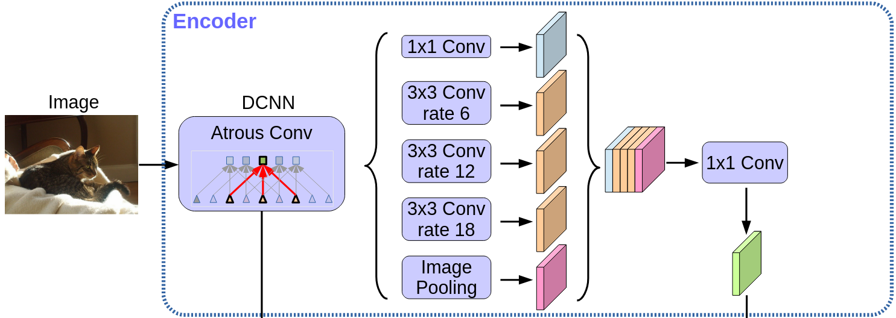
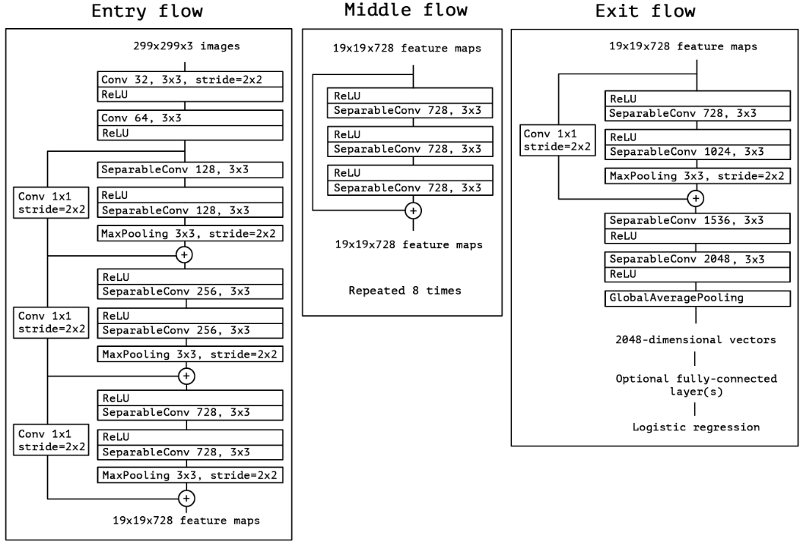
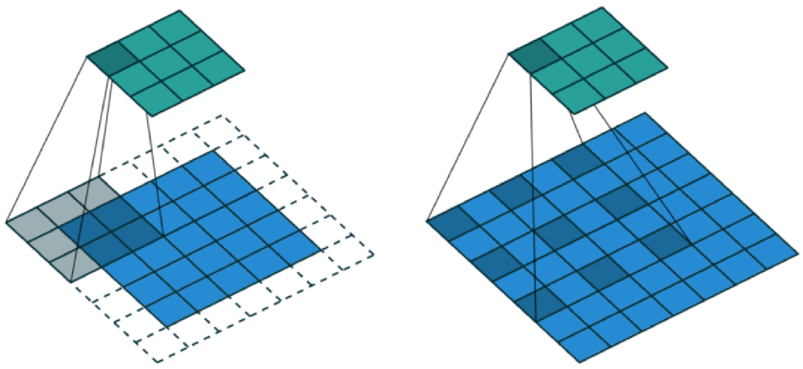
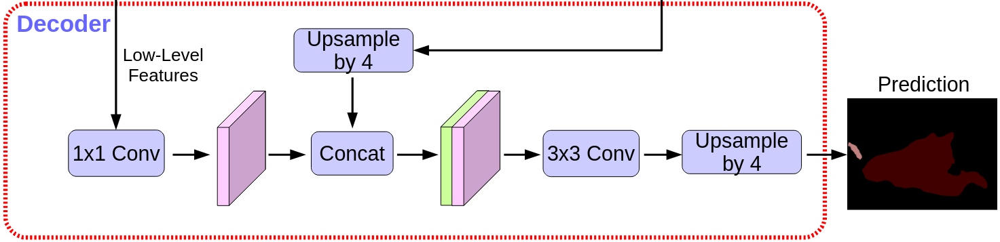

## 16.5 语义分割之 DeepLab V3+ 网络

 

图 16.5.1 DeepLabv3+ 网络架构  

### 16.5.1 Encoder部分

 

图 16.5.2 encoder部分 

 

图 16.5.3 Xception网络结构

 

图 16.5.4 普通卷积（左） vs 空洞卷积（右）  

### 16.5.2 Decoder部分

 
  
图 16.5.5 decoder部分  

### 16.5.3 LOSS 解析
