## 16.6 语义分割实践部署

### 语义分割-deeplabV3+部署

#### 1.准备环境

**创建conda环境**

建议环境：Python>=3.6.0, PyTorch>=1.2.0

```bash
$ conda create -n deeplabV3Plus pyhton=3.6
$ conda activate deeplabV3Plus
```

**拉取YOLOv5代码**

克隆yolo代码

```bash
$ git clone https://github.com/bubbliiiing/deeplabv3-plus-pytorch
```

安装依赖项

```bash
$ cd yolov5
$ pip install -r requirements.txt
```

显示以下内容，环境就装好了。

 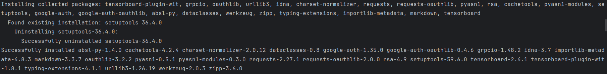 

图 16.6.8 环境的安装 

#### 2.数据集构建

样例数据在datasets/demo_images目录下

 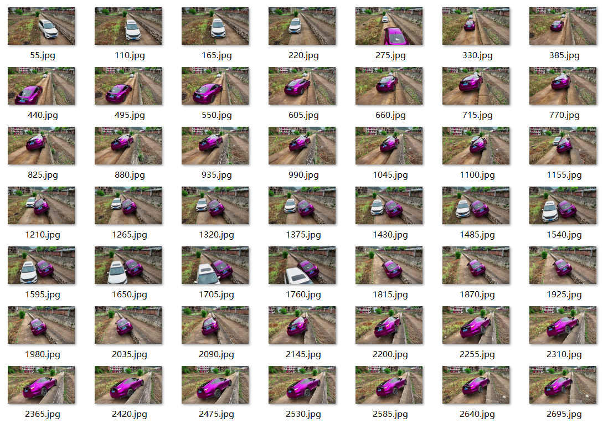 

图 16.6.9 数据集展示 

**labelme的下载**

```
pip install labelme
```

**运行labelme**

Run `labelme --help` for detail.

```
labelme  # just open gui
```

 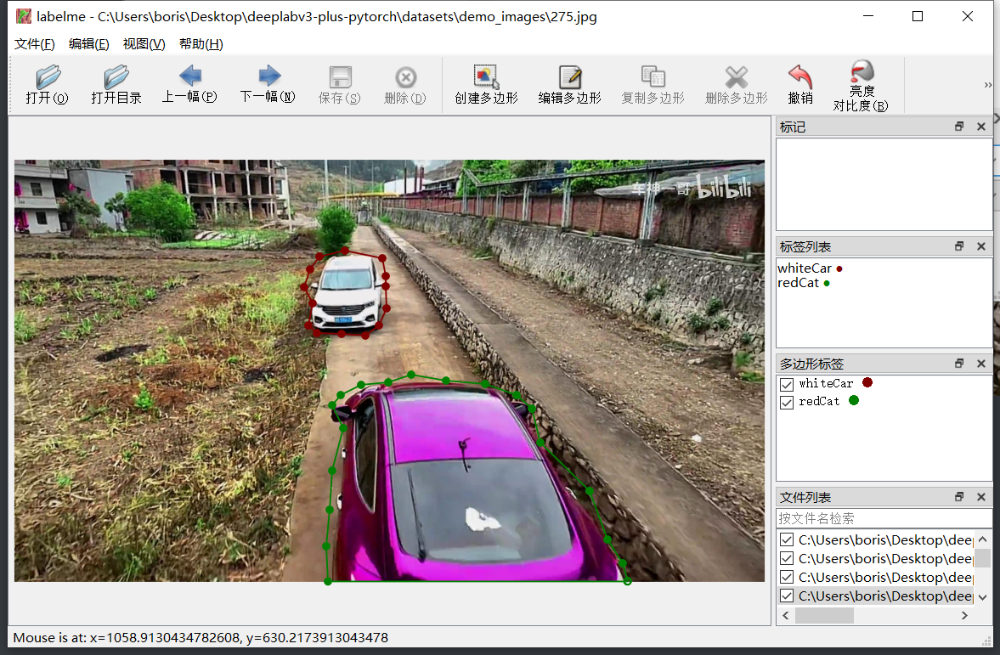 

图 16.6.10 labelme使用示例 

**标注自己的数据集**

打开自己数据集文件夹，选择创建多边形标注前景并且定义标签；

ctrl+S保存标注信息，保存在同文件夹下，与图片同名的json文件；

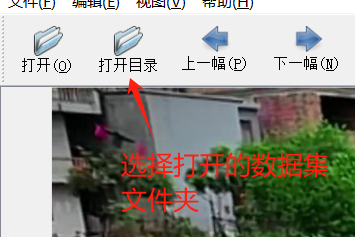
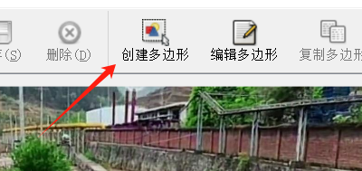
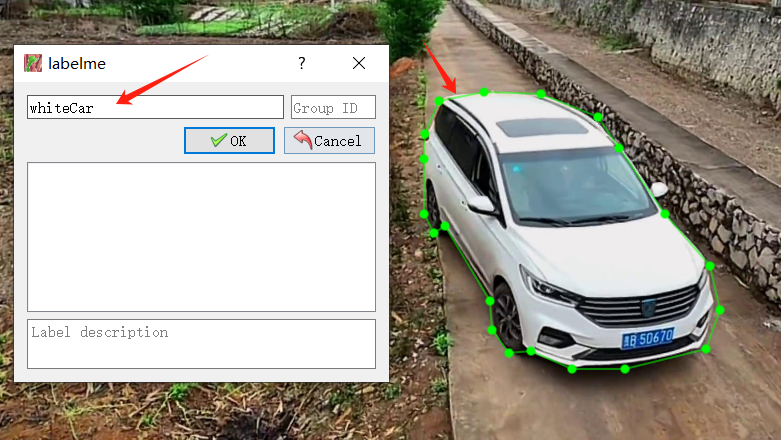
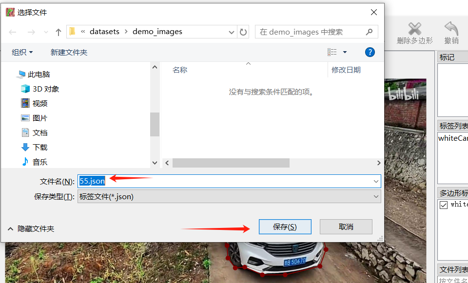

图 16.6.11 数据标注流程 


标注完成后每一个原图片对应都有了他的标注信息的json文件

 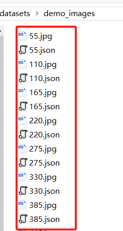 

图 16.6.12 标注json结果示例 

**将Labelme的json标注格式，转换为整数掩膜mask格式**

导入工具包

```python
import os
import json
import numpy as np
import cv2
import matplotlib.pyplot as plt
# %matplotlib inline

img_path = 'demo_images_segment/385.jpeg'
img_bgr = cv2.imread(img_path)
```

 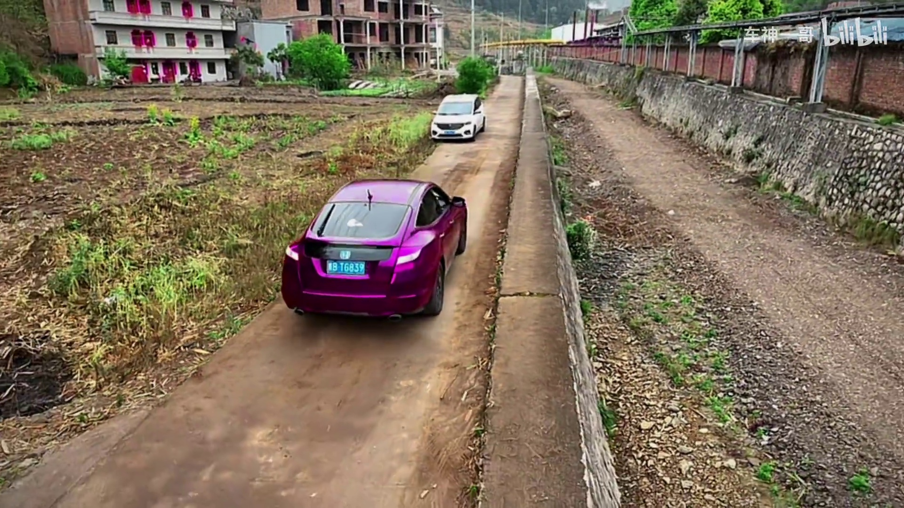 

图 16.6.13 数据原图 

创建空白图像

```python
img_mask = np.zeros(img_bgr.shape[:2])
```

```python
plt.imshow(img_mask)
plt.show()
```

载入该图像labelme格式的json标注文件

```python
labelme_json_path = 'demo_images_segment/385.json'

with open(labelme_json_path, 'r', encoding='utf-8') as f:
    labelme = json.load(f)
```

所有标注信息如下边示例所示

```python
labelme['shapes']

'''
[{'label': 'redCat',
  'points': [[884.074074074074, 370.8641975308642],
   [926.0493827160493, 389.38271604938274],
   [956.9135802469135, 399.2592592592593],
	...,
  'group_id': None,
  'description': '',
  'shape_type': 'polygon',
  'flags': {},
  'mask': None},
 {'label': 'whiteCar',
  'points': [[965.5555555555554, 193.08641975308643],
   [1014.9382716049381, 199.2592592592593],
   [1026.0493827160494, 216.54320987654324],
	...',
  'group_id': None,
  'description': '',
  'shape_type': 'polygon',
  'flags': {},
  'mask': None}]
  '''
```

每个类别的信息及画mask的顺序（按照由大到小，由粗到精的顺序）

```
# 0-背景，从 1 开始
class_info = [
    {'label':'redCat', 'type':'polygon', 'color':1}, # polygon 多段线
    {'label':'whiteCar', 'type':'polygon', 'color':2},
]
```

按顺序将mask绘制在空白图上

```python
代码：16.5-deeplabv3+-mask掩码.py
```

```python
img_mask = show_mask(class_info)
plt.imshow(img_mask)
plt.show()
```

 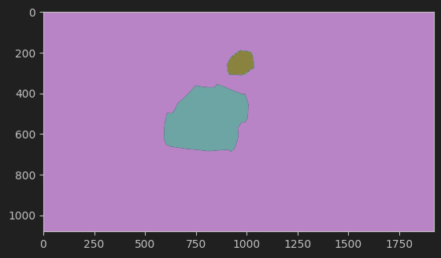 

图 16.6.14 mask图展示 

保存mask标注图像（必须是png格式)      

```python
mask_path = img_path.split('.')[0] + '.png'
cv2.imwrite(mask_path, img_mask)
```

```
# 将demo_images_segment/385.jpeg，demo_images_segment/385.png 并列对比画在一起
mask_img_origin = cv2.imread('demo_images_segment/385.jpeg')
mask_img = cv2.imread('demo_images_segment/385.png')

plt.subplot(1,2,1);plt.imshow(mask_img_origin[:,:,::-1]);plt.title('origin image');plt.axis('off')
plt.subplot(1,2,2);plt.imshow(mask_img[:,:,0]);plt.title('mask image');plt.axis('off')
plt.show()
```

 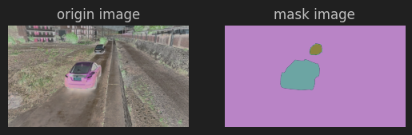 

图 16.6.15 图片对比 

#### 3.模型训练

本文使用VOC格式进行训练，训练前需要自己制作好数据集。
训练前将图片文件放在VOCdevkit文件夹下的VOC2007文件夹下的JPEGImages中。
训练前将标签文件放在VOCdevkit文件夹下的VOC2007文件夹下的SegmentationClass中。

 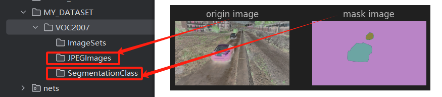 

图 16.6.16 数据集文件夹位置 

在完成数据集的摆放之后，我们需要对数据集进行下一步的处理，目的是获得训练用的train.txt以及val.txt，需要用到根目录下的voc_annotation.py。

配置voc_annotation.py下的参数如下：

```python
#-------------------------------------------------------#
#   想要增加测试集修改trainval_percent  修改train_percent用于改变验证集的比例 9:1
#   
#   当前该库将测试集当作验证集使用，不单独划分测试集
#-------------------------------------------------------#
trainval_percent    = 1
train_percent       = 0.9
#-------------------------------------------------------#
#   指向VOC数据集所在的文件夹 默认指向根目录下的VOC数据集
#-------------------------------------------------------#
VOCdevkit_path      = 'MY_DATASET'
```

**运行根目录下的voc_annotation.py，从而生成train.txt和val.txt。**

 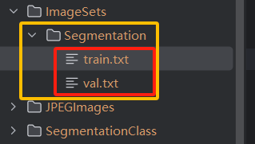 

图 16.6.17 标注数据文件夹位置 

通过 `voc_annotation.py` 已生成 `train.txt` 和 `val.txt` 后，可在 `train.py` 中进行配置并启动训练。

- `num_classes`：需设置为检测类别数 + 1，训练自定义数据集时必须修改此项！
- 在 `train.py` 中选择合适的主干模型 (`backbone`)、预训练权重 (`model_path`)，以及下采样因子 (`downsample_factor`)。预训练模型需与主干模型匹配，且下采样因子可选择 8 或 16。

**部分参数说明:**

- **`Cuda`**: 是否使用 CUDA 进行训练。如果没有 GPU，可将此参数设置为 `False`。
  - 默认值: `True`
- **`seed`**: 随机种子，用于固定训练的随机性，使得每次训练结果一致。
  - 默认值: `11`

- **`num_classes`**: 数据集的分类数目。此参数需要根据训练的数据集进行调整。
  - 默认值: `21` 
- **`pretrained`**: 是否使用主干网络的预训练权重。如果设置了 `model_path`，此参数无效。
  - 默认值: `False`
- **`model_path`**: 模型权重文件的路径。
  - 默认值: `"model_data/deeplab_mobilenetv2.pth"`
- **`input_shape`**: 输入图像的尺寸，以 `[高度, 宽度]` 的格式定义。
  - 默认值: `[512, 512]`

**优化器和学习率设置**

- **`Init_lr`**: 模型的最大学习率。根据选择的优化器类型设置不同的值。
  - 默认值: `7e-3`
- **`Min_lr`**: 模型的最小学习率，通常为最大学习率的 0.01 倍。
  - 默认值: `Init_lr * 0.01`
- **`optimizer_type`**: 优化器类型，可选 `adam` 或 `sgd`。
  - 默认值: `"sgd"`
- **`momentum`**: 优化器的动量参数。
  - 默认值: `0.9`

其他设置

- **`save_period`**: 每隔多少个 epoch 保存一次权重文件。
  - 默认值: `5`
- **`save_dir`**: 日志文件的保存目录。
  - 默认值: `"logs"`
- **`eval_flag`**: 是否在训练时进行验证集的评估。
  - 默认值: `True`
- **`eval_period`**: 评估的周期，即每隔多少个 epoch 进行一次评估。
  - 默认值: `5`
- **`VOCdevkit_path`**: 数据集路径，应为 VOC 格式。
  - 默认值: `"VOCdevkit"`

 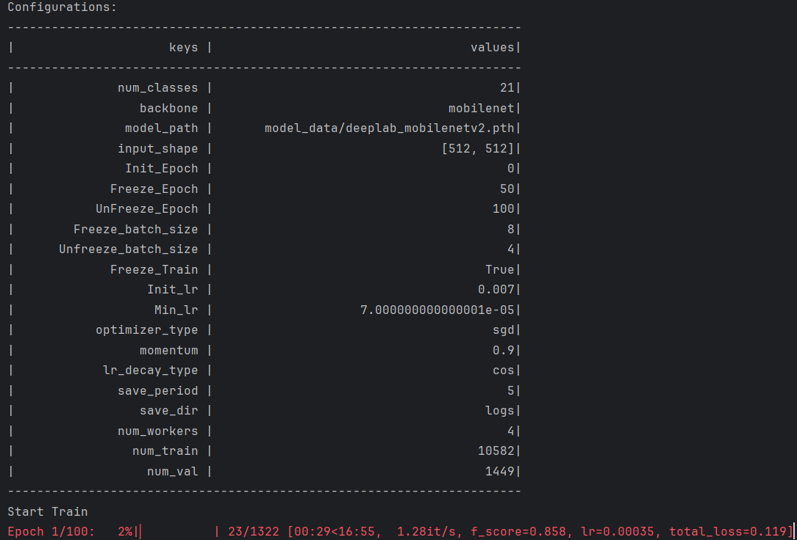 

图 16.6.18 训练过程展示 

如上图所示，开始运行代码。运行过程日志，将加载在logs文件夹下。


#### 4.模型推理

预测时需要用到 `deeplab.py` 和 `predict.py` 两个文件。

- 在 `deeplab.py` 中需修改：
  - `model_path`：指向训练好的权重文件。
  - `num_classes`：设置为检测类别数 + 1，这两个参数必须修改。

**predict.py部分参数说明：**

- **`mode`**: 指定测试的模式。
  - `predict`: 单张图片预测。
  - `video`: 视频检测，可调用摄像头或视频文件进行检测。
  - `fps`: 测试模型的 FPS。
  - `dir_predict`: 遍历文件夹中的图片进行检测并保存结果。
  - `export_onnx`: 将模型导出为 ONNX 格式。
  - 默认值: `"predict"`

`predict` 模式参数

- **`name_classes`**: 要区分的种类名称列表。用于显示在预测结果中的类别和数量。仅在 `mode='predict'` 时有效。
  - 默认值: `["background", "aeroplane", "bicycle", "bird", "boat", "bottle", "bus", "car", "cat", "chair", "cow", "diningtable", "dog", "horse", "motorbike", "person", "pottedplant", "sheep", "sofa", "train", "tvmonitor"]` 默认voc数据集中的分类`

`dir_predict` 模式参数

- **`dir_origin_path`**: 指定要检测的图片文件夹路径。仅在 `mode='dir_predict'` 时有效。

  - 默认值: `"img/"`

- **`dir_save_path`**: 指定检测后图片的保存路径。仅在 `mode='dir_predict'` 时有效。

  - 默认值: `"img_out/"`

  运行predict.py，传入自己测试数据实例：

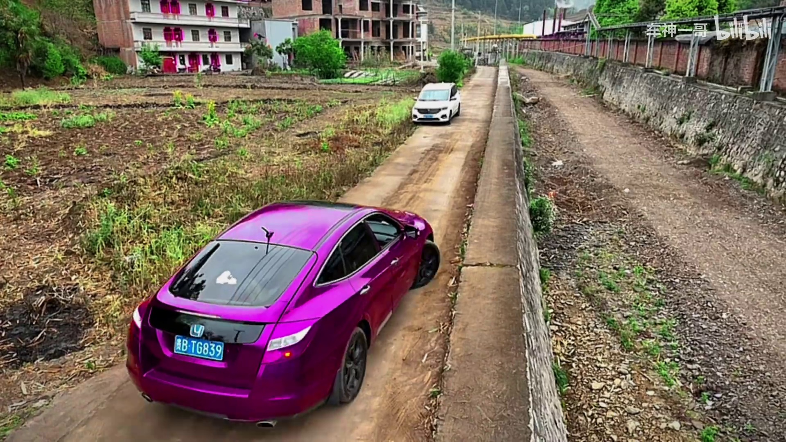

  
 图 16.6.19 结果图展示 
