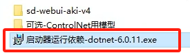
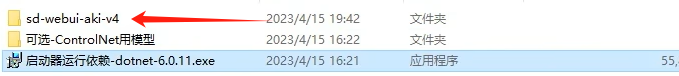
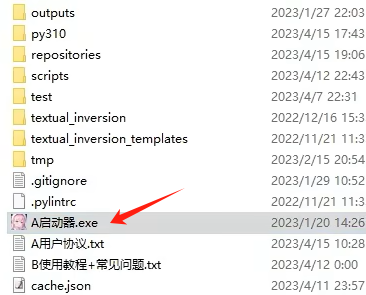
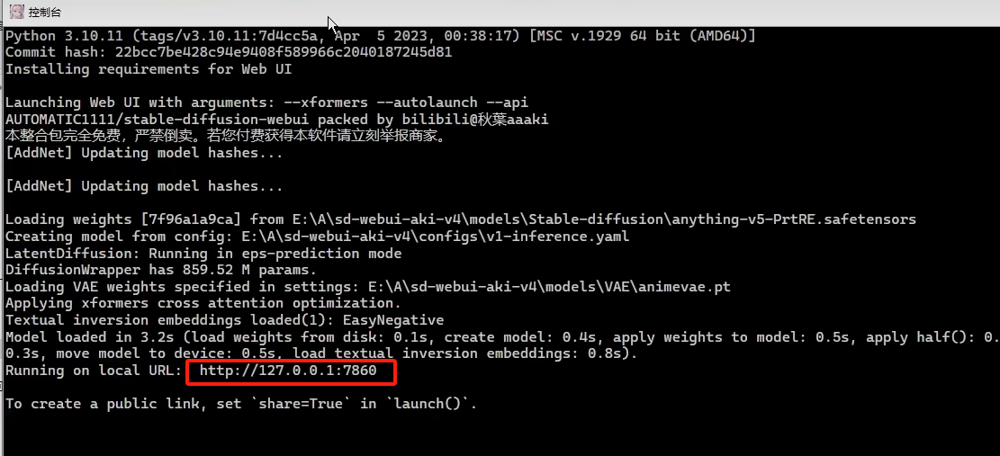
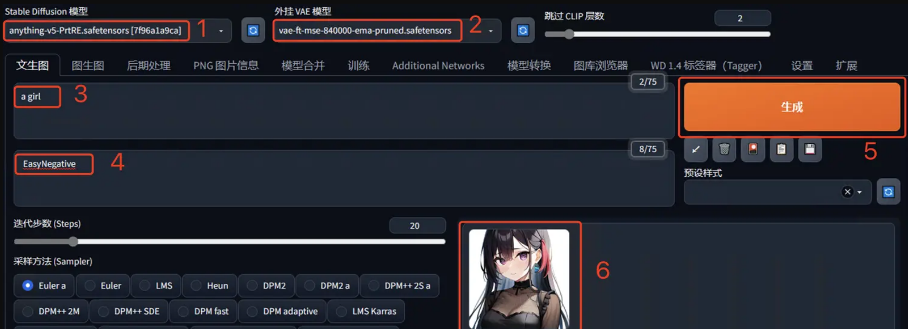

## 16.8 图像生成【电子资源】

图像生成（image generation）是指使用计算机算法和模型来生成具有艺术和创造性的图像。该领域技术的发展经历了多个关键阶段和时间节点，尤其是在深度学习的推动下经历了显著的发展，见表 16.8.1。

表 16.8.1 图像生成技术发展沿革

| 年份   | 关键节点                          | 描述                                                         |
|--------|-----------------------------------|--------------------------------------------------------------|
| 2013年 | 变分自编码器（VAE）              | D. P. Kingma和M. Welling提出，开创基于深度学习的生成模型。 |
| 2014年 | 生成对抗网络（GAN）               | Ian Goodfellow等人提出，通过对抗训练生成高质量图像。       |
| 2016年 | 深度卷积生成对抗网络（DCGAN）     | Radford等人提出，改进了GAN架构，提高了生成图像的清晰度。   |
| 2018年 | StyleGAN                         | NVIDIA提出，极大提升了面部图像生成的质量和多样性。         |
| 2020年 | 扩散模型（DDPM）                 | Ho等人提出，展示强大的生成能力，尤其在高分辨率图像生成中。 |
| 2021年 | CLIP                             | OpenAI推出，促进文本与图像理解，为文生图提供基础。         |
| 2022年 | DALL-E 2                        | OpenAI推出，结合CLIP和扩散模型，根据文本生成高质量图像。   |
| 2022年 | Stable Diffusion                 | 基于扩散模型的文本-图像生成技术，开源并广泛用于图像生成。   |

图像生成技术正处于快速演进中，有三条核心技术路线：

- 变分自编码器（Variational Auto-Encoder, VAE）；

- 生成对抗网络（Generative Adversarial Network, GAN），如 StyleGAN系列；

- 扩散模型，如 DDPM、Stable Diffusion、DALL-E 2。

目前发展的比较好的是 GAN 路线和扩散模型路线。下面我们来看看三条路线各自的原理及思路。 

### 16.8.1  技术路线-VAE变分自编码

变分自编码器的模型结构与传统的自编码器类似，但有关键的不同之处。VAE的核心结构由三个部分组成：编码器、潜在空间和编码器，如图 16.8.1 所示：

 

图 16.8.1 VAE模型结构  

#### 1. 编码器

编码器通常由一系列的卷积层或全连接层（根据数据类型）组成，用于提取输入数据的特征，并输出潜在空间的均值 $\mu$ 和标准差 $\sigma$。

$$x \xrightarrow{\text{Encoder}} (\mu, \sigma)$$

输入：一组数据样本，例如图像或其他高维数据。

输出：编码器将输入数据 $x$ 转换为潜在变量 $z$ 的两个参数：均值 $\mu(x)$ 和标准差（或者方差） $\sigma(x)$。

在标准的自编码器中，编码器输出的是一个固定的潜在向量 $z$，而在 VAE 中，编码器输出的是表示潜在分布的参数（均值和方差）。这个分布通常假设为正态分布 $z \sim N(\mu(x), \sigma(x))$。

#### 2. 采样层

VAE 引入了一个特殊的采样过程，称为重参数化技巧（Reparameterization Trick），使得我们能够从 $\mu$ 和 $\sigma$ 参数表示的分布中采样 $z$，并能够对整个模型进行反向传播以实现端到端训练。

首先从标准正态分布 $\epsilon \sim N(0, I)$ 中采样一个随机噪声向量 $\epsilon$。然后通过重参数化公式计算潜在向量 $z$：

$$
z = \mu + \sigma \times \epsilon
$$

这个步骤确保了从 $\mu$ 和 $\sigma$ 表示的潜在空间进行可微分的采样，使模型可以通过梯度下降进行优化。

#### 3. 解码器

解码器的目的是生成与输入 $x$ 尽可能相似的重构 $\hat{x}$，并且允许从不同的潜在变量 $z$ 中生成新样本。

$$
z \xrightarrow{\text{Decoder}} \hat{x}
$$

解码器通常采用与编码器对称的结构。如果编码器使用了卷积层，解码器通常会使用反卷积层或上采样层，以逐步恢复到原始数据的维度。

输入：采样得到的潜在变量 $z$。

输出：解码器将潜在变量 $z$ 重新映射回原始数据空间，生成与输入 $x$ 结构相似的新样本 $\hat{x}$。


#### 4. 损失函数

VAE 的损失函数由两部分组成：

- 重构损失（Reconstruction Loss）：衡量解码器生成的样本 $\hat{x}$ 与输入样本 $x$ 的差异。常用的度量是均方误差或二元交叉熵；

- KL 散度损失（KL Divergence Loss）：衡量编码器输出的潜在分布 $q(z|x)$ 与先验分布之间的差异。通常使用标准正态分布。这部分强制编码器学习一个结构化的潜在空间。

VAE的内容在此不过多展开，有兴趣的同学可以自行翻看学习论文。

### 16.8.2  技术路线-GAN对抗神经网络

生成对抗网络（Generative Adversarial Network, GAN）是一类由两个神经网络组成的框架，它们相互对抗、竞争，以产生逼真的数据。GAN 的核心思想是通过两个网络的对抗性训练，让生成的样本逐渐逼近真实数据的分布。

GAN 包含两个主要组件：生成器（Generator）和 判别器（Discriminator），如图 16.8.2 所示。

 

图 16.8.2 GAN网络结构   

生成器：

- 生成器的任务是从随机噪声（通常是正态分布或均匀分布的噪声）中生成类似真实数据的样本。生成器通过学习将随机噪声映射到数据空间，使得输出看起来像真实数据；

- 网络通常是一个反向传播的深度神经网络，生成数据的维度和训练集的数据维度一致。

判别器：

- 判别器的任务是判别给定的数据是来自真实的数据集还是生成器生成的假数据；

- 它也是一个深度神经网络，通常是一个二分类模型。判别器的目标是最大化区分真实数据和生成数据的能力。

#### 1. 先进行判别器训练

判别器的任务是区分真实数据和生成的数据，优化的目标是最大化以下损失函数：

$$
L(D) = \log(D(x)) + \log(1 - D(G(z)))
$$

其中：$x$ 表示真实数据、$z$ 表示随机噪声向量、$G(z)$ 是生成器生成的数据样本、$D(x)$ 是判别器对于真实数据的预测概率、$D(G(z))$ 是判别器对于生成数据的预测概率。

判别器训练步骤：
- 从真实数据中采样一批样本，记为 $x$；

- 从随机噪声中采样一批噪声向量 $z$；

- 计算生成器生成的样本 $G(z)$；

- 将真实样本 $x$ 和生成样本 $G(z)$ 输入判别器，计算判别器的输出 $D(x)$ 和 $D(G(z))$；

- 优化判别器，使其最大化上面的损失函数 $L(D)$。

#### 2. 后进行生成器训练

生成器的任务是生成尽可能逼真的数据，以欺骗判别器，目标是最小化以下损失函数：

$$
L(G) = \log(1 - D(G(z)))
$$

生成器训练步骤：

- 从随机噪声中采样一批噪声向量 $z$；

- 使用生成器生成一批样本 $G(z)$；

- 将生成的样本输入判别器，获取判别器的输出 $D(G(z))$；

- 优化生成器，使其最小化上述损失函数 $L(G)$，即让判别器认为生成的数据更接近真实数据。

因此训练过程的整体步骤便可以循环对判别器和生成器的训练：固定生成器，优化判别器，更新 $D$ 的权重，使其更好地区分真实数据和生成数据；固定判别器，优化生成器，更新 $G$ 的权重，使其生成的数据能够更好地欺骗判别器；重复上述过程，直到生成器能够生成与真实数据几乎无差别的样本。

与传统模型相比，GAN 包含两个不同的网络（生成器和判别器），而不是单一的网络，并且其训练方式是基于对抗训练的。注意：在 GAN 中，生成器 G 的梯度更新信息是从判别器 D 获取的，而不是直接从数据样本中获得的。

### 16.8.3 技术路线-扩散模型

扩散模型是近年来最流行的生成模型之一，其灵感来自非平衡热力学，通过定义一个马尔可夫链来进行数据的扩散过程，逐步将数据转化为随机噪声，然后通过逆向扩散过程，从噪声中重构出原始数据样本。

代表模型有如下几个。

- Denoising Diffusion Probabilistic Models (DDPM)：这是扩散模型的一种，通过反向过程生成逼真的图像。

- Stable Diffusion：这是当前非常流行的文本到图像生成模型，广泛应用于 AI 图像生成中。

- DALL·E 2：OpenAI 提出的多模态模型，基于扩散模型生成高质量的文本到图像的结果。

其中只有Stable Diffusion是完全开源的，是由 Stability AI 及其合作伙伴开发的，并且是一个开源项目。它的代码和模型权重都公开发布，允许开发者和研究人员自由使用和修改。Stable Diffusion 是基于扩散模型的，能够生成高质量的图像，特别适合文本到图像生成任务。

#### 1. Stable Diffusion 模型结构

Stable Diffusion 的架构结合了潜在空间 (Latent Space) 和扩散过程 (Diffusion Process) 的思想，如图 16.8.3 所示：

 

图 16.8.3 Stable Diffusion 模型结构   

包含以下关键组件：

- Pixel Space（像素空间，左侧红色部分）：模型的输入与输出处于像素空间，也就是图像的实际分辨率空间。最左侧的 $x$ 表示原始输入图像（像素空间的图像数据）。
  - Encoder $\mathcal{E}$：这个编码器将原始图像 $x$ 压缩到一个潜在空间表示 $z$，其维度比原始图像小得多。这个潜在表示包含了图像的核心特征。
  - Decoder $\mathcal{D}$：在图像生成完成之后，潜在空间中的表示 $z$ 会通过解码器 $\mathcal{D}$ 转换回像素空间中的图像 $\tilde{x}$（即最终生成的图像）。

- Latent Space（潜在空间，绿色部分）：在 Stable Diffusion 中，原始图像并不是直接在像素空间进行处理的，而是通过编码器（$\mathcal{E}$）被映射到潜在空间（Latent Space）中的紧凑表示 $z$，减少计算负担和提升效率。

- Diffusion Process（扩散过程）：这是Stable Diffusion模型的核心部分。潜在表示 $z$ 逐步添加噪声，生成一系列的噪声表示 $z_t$，直至到达最终的噪声 $z_T$。

- Denoising U-Net（U-Net去燥网络，反向扩散过程）
  - U-Net 是负责在扩散步骤中逐步去除噪声的神经网络。U-Net 采用对称的编码器-解码器架构，并具有跳跃连接（skip connections），以帮助模型恢复原始细节。  
  - Cross-attention：在去噪过程中，U-Net 将图像的潜在表示与来自条件输入（如文本编码器的表示）的信息进行对齐，使得模型可以根据条件生成符合特定语义的图像。其中$[Q、K、V]$分别为$[Query、Key、Value]$。

- Conditioning（条件控制）：表示了模型接受的外部条件输入，这些条件可以是:
  - Semantic Map（语义图）：可以是某些预定义的图像信息（例如分割图）；
  - Text（文本）：最常见的是通过文本输入，如描述性文字，模型将根据这些描述生成符合要求的图像；
  - Representations（表示）：可包括其他高维度的特征表示，或者图像的高层语义信息；
  - Images（图像）：也可以直接输入其他图像作为条件，用来控制生成图像的内容。
  
#### 2. 文本到图像生成流程

图 16.8.4 展示了 Stable Diffusion 通过文本生成图像的工作流程。

 

图 16.8.4 Stable Diffusion 文本到图像的生成流程   

### 16.8.4 图像生成小结

总体来说，VAE 训练稳定且具有良好的概率解释性，但生成质量相对较低，适合数据压缩和异常检测等任务；GAN 生成高质量图像，速度快，但训练不稳定且易出现模式崩溃，广泛应用于图像生成和风格迁移等场景；扩散模型 在生成质量上领先，尤其适用于高分辨率和可控生成任务，但生成速度较慢。其具体特点对比请参见表 16.8.2 。

 表 16.8.2 三种图像生成技术路线对比   

| 特点    | VAE        | GAN           | 扩散模型      |
|------------------|----------------------------------|------------------------------------|------------------------------------|
| 生成方式        | 编码-解码，重建概率分布                  | 对抗训练，生成器与判别器博弈               | 扩散过程中的逐步去噪                    |
| 生成图像质量     | 较低                               | 高质量，但存在模式崩溃                 | 极高质量，细节丰富                     |
| 训练稳定性      | 稳定                               | 不稳定，易崩溃                      | 较稳定，但训练过程复杂                  |
| 训练难度        | 简单，收敛较快                        | 训练困难，生成器与判别器难以平衡             | 训练复杂，需多步训练                      |
| 生成速度        | 快                                | 极快                                | 慢，生成需要多次迭代                     |
| 潜在空间结构     | 连续性好，易插值                      | 难以解释，潜在空间不连续                 | 连续性好，支持条件生成                   |
| 概率解释性      | 良好                               | 较差                                | 优秀，生成过程具有概率解释               |
| 应用场景        | 潜在空间探索、异常检测、数据重建          | 图像生成、风格迁移、超分辨率、文本生成图像     | 高质量图像生成、文本生成图像、可控生成任务     |


如图 16.8.5 所示，可以看出 Stable Diffusion 模型在这两组图像的生成任务中表现最好，PSNR 和 R-FID 均显示其生成质量更高，图像细节更为清晰，且与真实图像分布更接近。

 

图 16.8.5 Stable Diffusion 生成图像效果比较   

对比下，DALL-E 显示出边缘模糊化严重。VQGAN 在细节丰富的区域，如碟子和女性眼部，生成的图像出现了明显的失真和模糊。

注：PSNR（Peak Signal-to-Noise Ratio） 和 R-FID（Relative Fréchet Inception Distance）为衡量图片生成的常用指标。

### 16.8.5 图像生成实践

#### 1.使用开源代码部署

创建python 3.10.6版本的环境
运行下面语句，创建环境

```
conda create --name lmd python=3.10.6
```

激活环境输入`conda activate lmd` 回车。

再来克隆stable diffusion webui项目（下面简称sd-webui）

```
git clone https://github.com/AUTOMATIC1111/stable-diffusion-webui.git
```

下载stable diffusion的训练模型

地址：https://huggingface.co/CompVis/stable-diffusion-v-1-4-original/tree/main

点击file and versions选项卡，下载一个自己看好的训练模型。

注：这个模型是用于后续生成AI绘图的绘图元素基础模型库。

后面如果要用waifuai或者novelai，其实更换模型放进去sd-webui项目的模型文件夹即可。

下载好之后，请把模型更名成model.ckpt,然后放置在sd-webui的models/stable-diffusion目录下。

开启运行ai绘图程序sd-webui

```python
cd stable-diffusion-webui
# 进入项目的根目录。执行
webui-user.bat
```

直到系统提示，running on local URL: http://127.0.0.1:7860

点击链接，进入webUi界面。

#### 2.使用整合包部署

在云盘下载整合包 sd-webui-aki-v4.9.7z 文件。

进行解压缩。内容入下图所示：
双击启动运行依赖exe文件，即可自动为项目环境配置依赖环境，环境是虚拟独立在已有python环境之外的，很方便。

  

图 16.6.8 整合包环境的安装 

安装完成后进入整合包的文件夹中：

  

图 16.6.9 主程序文件夹 

进入目录，双击启动器；打开启动器，选择一键启动：




图 16.6.10 启动流程 


和运行起来开源的代码的项目一样，都会启动一个web服务，并提供一个URL链接，使用浏览器打开链接，即可打开页面（整合包对页面也进行了汉化处理）：

  

图 16.6.11 服务启动 

#### 3.模型推理

只需简单 5 步即可生成图像：

1. **Stable Diffusion 模型**：默认使用 `anything-v5` 模型，无需选择。
2. **外挂 VAE 模型**：它类似滤镜，可以让生成的图像颜色更丰富。
3. **提示词**：输入想要生成图像的描述（需为英文）。
4. **反向提示词**：输入不希望出现在图像中的元素。
5. **点击生成**：其他参数保持默认，点击“生成”按钮即可。

生成速度取决于计算机性能，稍等片刻后即可查看生成图像。点击可放大，右键可下载。

  
 
图 16.6.12 主页面效果 

