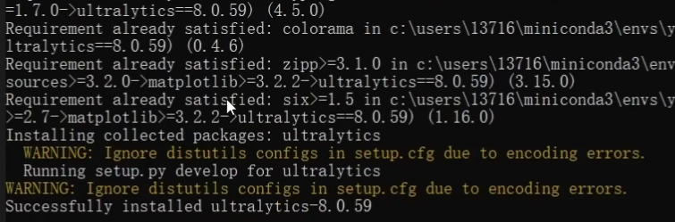
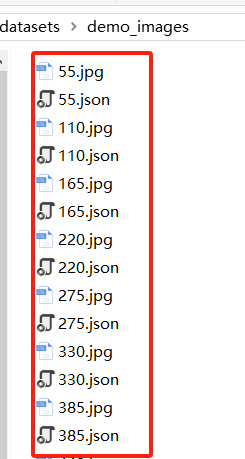
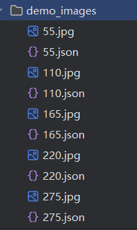
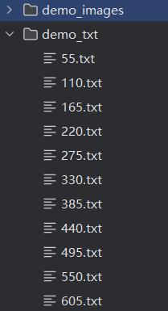
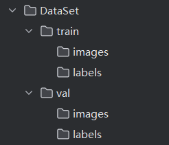
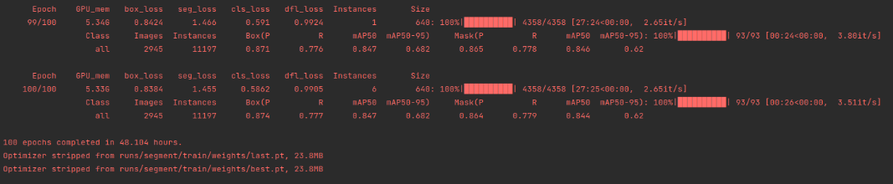
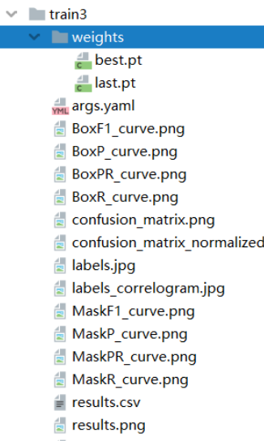
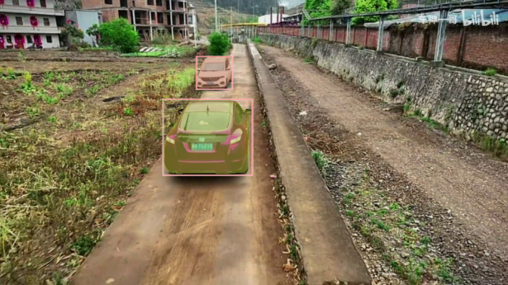

## 16.9 实例分割实践部署

### 实例分割-yoloV8seg部署

YOLACT是一种单阶段、实时的实例分割方法。YOLACT的设计使其在处理实例分割任务时能够实现实时性能，适用于需要快速响应的应用场景。

在实例分割方面，YOLOv8的实例分割模型是基于YOLACT实现的。这意味着YOLOv8在处理实例分割任务时，部分借鉴了YOLACT的方法和思路。通过这种方式，YOLOv8不仅能够进行高效的目标检测，还能实现高质量的实例分割。

YOLACT和YOLOv8在实例分割方面的关系可以视为一种基于方法继承和改进的关系。YOLACT作为一种有效的实例分割方法，其核心思想被YOLOv8采纳并进一步优化，以适应更广泛的应用场景和需求。

所以我们这次讲解实例分割项目的部署以YOLOv8seg模型为例。

#### 1.准备环境

**创建conda环境**

建议环境：Python>=3.8.0, PyTorch>=1.8.0

```bash
$ conda create -n yolov8 pyhton=3.8
$ conda activate yolo_v8
```

**拉取YOLOv8代码**

克隆yolo代码

```bash
$ git clone https://github.com/ultralytics/ultralytics.git
```

安装依赖项

```bash
$ cd ultralytics-main
$ pip install -e .
```

显示以下内容，环境就装好了。

  

图 16.9.1 环境的安装 

#### 2.数据集构建

样例数据在MY_DATA/demo_images目录下

**labelme的下载**

```
pip install labelme
```

**运行labelme**

Run `labelme --help` for detail.

```
labelme  # just open gui
```

**标注自己的数据集**

标注数据集合分两部分

第一部分是将图像标注轮廓生成对应的JSON文件，这一部分和 `16.5.2  语义分割-deeplabV3+部署` 中的Labelme生成json标注文件的步骤一致。第一部分最终获得标注信息的JSON文件。

  

图 16.9.2 第一部分生成json文件展示 

第二部分是JSON文件生成之后，转换成TXT文件的格式：【代码如下】

```
代码：16.6-yolov8-json2txt.py
```

```python
jsonfilePath = ""  # 要转换的json文件所在目录
resultDirPath = ""  # 要生成的txt文件夹
labelme2yolov2Seg(jsonfilePath=jsonfilePath, resultDirPath=resultDirPath, classList=["类别1","类别2"])  # 更改为自己的类别名
```

如图所示：将json文件生成 yolo所需要的txt 标注文件（左图为json文件，右图为txt文件）：




图 16.9.3 第二部分生成txt文件展示 

#### 3.模型训练

**分割训练集和验证集**
转换好之后，创建一个这样的文件夹：

  

图 16.9.4 数据集文件夹 

```
/train：    训练所用的数据（包含图片，和图片所标注的数据集文件）。
/val：      训练的时候，验证所用的数据（包含图片，和图片所标注的数据集文件）。
```

**开始训练**

在项目根目录创建my_train.py文件

```python
from ultralytics import YOLO
model = YOLO('yolov8-seg.yaml').load('yolov8n-seg.pt')#改成自己所放的位置
model.train(data='my-seg.yaml',epochs=100) # 训练100个epoch
```

设置yolov8s-seg.yaml

```python
代码：case_yolov8/ultralytics/cfg/models/v8/yolov8-seg.yaml
```

```
# 主要修改以下参数 
# Parameters
nc: 2  # number of classes 白车，红车
scales: # model compound scaling constants, i.e. 'model=yolov8n-seg.yaml' will call yolov8-seg.yaml with scale 'n'
  # [depth, width, max_channels]
  s: [0.33, 0.50, 1024]
 ...
```

yolov8x-seg.pt 预训练参数（可加可不加）yolo代码GitHub官网下载的实例分割的预训练模型，一般直接放到根目录即可。

设置my-seg.yaml

```
代码：my-seg.yaml
```

```
path: DataSet  # dataset root dir
train: train/images  # train images (relative to 'path') 
val: val/images  # val images (relative to 'path') 
test:  # test images (optional)

# Classes
names:
  0: whiteCar 
  1: redCar
```

配置完成后

**运行train.py**。

```
代码：case_yolov8/ultralytics/models/yolo/detect/train.py
```

  

图 16.9.5 训练过程展示 

训练过程中会保存以下内容，最后得到两个模型分别是：best.pt、last.pt

  

图 16.9.6 训练结果文件 

#### 4.模型推理

预测的时候，直接命令行、python脚本都可以：

1.命令行：`yolo predict model=best.pt source=图片文件或所在文件夹`

2.python代码：

```python
from ultralytics import YOLO

# 读取模型，这里传入训练好的模型
model = YOLO('best.pt')

# 模型预测，save=True 的时候表示直接保存yolov8的预测结果
metrics = model.predict(['55.jpg'], save=True)
# 如果想自定义的处理预测结果可以这么操作，遍历每个预测结果分别的去处理
for m in metrics:
    # 获取每个boxes的结果
    box = m.boxes
    # 获取box的位置，
    xywh = box.xywh
    # 获取预测的类别
    cls = box.cls
    print(box, xywh, cls)
```

  

图 16.9.7 推理结果 

