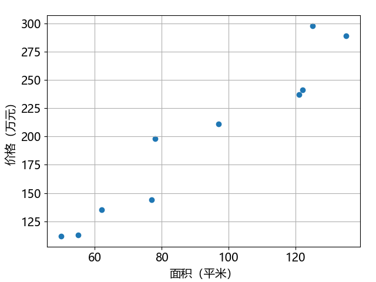
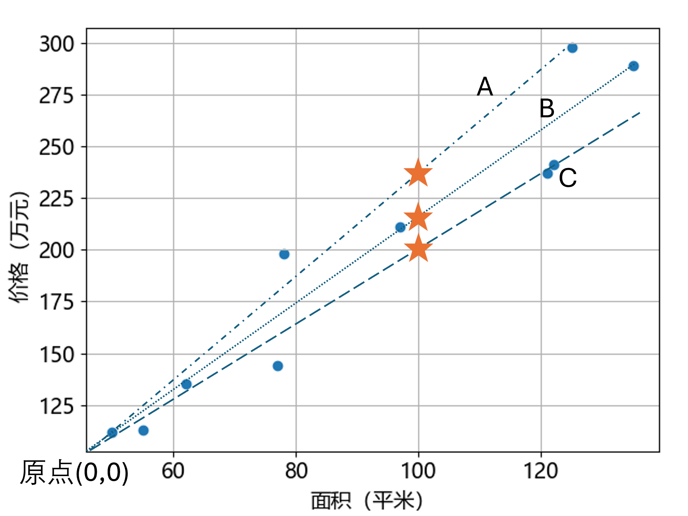

## 1.1 问题与建模

董大白毕业后工作在一线城市，但是父母仍然居住在三线城市的老家，所以他想给父母在老家买一套房子。于是他统计了老家不同小区的十套房子的价格，如表 1.1.1 所示，具体数据在【数据：train1.txt】中。

表 1.1.1 十套房屋的价格与面积

|样本序号|1| 2| 3| 4| 5| 6| 7| 8| 9| 10|
|:-:|-|-|-|-|-|-|-|-|-|-|
|**面积（平米）**|122| 62| 55| 50| 78| 77| 121| 125| 135| 97|
|**价格（万元）**|241|135|113| 112|198|144|237|298|289|211|

**问题：如果董大白想在老家买一套 100 平米左右的房子，大概需要多少钱？**

### 1.1.1 问题分析

这是一个典型的回归问题，是机器学习三大基本模型（回归、分类、聚类）中很重要的一类，其功能是分析自变量与因变量之间的关系。在表 1.1.1 中，$x$ 为自变量，又称为样本**特征值**（feature）；$y$ 为因变量，又称为样本**标签值**（label）。机器学习的做法就是先建模，根据特征值得到**预测值** （prediction）$z$ 并与标签值 $y$ 做比较。在有些资料中把预测值命名为 $\hat{y}$。所谓建模，就是用一个或一组带假想参数的数学表达式来描述一个问题，通过各种方法求得这些参数，以符合输入和输出的关系。

回归又分为线性回归与非线性回归。鉴于这个问题的数据量很小，我们可以采用可视化原始数据的方式来判别其回归类型。运行【代码：H1_1_ShowData.py】可以得到图 1.1.1：

图 1.1.1 房屋价格与面积的关系数据

图 1.1.1 中的各个点大致分布在一条直线上，所以可以确定这是一个线性回归问题。不考虑截距的话，最简单的建模方法是假定有一条过原点（0,0）的直线方程，称为回归线：

$$
z=wx \tag{1.1.1}
$$

只要用某种方法根据样本数据得到假想参数 $w$ 的真实值，就可以预测 100 平米房子的价格 $z$ 了。参数 $w$ 的几何含义就是直线的斜率，在图 1.1.2 中，画出了三条射线 A、B、C，它们的起点相同，斜率有差别，这种差别会带来预测值的不一致。

图 1.1.2 数学模型

比如，同样是横坐标为 100 平米时，纵坐标为预测值（三颗星星所在的位置）：直线 A 的房价大概是235万元；直线 B 的房价大概是215万元；直线 C 的房价大概是200万元。

相差十几万元的预测误差对于三线城市的购房者来说是不容忽视的，所以问题就变成究竟哪条直线是最准确的回归线？

### 1.1.2 得到一个估计值

我们扩展一下表 1.1.1，在最下面增加一行，其值为 $w=y/x$，即房屋单价，得到表 1.1.2。

表 1.1.2 十套房屋价格与面积的对应关系样本及其单价估计

|样本序号|1| 2| 3| 4| 5| 6| 7| 8| 9| 10|
|:-:|-|-|-|-|-|-|-|-|-|-|
|**面积（平米）$x$**|122| 62| 55| 50| 78| 77| 121| 125| 135| 97|
|**价格（万元）$y$**|241|135|113| 112|198|144|237|298|289|211|
|**单价（万元/平米）$w$**|1.97|2.18|2.05|2.24|2.54|1.87|1.96|2.38|2.14|2.17|

综合十个样本的单价求其平均值为 2.15 万元/平米，当然，这个值仅仅是个估计值，作为参考。
